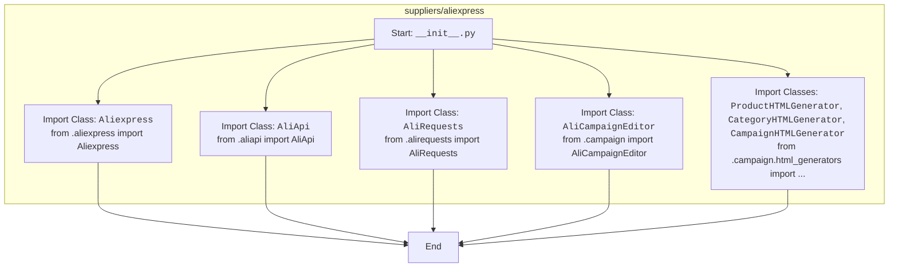

## ИНСТРУКЦИЯ:

Анализируй предоставленный код подробно и объясни его функциональность. Ответ должен включать три раздела:  

1.  **<алгоритм>**: Опиши рабочий процесс в виде пошаговой блок-схемы, включая примеры для каждого логического блока, и проиллюстрируй поток данных между функциями, классами или методами.  
2.  **<mermaid>**: Напиши код для диаграммы в формате `mermaid`, проанализируй и объясни все зависимости,  
    которые импортируются при создании диаграммы.  
    **ВАЖНО!** Убедитесь, что все имена переменных, используемые в диаграмме `mermaid`,  
    имеют осмысленные и описательные имена. Имена переменных вроде `A`, `B`, `C`, и т.д., не допускаются!  
    
    **Дополнительно**: Если в коде есть импорт `import header`, добавьте блок `mermaid` flowchart, объясняющий `header.py`:\
    ```mermaid
    flowchart TD
        Start --> Header[<code>header.py</code><br> Determine Project Root]
    
        Header --> import[Import Global Settings: <br><code>from src import gs</code>] 
    ```

3.  **<объяснение>**: Предоставьте подробные объяснения:  
    - **Импорты**: Их назначение и взаимосвязь с другими пакетами `src.`.  
    - **Классы**: Их роль, атрибуты, методы и взаимодействие с другими компонентами проекта.  
    - **Функции**: Их аргументы, возвращаемые значения, назначение и примеры.  
    - **Переменные**: Их типы и использование.  
    - Выделите потенциальные ошибки или области для улучшения.  

Дополнительно, постройте цепочку взаимосвязей с другими частями проекта (если применимо).  

Это обеспечивает всесторонний и структурированный анализ кода.
## Формат ответа: `.md` (markdown)
**КОНЕЦ ИНСТРУКЦИИ**
## <алгоритм>

1.  **Импорт `Aliexpress`:**
    *   Импортирует класс `Aliexpress` из модуля `aliexpress.py`.
    *   Пример: `from .aliexpress import Aliexpress`
2.  **Импорт `AliApi`:**
    *   Импортирует класс `AliApi` из модуля `aliapi.py`.
    *   Пример: `from .aliapi import AliApi`
3.  **Импорт `AliRequests`:**
    *   Импортирует класс `AliRequests` из модуля `alirequests.py`.
    *   Пример: `from .alirequests import AliRequests`
4.  **Импорт `AliCampaignEditor`:**
    *   Импортирует класс `AliCampaignEditor` из модуля `campaign.py`.
    *   Пример: `from .campaign import AliCampaignEditor`
5.  **Импорт генераторов HTML:**
    *   Импортирует классы `ProductHTMLGenerator`, `CategoryHTMLGenerator` и `CampaignHTMLGenerator` из модуля `html_generators.py` (внутри директории `campaign`).
    *   Пример: `from .campaign.html_generators import ProductHTMLGenerator, CategoryHTMLGenerator, CampaignHTMLGenerator`

## <mermaid>



## <объяснение>

**Импорты:**

*   `from .aliexpress import Aliexpress`: Импортирует класс `Aliexpress` из файла `aliexpress.py`, расположенного в той же директории (`.`). Этот класс, вероятно, предоставляет интерфейс для взаимодействия с AliExpress.
*   `from .aliapi import AliApi`: Импортирует класс `AliApi` из файла `aliapi.py` в той же директории. Этот класс, скорее всего, отвечает за взаимодействие с API AliExpress.
*   `from .alirequests import AliRequests`: Импортирует класс `AliRequests` из файла `alirequests.py`, также в той же директории. Этот класс, вероятно, отвечает за создание и отправку HTTP-запросов к API AliExpress.
*   `from .campaign import AliCampaignEditor`: Импортирует класс `AliCampaignEditor` из файла `campaign.py`. Этот класс, вероятно, используется для управления рекламными кампаниями на AliExpress.
*   `from .campaign.html_generators import ProductHTMLGenerator, CategoryHTMLGenerator, CampaignHTMLGenerator`: Импортирует три класса из файла `html_generators.py`, находящегося в поддиректории `campaign`. Эти классы, скорее всего, используются для генерации HTML-кода для отображения товаров, категорий и кампаний соответственно.

**Классы:**

*   `Aliexpress`: Предположительно, это основной класс, предоставляющий интерфейс для взаимодействия с AliExpress. Может включать методы для поиска товаров, управления заказами, доступа к API и т. д.
*   `AliApi`: Вероятно, этот класс инкапсулирует логику взаимодействия с API AliExpress. Может содержать методы для аутентификации, отправки запросов к различным эндпоинтам API, обработки ответов и т. д.
*   `AliRequests`: Этот класс, скорее всего, используется для создания и отправки HTTP-запросов. Может предоставлять методы для отправки GET, POST и других типов запросов, а также обработки заголовков и параметров.
*   `AliCampaignEditor`: Этот класс, вероятно, используется для управления рекламными кампаниями на AliExpress. Может включать методы для создания, редактирования, запуска и отслеживания кампаний.
*   `ProductHTMLGenerator`, `CategoryHTMLGenerator`, `CampaignHTMLGenerator`: Эти классы отвечают за генерацию HTML-кода. `ProductHTMLGenerator` создает HTML для отображения товаров, `CategoryHTMLGenerator` для отображения категорий, а `CampaignHTMLGenerator` для отображения рекламных кампаний.

**Функции:**

В этом файле нет определения функций. Он служит для импорта и объединения различных компонентов модуля.

**Переменные:**

В этом файле нет определения переменных.

**Взаимосвязь с другими частями проекта:**

Этот модуль (`src.suppliers.aliexpress`) отвечает за интеграцию с AliExpress. Он использует классы для API, обработки запросов и управления рекламными кампаниями. Вероятно, другие части проекта могут использовать этот модуль для получения данных о товарах, управления заказами, запуска рекламных кампаний и т. д.
Цепочка взаимосвязей: `src/suppliers/aliexpress/__init__.py` -> `src/suppliers/aliexpress/aliexpress.py` (класс `Aliexpress`) -> `src/suppliers/aliexpress/aliapi.py` (класс `AliApi`) -> `src/suppliers/aliexpress/alirequests.py` (класс `AliRequests`) и `src/suppliers/aliexpress/campaign/campaign.py` (класс `AliCampaignEditor`) и `src/suppliers/aliexpress/campaign/html_generators.py` (классы `ProductHTMLGenerator`, `CategoryHTMLGenerator`, `CampaignHTMLGenerator`).

**Потенциальные ошибки и области для улучшения:**

*   Отсутствуют комментарии к коду, которые могли бы объяснить предназначение каждого класса.
*   Нет обработки исключений.
*   Не указано использование `header.py`.

**Дополнительно:**

Отсутствует `header.py`, в коде нет его импорта.