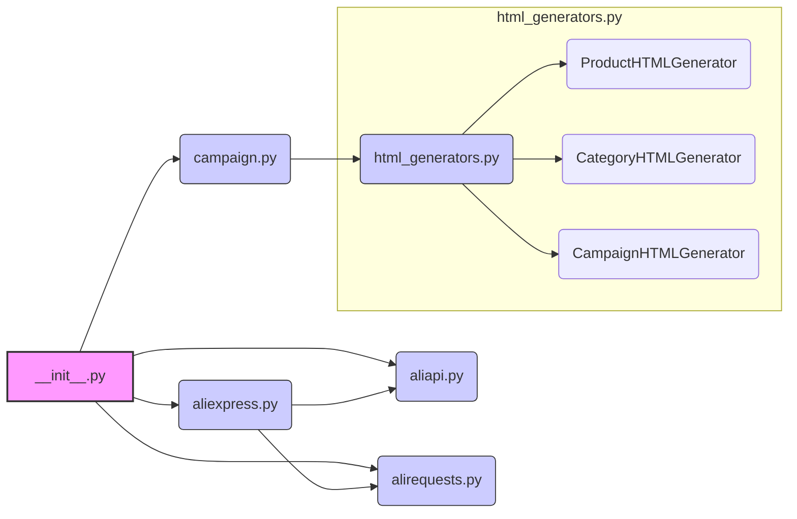

## Анализ кода `hypotez/src/suppliers/aliexpress/__init__.py`

### <алгоритм>
1.  **Инициализация режима:**
    *   Устанавливается переменная `MODE` в значение `'dev'`. Это может указывать на режим разработки, влияющий на поведение других модулей, например, может использоваться для включения логирования или деактивации определенных функциональностей.

2.  **Импорт классов:**
    *   Импортируется класс `Aliexpress` из модуля `aliexpress.aliexpress`. Этот класс, вероятно, представляет основного поставщика Aliexpress и содержит методы для взаимодействия с ним.
    *   Импортируется класс `AliApi` из модуля `aliexpress.aliapi`. Этот класс, скорее всего, инкапсулирует логику взаимодействия с API Aliexpress.
    *   Импортируется класс `AliRequests` из модуля `aliexpress.alirequests`. Этот класс, вероятно, отвечает за формирование и отправку HTTP-запросов к Aliexpress.
    *   Импортируется класс `AliCampaignEditor` из модуля `aliexpress.campaign`. Он используется для управления рекламными кампаниями на Aliexpress.
    *   Импортируются классы `ProductHTMLGenerator`, `CategoryHTMLGenerator` и `CampaignHTMLGenerator` из модуля `aliexpress.campaign.html_generators`. Эти классы отвечают за генерацию HTML-кода для отображения информации о продуктах, категориях и кампаниях соответственно.
3.  **Завершение инициализации:**
    *   После импорта всех необходимых классов, модуль готов к использованию. Другие части проекта могут импортировать этот модуль и работать с предоставленными классами и переменной `MODE`.

**Примеры:**

*   `Aliexpress` может иметь методы для поиска товаров, получения информации о продавцах и совершения покупок.
*   `AliApi` может иметь методы для аутентификации, запроса данных, обработки ответов и т.д.
*   `AliRequests` может иметь методы для формирования URL-ов, настройки заголовков и обработки ошибок.
*   `AliCampaignEditor` может иметь методы для создания, редактирования и удаления рекламных кампаний.
*   Генераторы `HTML` классов могут принимать на вход данные в виде словаря или объектов и возвращать HTML код для дальнейшего отображения.

### <mermaid>

**Описание диаграммы:**
*   `__init__.py` (A): Главный файл, который импортирует и связывает другие модули.
*   `aliexpress.py` (B): Модуль, предоставляющий основной класс `Aliexpress`.
*   `aliapi.py` (C): Модуль, предоставляющий класс `AliApi` для работы с API Aliexpress.
*   `alirequests.py` (D): Модуль, предоставляющий класс `AliRequests` для выполнения HTTP-запросов.
*  `campaign.py` (E): Модуль, предоставляющий класс `AliCampaignEditor`.
*  `html_generators.py` (F): Модуль с классами для генерации HTML-кода.
    *  `ProductHTMLGenerator` (F1): Класс для генерации HTML кода для продуктов.
    *  `CategoryHTMLGenerator` (F2): Класс для генерации HTML кода для категорий.
    *  `CampaignHTMLGenerator` (F3): Класс для генерации HTML кода для рекламных кампаний.
*   Стрелки показывают зависимости: `__init__.py` импортирует модули `aliexpress.py`, `aliapi.py`, `alirequests.py` и `campaign.py`. Модуль `campaign.py` импортирует `html_generators.py`.  Модуль `aliexpress.py` также использует модули `aliapi.py` и `alirequests.py`.
### <объяснение>
**Импорты:**
   -  `from .aliexpress import Aliexpress`: Импортирует класс `Aliexpress` из модуля `aliexpress.py`, который находится в той же директории.
   -  `from .aliapi import AliApi`: Импортирует класс `AliApi` из модуля `aliapi.py`, также в той же директории. Этот класс отвечает за взаимодействие с API Aliexpress, вероятно, предоставляя методы для аутентификации, запроса данных и обработки ответов.
   -  `from .alirequests import AliRequests`: Импортирует класс `AliRequests` из модуля `alirequests.py`, который отвечает за формирование и отправку HTTP-запросов.
   -  `from .campaign import AliCampaignEditor`: Импортирует класс `AliCampaignEditor` из модуля `campaign.py`, который отвечает за управление рекламными кампаниями.
   -  `from .campaign.html_generators import ProductHTMLGenerator, CategoryHTMLGenerator, CampaignHTMLGenerator`: Импортирует три класса для генерации HTML из модуля `html_generators.py`, который находится в директории `campaign`: `ProductHTMLGenerator` - для генерации HTML-кода для продуктов, `CategoryHTMLGenerator` - для категорий и `CampaignHTMLGenerator` - для рекламных кампаний.
**Классы:**
   - `Aliexpress`: Представляет взаимодействие с платформой Aliexpress, может иметь методы для поиска товаров, обработки заказов и т.д.
   - `AliApi`: Осуществляет взаимодействие с API Aliexpress, вероятно, через HTTP запросы.
   - `AliRequests`: Отвечает за формирование и отправку HTTP-запросов, а также обработку ответов от сервера.
   - `AliCampaignEditor`: Предоставляет функциональность для управления рекламными кампаниями на Aliexpress.
   - `ProductHTMLGenerator`, `CategoryHTMLGenerator`, `CampaignHTMLGenerator`: Используются для генерации HTML-кода, предположительно для отображения информации о продуктах, категориях и кампаниях.
**Функции:**
   - В данном файле функции не определены, но, судя по импортам, можно сделать вывод что будут использоваться методы классов.
   - Например `AliApi` может иметь функции, как `login()`, `get_product(id)`, `search_product(keyword)`, которые будут возвращать данные.
   -  Класс `AliRequests` может содержать методы, как `send_get_request(url)`, `send_post_request(url, data)` и т.д.
   -  Классы генерации HTML, будут иметь метод, например `generate_html(data)`, принимающий на вход данные, и возвращающий HTML код для отображения.
**Переменные:**
   - `MODE`: Глобальная переменная, которая установлена в значение `'dev'`. Это указывает, что модуль находится в режиме разработки. Значение переменной `MODE` может быть использовано для активации или деактивации какой-либо функциональности.

**Взаимосвязи с другими частями проекта:**
   - Этот модуль является частью пакета `src.suppliers` и отвечает за интеграцию с Aliexpress. Другие модули, например, `src.core` или `src.web`, могут использовать классы, предоставленные этим модулем для доступа к данным Aliexpress.
   - HTML-генераторы могут использоваться для отображения информации в пользовательском интерфейсе.

**Потенциальные ошибки и улучшения:**
*   **Обработка ошибок:** Неясно, как обрабатываются ошибки при HTTP-запросах. Нужно добавить механизм обработки исключений.
*   **Логирование:** Для режима разработки, возможно, полезно добавить логирование для отслеживания работы и отладки.
*   **Конфигурация:**  Значение переменной `MODE` лучше вынести в файл конфигурации.
*   **Документация:** Коду не хватает документации (docstrings) для классов и функций, что усложняет его понимание.
*   **Тестирование:** Отсутствуют тесты для проверки работоспособности классов и функций.

**Цепочка взаимосвязей:**
`hypotez` -> `src` -> `suppliers` -> `aliexpress` -> `__init__.py` -> `aliexpress.py`, `aliapi.py`, `alirequests.py`, `campaign.py`, `html_generators.py`.