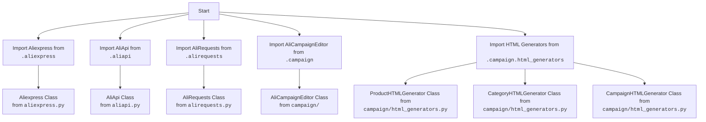

## АНАЛИЗ КОДА: `hypotez/src/suppliers/aliexpress/__init__.py`

### <алгоритм>

1.  **Импорт модулей:**
    *   Импортируются классы `Aliexpress`, `AliApi` и `AliRequests` из текущего пакета (`.`).
    *   Импортируется класс `AliCampaignEditor` из модуля `campaign` внутри текущего пакета.
    *   Импортируются классы `ProductHTMLGenerator`, `CategoryHTMLGenerator` и `CampaignHTMLGenerator` из модуля `campaign.html_generators` внутри текущего пакета.

    **Пример:**
    ```
    from .aliexpress import Aliexpress  # Импорт класса Aliexpress из файла aliexpress.py в том же каталоге
    ```

    **Поток данных:** Импорт модулей не подразумевает прямого потока данных в классическом смысле, но устанавливает зависимости и делает доступными классы для использования в других частях проекта.
    

### <mermaid>



### <объяснение>

**Импорты:**

-   `from .aliexpress import Aliexpress`:
    *   **Назначение:** Импортирует класс `Aliexpress` из модуля `aliexpress.py`, расположенного в той же директории. Вероятно, этот класс содержит логику для взаимодействия с платформой Aliexpress.
    *   **Взаимосвязь:** Этот класс может использовать другие модули в проекте для выполнения API-запросов и обработки данных.
-   `from .aliapi import AliApi`:
    *   **Назначение:** Импортирует класс `AliApi` из модуля `aliapi.py` (в той же директории). Вероятно, этот класс отвечает за логику API запросов к Aliexpress.
    *   **Взаимосвязь:** Вероятно, класс `Aliexpress` использует `AliApi` для запросов.
-   `from .alirequests import AliRequests`:
    *   **Назначение:** Импортирует класс `AliRequests` из модуля `alirequests.py` (в той же директории). Возможно, этот класс отвечает за отправку HTTP запросов к Aliexpress.
    *   **Взаимосвязь:** Класс `AliApi` вероятно использует `AliRequests` для отправки запросов.
-   `from .campaign import AliCampaignEditor`:
    *   **Назначение:** Импортирует класс `AliCampaignEditor` из модуля `campaign.py` (внутри текущего пакета). Этот класс, вероятно, предоставляет функционал для редактирования рекламных кампаний на Aliexpress.
    *   **Взаимосвязь:**  Может использовать классы `AliApi` и `AliRequests` для получения данных о кампаниях.
-   `from .campaign.html_generators import ProductHTMLGenerator, CategoryHTMLGenerator, CampaignHTMLGenerator`:
    *   **Назначение:** Импортирует классы, которые генерируют HTML-код для различных типов контента, связанного с кампаниями, например, для продуктов, категорий и общих кампаний. Все находятся в модуле `html_generators.py` в подпапке `campaign/`.
    *   **Взаимосвязь:** Вероятно используются классом `AliCampaignEditor` для генерации HTML-кода отчетов.

**Классы:**

-   `Aliexpress`:
    *   **Роль:** Представляет собой основной класс для взаимодействия с Aliexpress, вероятно, реализует основную логику.
    *   **Атрибуты и методы:** Неизвестно без просмотра реализации класса, но можно предположить наличие методов для получения данных о товарах, категориях, отслеживания заказов и т. д.
-   `AliApi`:
    *   **Роль:** Предоставляет интерфейс для взаимодействия с API Aliexpress.
    *   **Атрибуты и методы:** Неизвестно, но вероятно методы для отправки запросов, аутентификации и получения ответов от API.
-   `AliRequests`:
    *   **Роль:** Отвечает за отправку HTTP запросов.
    *   **Атрибуты и методы:** Неизвестно, но вероятно включает методы для отправки GET и POST запросов.
-   `AliCampaignEditor`:
    *   **Роль:** Предоставляет функционал для редактирования рекламных кампаний.
    *   **Атрибуты и методы:** Неизвестно, но вероятно методы для создания, изменения и удаления кампаний, настройки параметров.
-   `ProductHTMLGenerator`, `CategoryHTMLGenerator`, `CampaignHTMLGenerator`:
    *   **Роль:** Создают HTML-код для отображения различных данных.
    *   **Атрибуты и методы:** Неизвестно, но, вероятно, методы принимают данные и возвращают сгенерированный HTML.

**Переменные:**

В данном коде отсутствуют явные переменные, но классы могут иметь собственные переменные.

**Потенциальные ошибки или области для улучшения:**

-   Отсутствует документация по классам, методам и аргументам, что затрудняет понимание кода без доступа к реализации.
-   Слишком много классов импортируется в `__init__.py`, что может усложнить структуру проекта.

**Цепочка взаимосвязей:**

1.  Пользовательский код взаимодействует с классом `Aliexpress`.
2.  `Aliexpress` использует `AliApi` для выполнения запросов к API Aliexpress.
3.  `AliApi` использует `AliRequests` для отправки HTTP запросов.
4.  `AliCampaignEditor` использует `AliApi` и `AliRequests` для работы с рекламными кампаниями.
5. `AliCampaignEditor` использует генераторы HTML (`ProductHTMLGenerator`, `CategoryHTMLGenerator`, `CampaignHTMLGenerator`) для создания отчетов.