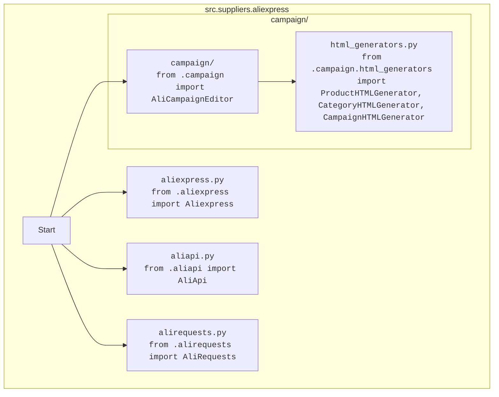

## Анализ кода `hypotez/src/suppliers/aliexpress/__init__.py`

### 1. <алгоритм>

1.  **Импорт модулей:**
    *   Импортируются модули `Aliexpress`, `AliApi`, `AliRequests` из текущего пакета `src.suppliers.aliexpress`.
        *   **Пример:** `from .aliexpress import Aliexpress` - импортирует класс `Aliexpress`, предполагается, что он находится в файле `aliexpress.py` внутри текущего каталога.
    *   Импортируется модуль `AliCampaignEditor` из подпакета `src.suppliers.aliexpress.campaign`.
        *   **Пример:** `from .campaign import AliCampaignEditor` - импортирует класс `AliCampaignEditor`, предполагается, что он находится в файле `campaign.py` внутри подкаталога `campaign`.
    *   Импортируются классы `ProductHTMLGenerator`, `CategoryHTMLGenerator`, `CampaignHTMLGenerator` из модуля `html_generators` в подпакете `src.suppliers.aliexpress.campaign`.
        *    **Пример:** `from .campaign.html_generators import ProductHTMLGenerator` - импортирует класс `ProductHTMLGenerator` из файла `html_generators.py` внутри подкаталога `campaign`.

2.  **Сборка модуля:**
    *  Импортированные классы становятся доступны для использования в других частях проекта, где будет импортирован пакет `src.suppliers.aliexpress`.
    *  Файл `__init__.py` действует как точка входа для пакета, позволяя удобно импортировать все необходимые модули, не обращаясь напрямую к файлам внутри пакета.

### 2. <mermaid>

**Объяснение зависимостей:**

*   Диаграмма представляет пакет `src.suppliers.aliexpress` и его подпакет `campaign`.
*   `Start` - это начало процесса импорта.
*   Стрелки показывают, какие модули и подмодули импортируются:
    *   `AliexpressModule`, `AliApiModule`, `AliRequestsModule` импортируются напрямую из пакета `src.suppliers.aliexpress`.
    *   `CampaignModule` импортируется из подпакета `campaign`.
    *   `HTMLGenerators` импортируется из файла `html_generators.py`, который находится внутри подпакета `campaign`.
*   Таким образом,  `__init__.py` как бы собирает все эти компоненты, делая их доступными при импорте пакета `src.suppliers.aliexpress`.

### 3. <объяснение>

**Импорты:**

*   `from .aliexpress import Aliexpress`: Импортирует класс `Aliexpress` из файла `aliexpress.py`, находящегося в том же каталоге, что и `__init__.py`. Этот класс, вероятно, содержит логику для работы с API Aliexpress.
*   `from .aliapi import AliApi`: Импортирует класс `AliApi` из файла `aliapi.py`, находящегося в том же каталоге. `AliApi` вероятно инкапсулирует взаимодействие с API Aliexpress.
*   `from .alirequests import AliRequests`: Импортирует класс `AliRequests` из файла `alirequests.py`. Скорее всего, этот класс содержит функциональность для отправки HTTP-запросов к API Aliexpress.
*   `from .campaign import AliCampaignEditor`: Импортирует класс `AliCampaignEditor` из файла `campaign.py`, находящегося в подпапке `campaign`. Этот класс, вероятно, предоставляет функционал для редактирования кампаний на Aliexpress.
*  `from .campaign.html_generators import ProductHTMLGenerator, CategoryHTMLGenerator, CampaignHTMLGenerator`: Импортирует классы `ProductHTMLGenerator`, `CategoryHTMLGenerator` и `CampaignHTMLGenerator` из модуля `html_generators.py`, находящегося в подпапке `campaign`. Эти классы предназначены для генерации HTML-контента для продуктов, категорий и кампаний, соответственно.

**Взаимосвязи с другими пакетами `src`:**

*   Этот пакет `src.suppliers.aliexpress` является частью более широкой системы, вероятно, занимающейся работой с поставщиками. Пакет зависит от внутренних модулей  `src`, о чем говорит `from .`.
*   Также, этот пакет, вероятно, использует другие части `src` для работы с HTTP-запросами или настройки, которые предоставляются через `import header`, хоть в этом файле нет явного импорта.

**Классы:**

*   `Aliexpress`:  Предположительно, основной класс, предоставляющий интерфейс для работы с Aliexpress. Может содержать методы для поиска товаров, получения информации и т.д.
*   `AliApi`: Класс, ответственный за взаимодействие с API Aliexpress. Он может обрабатывать запросы, аутентификацию и форматирование ответов.
*   `AliRequests`: Класс, инкапсулирующий отправку HTTP-запросов к API Aliexpress. Может включать логику для обработки ошибок и повторных попыток.
*   `AliCampaignEditor`: Класс для редактирования кампаний на Aliexpress. Включает методы для управления кампаниями, настройками и т.д.
*   `ProductHTMLGenerator`, `CategoryHTMLGenerator`, `CampaignHTMLGenerator`: классы, специализирующиеся на генерации HTML-контента для продуктов, категорий и кампаний соответственно.

**Функции:**

*   В представленном коде нет явно определенных функций, но импортированные классы,  скорее всего, содержат методы, которые выполняют различные функции:
    *  методы для взаимодействия с API
    *  методы для обработки данных
    *  методы для генерации HTML.

**Переменные:**

*   В этом файле переменные не объявлены, поскольку он служит точкой входа для пакета.

**Потенциальные ошибки и области для улучшения:**

*   **Зависимости:** Наличие большого количества классов может привести к сложностям в поддержке и понимании. Возможно, стоит рассмотреть более модульную архитектуру.
*  **Обработка ошибок**: Непонятно как в коде происходит обработка ошибок.
*   **Тестирование**: Без конкретного кода сложно сказать, насколько хорошо покрыта тестами.

**Дополнительно**:

*   Цепочка взаимосвязей: `src.suppliers.aliexpress` - это часть пакета `src.suppliers` который может взаимодействовать с другими поставщиками и другими частями проекта.
*  Улучшение:  Можно было бы добавить логгирование для более удобного отслеживания ошибок.
*  Улучшение:  Стоит написать подробные docstring'и, которые помогут понять что делает каждая функция и класс.