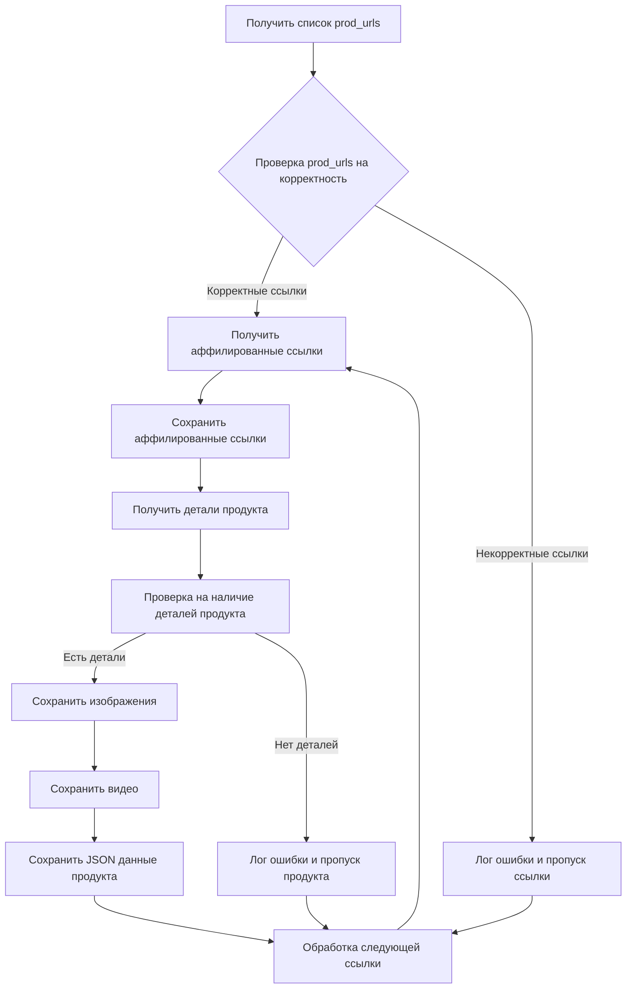
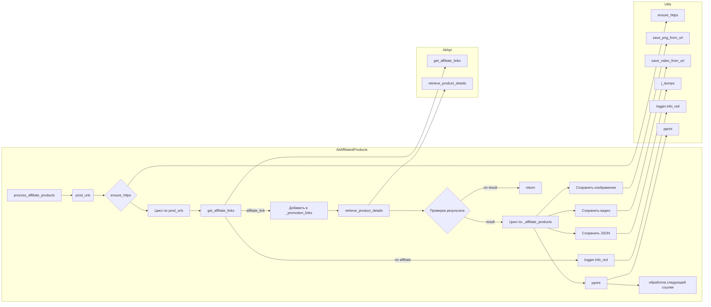

# Анализ кода `affiliated_products_generator.py`

## <input code>

```python
import asyncio
from itertools import count
from math import log
from pathlib import Path
from typing import List, Union, Optional
from types import SimpleNamespace
from urllib.parse import urlparse, parse_qs

from src import gs
from src.suppliers.aliexpress import AliApi
from src.suppliers.aliexpress import Aliexpress
from src.suppliers.aliexpress.affiliate_links_shortener_via_webdriver import AffiliateLinksShortener
from src.suppliers.aliexpress.utils.extract_product_id import extract_prod_ids
from src.suppliers.aliexpress.utils.set_full_https import ensure_https
from src.utils.convertor.csv2json import csv2dict
from src.utils.jjson import j_dumps
from src.utils import save_png_from_url, save_video_from_url
from src.utils.printer import pprint
from src.utils.file import read_text_file, save_text_file

from src.logger import logger
```

```python
class AliAffiliatedProducts(AliApi):
    """ Class to collect full product data from URLs or product IDs
    locator_description For more details on how to create templates for ad campaigns, see the section `Managing Aliexpress Ad Campaigns`
    @code
    # Example usage:
    prod_urls = ['123', '456', ...]
    prod_urls = ['https://www.aliexpress.com/item/123.html', '456', ...]

    parser = AliAffiliatedProducts(
                                campaign_name,
                                campaign_category,
                                language,
                                currency)

    products = parser._affiliate_product(prod_urls)
    @endcode
    """
    campaign_name: str
    campaign_category: Optional[str]
    campaign_path: Path
    language: str
    currency: str

    def __init__(self,
                 campaign_name: str,
                 campaign_category: Optional[str] = None,
                 language: str = 'EN',
                 currency: str = 'USD',
                 *args, **kwargs):
        """
        @param campaign_name `str`: Name of the advertising campaign. The directory with the prepared material is taken by name.
        @param campaign_category `Optional[str]`: Category for the campaign (default None).
        @param language `str`: Language for the campaign (default 'EN').
        @param currency `str`: Currency for the campaign (default 'USD').
        @param tracking_id `str`: Tracking ID for Aliexpress API.
        """
        super().__init__(language, currency)

        self.campaign_name = campaign_name
        self.campaign_category = campaign_category
        self.language = language
        self.currency = currency
        self.locale = f"{self.language}_{self.currency}"
        self.campaign_path = gs.path.google_drive / 'aliexpress' / 'campaigns' / self.campaign_name / 'categories' / self.campaign_category

    def process_affiliate_products(self, prod_urls: List[str]) -> List[SimpleNamespace]:
        # ... (implementation details omitted for brevity)
        pass

    def delete_product(self, product_id: str, exc_info: bool = False):
        # ... (implementation details omitted for brevity)
        pass
```

## <algorithm>

**Описание алгоритма:**

Класс `AliAffiliatedProducts` получает список ссылок на продукты (prod_urls) и обрабатывает каждую ссылку, чтобы извлечь аффилированные ссылки, загрузить изображения и видео, и сохранить данные о продукте в файлы.

**Блок-схема:**



**Пример:**

Если `prod_urls` содержит `['https://example.com/product1', 'https://example.com/product2']`, то алгоритм последовательно обрабатывает каждый URL:

1. Проверяется корректность ссылки `https://example.com/product1`.
2. Извлекается аффилированная ссылка.
3. Извлекаются подробности продукта.
4. Сохраняется изображение продукта.
5. Сохраняется видео продукта (если есть).
6. Сохраняется JSON-представление продукта.
7. Обрабатывается следующая ссылка `https://example.com/product2`.

## <mermaid>



**Объяснение зависимостей:**

Диаграмма показывает взаимодействие между методами `AliAffiliatedProducts`, `AliApi`, и различными вспомогательными функциями (из `src.utils`). `AliAffiliatedProducts` использует `AliApi` для получения аффилированных ссылок и `retrieve_product_details`, а также подключает функции для работы с файлами и логами.

## <explanation>

**Импорты:**

Импортируются необходимые библиотеки Python (например, `asyncio`, `pathlib`, `typing`) и модули из проекта (`src`). Важно, что импортируются классы `AliApi`, `AffiliateLinksShortener`, вспомогательные функции из `src.utils` (для работы с изображениями, видео, файлами, логами). Это указывает на то, что `affiliated_products_generator` использует функциональность других модулей проекта, например, обработку HTTP-запросов, сохранение файлов и т. д.

**Классы:**

- `AliAffiliatedProducts`: наследуется от `AliApi`, предназначен для сбора данных о продуктах с AliExpress. Хранит информацию о кампании (название, категория, язык, валюта).  Имеет метод `process_affiliate_products` для обработки списка ссылок на продукты, а также `delete_product` для удаления продуктов без аффилированных ссылок.

- `AliApi`: базовый класс, вероятно, для работы с API AliExpress (у функции `__init__` есть параметр `tracking_id`).

**Функции:**

- `process_affiliate_products`: обрабатывает список `prod_urls`, получая аффилированные ссылки, данные продукта, сохраняет изображения и видео, и сохраняет данные в JSON файлы.

- `delete_product`: удаляет продукт из списка (вероятно, из файла или базы данных), если у него нет аффилированной ссылки.

**Переменные:**

- `campaign_name`, `campaign_category`, `language`, `currency`:  параметры, определяющие параметры кампании и конфигурацию.
- `prod_urls`: список ссылок на продукты.
- `_promotion_links`, `_prod_urls`: промежуточные списки для хранения полученных аффилированных ссылок и соответствующих им исходных ссылок.

**Возможные ошибки и улучшения:**

- Недостаточно подробной обработки ошибок: есть обработка `FileNotFoundError`, но она не охватывает все возможные исключения (например, проблемы с подключением к интернету, неправильные форматы данных). Необходимо добавить более robust'ную обработку ошибок.
- Отсутствие валидации `prod_urls`: код не проверяет, являются ли переданные `prod_urls` валидными URL или ID.
- Неясно, где происходит инициализация `gs.path`.
- Отсутствие асинхронной обработки. Для большого количества `prod_urls` следует рассмотреть асинхронный подход (`asyncio`).
- Недостаточно подробная документация для методов.
- Не описаны функции, которые вызываются внутри `process_affiliate_products`.


**Цепочка взаимосвязей:**

`AliAffiliatedProducts` использует `AliApi` и другие утилитарные функции из `src.utils`, такие как сохранение изображений, видео и JSON-данных.  Функции из `src.suppliers.aliexpress.utils` предоставляют вспомогательные функции, а также, возможно, средства для работы с API AliExpress.  Взаимодействие с Google Drive происходит через `gs.path`.  Логирование происходит через `src.logger`.