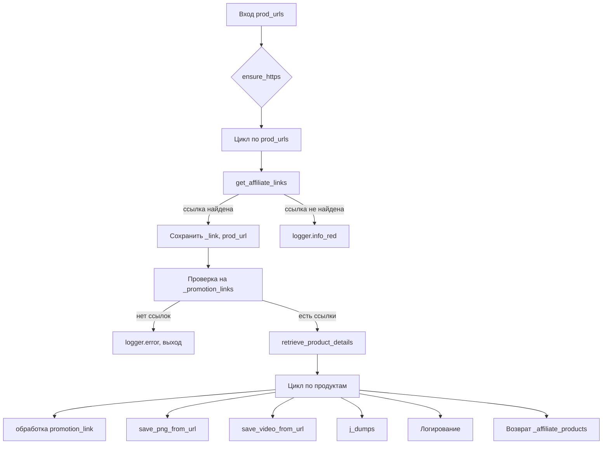

```MD
# Анализ кода `affiliated_products_generator.py`

## <input code>

```python
import asyncio
from itertools import count
from math import log
from pathlib import Path
from typing import List, Union, Optional
from types import SimpleNamespace
from urllib.parse import urlparse, parse_qs

from src import gs
from src.suppliers.aliexpress import AliApi
from src.suppliers.aliexpress import Aliexpress
from src.suppliers.aliexpress.affiliate_links_shortener_via_webdriver import AffiliateLinksShortener
from src.suppliers.aliexpress.utils.extract_product_id import extract_prod_ids
from src.suppliers.aliexpress.utils.set_full_https import ensure_https
from src.utils.convertor.csv2json import csv2dict 
from src.utils.jjson import j_dumps
from src.utils import save_png_from_url, save_video_from_url
from src.utils.printer import pprint 
from src.utils.file import read_text_file, save_text_file

from src.logger import logger
```

```python
class AliAffiliatedProducts(AliApi):
    """ Class to collect full product data from URLs or product IDs
    locator_description For more details on how to create templates for ad campaigns, see the section `Managing Aliexpress Ad Campaigns`
    @code
    # Example usage:
    prod_urls = ['123','456',...]
    prod_urls = ['https://www.aliexpress.com/item/123.html','456',...]

    parser = AliAffiliatedProducts(
                                campaign_name,
                                campaign_category,
                                language,
                                currency)

    products = parser._affiliate_product(prod_urls)
    @endcode
    """
    campaign_name: str
    campaign_category: Optional[str]
    campaign_path: Path
    language: str
    currency: str

    def __init__(self,
             campaign_name: str,
             campaign_category: Optional[str] = None,
             language: str = 'EN',
             currency: str = 'USD',
             *args, **kwargs):
        """
        @param campaign_name `str`: Name of the advertising campaign. The directory with the prepared material is taken by name.
        @param campaign_category `Optional[str]`: Category for the campaign (default None).
        @param language `str`: Language for the campaign (default 'EN').
        @param currency `str`: Currency for the campaign (default 'USD').
        @param tracking_id `str`: Tracking ID for Aliexpress API.
        """
        super().__init__(language, currency)

        self.campaign_name = campaign_name
        self.campaign_category = campaign_category
        self.language = language
        self.currency = currency
        self.locale = f"{self.language}_{self.currency}"
        self.campaign_path = gs.path.google_drive / 'aliexpress' / 'campaigns' / self.campaign_name / 'categories' / self.campaign_category
```

```python
    def process_affiliate_products(self, prod_urls: List[str]) -> List[SimpleNamespace]:
        """
        Processes a list of URLs and returns a list of products with affiliate links and saved images.

        :param prod_urls: List of product URLs or IDs.
        :return: List of processed products.
        """
        # ... (implementation details)
```


## <algorithm>

**Блок-схема (частично, из-за объёма кода):**

1. **Вход:** Список `prod_urls` (URL или ID товаров).
2. **Преобразование:** `ensure_https(prod_urls)` - преобразует список URL к https.
3. **Итерация:** Цикл `for prod_url in promotional_prod_urls`:
   * **Получение ссылки:**  `super().get_affiliate_links(prod_url)` - запрос на получение партнерской ссылки по `prod_url`.
   * **Проверка:** Если ссылка найдена (`if _link:`), сохранение ссылки и `prod_url` в списки.
   * **Логирование:** Если ссылка не найдена, `logger.info_red(...)` - сообщение об отсутствии.
4. **Проверка:** Если нет партнерских ссылок (`if not _promotion_links:`), `logger.error(...)` - ошибка и выход.
5. **Получение данных о товаре:** `self.retrieve_product_details(_prod_urls)` - запрос на данные о товаре по списку URL.
6. **Итерация по результатам:** Цикл `for product, promotion_link in zip(_affiliate_products, _promotion_links)`:
   * **Обработка ссылки:**  Проверка и корректировка  `promotion_link` (если нужно).
   * **Сохранение изображения:** `save_png_from_url(...)` - Сохранение изображения продукта по `product.product_main_image_url` в папку кампании.
   * **Сохранение видео:** `save_video_from_url(...)` (если есть видео).
   * **Сохранение данных:** `j_dumps(product, ...)` - Сохранение JSON данных о товаре в папку кампании.
   * **Логирование:** Логирование успешных и неудачных операций.
7. **Возврат:** Возврат списка обработанных продуктов.

**Пример данных:**

Вход: `prod_urls = ['url1', 'url2', 'url3']`
Выход: Список `SimpleNamespace` объектов с данными о товарах, сохранёнными изображениями и видео.

## <mermaid>




## <explanation>

**Импорты:**

Код импортирует необходимые библиотеки, как стандартные (asyncio, itertools, pathlib, urllib.parse), так и из пользовательских пакетов `src.`:
  * `gs`: Вероятно, содержит константы или функции, связанные с Google Drive.
  * `AliApi`: Базовый класс для работы с Aliexpress API.
  * `Aliexpress`:  Возможно, содержит константы или функции, специфичные для Aliexpress.
  * `AffiliateLinksShortener`: Класс, отвечающий за укорачивание партнерских ссылок.
  * `extract_prod_ids`, `ensure_https`: Вспомогательные функции для работы с идентификаторами и URL.
  * `csv2dict`, `j_dumps`: Для конвертации CSV в JSON и сериализации JSON.
  * `save_png_from_url`, `save_video_from_url`:  Функции для сохранения изображений и видео.
  * `pprint`, `read_text_file`, `save_text_file`: Функции для печати, чтения и записи файлов.
  * `logger`: Модуль для логирования.

**Классы:**

* `AliAffiliatedProducts`: Наследует от `AliApi`.  Предназначен для сбора полных данных о продуктах из Aliexpress API с фокусом на партнерские ссылки.  Имеет атрибуты `campaign_name`, `campaign_category`, `campaign_path`, `language`, `currency` для настройки работы.
* `AliApi`: Базовый класс, скорее всего, содержащий методы для работы с Aliexpress API.  Необходимо контекст.
*  `SimpleNamespace`: Из `types`. Используется для создания простых объектов, что позволяет иметь атрибуты без необходимости создания отдельного класса.

**Функции:**

* `process_affiliate_products`:  Основная функция класса `AliAffiliatedProducts`, обрабатывающая список URL, получающая партнерские ссылки, сохраняющая изображения и видео, а также сохраняет данные в JSON. Возвращает список обработанных продуктов.
* `delete_product`: Функция для удаления продукта из списка, если не найдена партнерская ссылка. Важно обратить внимание на обработку исключений (`FileNotFoundError`).

**Переменные:**

Переменные имеют соответствующие типы (строки, списки, объекты `Path`), необходимые для работы кода.

**Возможные ошибки и улучшения:**

* **Обработка ошибок:**  Хотя есть `try...except` блоки, обработка ошибок, особенно при взаимодействии с внешними сервисами (AliExpress API, загрузка файлов), может быть расширена.  Не хватает информации о возможных HTTP-кодах ошибок и других ошибках.
* **Асинхронность:** Для ускорения процесса обработки большого количества URL'ов, можно использовать асинхронный код (`asyncio`).
* **Универсальность:** Функции для обработки файлов (`read_text_file`, `save_text_file`) могут быть сделаны более общими.
* **Модульность:** Некоторые небольшие функции (например, для преобразования списка в строку) стоит вынести в отдельные модули.


**Взаимосвязи с другими частями проекта:**

Код сильно зависит от других компонентов `src.`, таких как `gs`, `AliApi`, `logger` и `utils`, что говорит о необходимости наличия соответствующих импортов и реализации внутри пакета `src`.