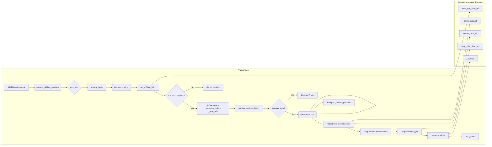

# Анализ кода `affiliated_products_generator.py`

## <input code>

```python
import asyncio
from itertools import count
from math import log
from pathlib import Path
from typing import List, Union, Optional
from types import SimpleNamespace
from urllib.parse import urlparse, parse_qs

from src import gs
from src.suppliers.aliexpress import AliApi
from src.suppliers.aliexpress import Aliexpress
from src.suppliers.aliexpress.affiliate_links_shortener_via_webdriver import AffiliateLinksShortener
from src.suppliers.aliexpress.utils.extract_product_id import extract_prod_ids
from src.suppliers.aliexpress.utils.set_full_https import ensure_https
from src.utils.convertor.csv2json import csv2dict 
from src.utils import j_dumps
from src.utils import save_png_from_url, save_video_from_url
from src.utils import pprint 
from src.utils.file import read_text_file, save_text_file

from src.logger import logger
```

```python
class AliAffiliatedProducts(AliApi):
    """ Class to collect full product data from URLs or product IDs
    locator_description For more details on how to create templates for ad campaigns, see the section `Managing Aliexpress Ad Campaigns`
    @code
    # Example usage:
    prod_urls = ['123','456',...]
    prod_urls = ['https://www.aliexpress.com/item/123.html','456',...]

    parser = AliAffiliatedProducts(
                                campaign_name,
                                campaign_category,
                                language,
                                currency)

    products = parser._affiliate_product(prod_urls)
    @endcode
    """

    campaign_name: str
    campaign_category: Optional[str]
    campaign_path: Path
    language: str
    currency: str

    def __init__(self,
             campaign_name: str,
             campaign_category: Optional[str] = None,
             language: str = 'EN',
             currency: str = 'USD',
             *args, **kwargs):
        """
        @param campaign_name `str`: Name of the advertising campaign. The directory with the prepared material is taken by name.
        @param campaign_category `Optional[str]`: Category for the campaign (default None).
        @param language `str`: Language for the campaign (default 'EN').
        @param currency `str`: Currency for the campaign (default 'USD').
        @param tracking_id `str`: Tracking ID for Aliexpress API.
        """
        super().__init__(language, currency)

        self.campaign_name = campaign_name
        self.campaign_category = campaign_category
        self.language = language
        self.currency = currency
        self.locale = f"{self.language}_{self.currency}"
        self.campaign_path = gs.path.google_drive / 'aliexpress' / 'campaigns' / self.campaign_name / 'categories' / self.campaign_category
```

```python
def process_affiliate_products(self, prod_urls: List[str]) -> List[SimpleNamespace]:
    """
    Processes a list of URLs and returns a list of products with affiliate links and saved images.

    :param prod_urls: List of product URLs or IDs.
    :return: List of processed products.
    """
    ...
```
(и т.д.)


## <algorithm>

Блок-схема алгоритма `process_affiliate_products`:

```mermaid
graph TD
    A[Начало] --> B{prod_urls? Пусто};
    B -- Да --> Z[Возврат None];
    B -- Нет --> C[promotional_prod_urls = ensure_https(prod_urls)];
    C --> D(Цикл по prod_url);
    D --> E[get_affiliate_links(prod_url)];
    E -- _link не пусто? --> F[_link.promotion_link добавление в _promotion_links и _prod_urls];
    E -- _link пусто? --> G[logger.info_red(Ошибка)];
    F --> H{Нет _promotion_links?};
    H -- Да --> I[logger.error(Ошибка)];
    H -- Нет --> J[logger.info_red(Получение деталей)];
    J --> K[retrieve_product_details(_prod_urls)];
    K -- _affiliate_products не пусто? --> L(Цикл по product, promotion_link);
    K -- _affiliate_products пусто? --> M[Возврат None];
    L --> N[Обработка promotion_link];
    N -- affiliate link существует? --> O[product.promotion_link = promotion_link];
    N -- affiliate link не существует? --> P[Обработка aff_short_key];
    P -- aff_short_key есть? --> Q[product.promotion_link = новый URL];
    P -- aff_short_key нет? --> R[delete_product(product.product_id)];
    O --> S[Сохранение изображения];
    S --> T[Сохранение видео (если есть)];
    T --> U[pprint(Успешно)];
    U --> V[j_dumps(product, json-файл)];
    V --> L;
    L --> W[pprint(Количество продуктов)];
    W --> X[Возврат _affiliate_products];
    Z --> X;
    M --> X;
    I --> X;
```

Пример:  `prod_urls = ['url1', 'url2']`.  `ensure_https` преобразует ссылки к формату https. Затем цикл обрабатывает каждую ссылку: `url1` -> `get_affiliate_links` -> ссылка найдена -> `_promotion_links` и `_prod_urls` обновляются -> `retrieve_product_details` -> детали продукта получены и сохранены.  Процесс повторяется для каждой ссылки.


## <mermaid>



**Объяснение зависимостей:** `AliAffiliatedProducts` использует `AliApi`,  `get_affiliate_links` (возможно, из `AliApi` или связанного модуля), `retrieve_product_details` (возможно, из `AliApi` или связанного модуля), и  внешние функции, такие как `save_png_from_url`, `save_video_from_url`, `j_dumps` и т.д., для обработки и сохранения данных.  Модули `src` (и его подпапки) обеспечивают необходимые функциональности для взаимодействия с внешними сервисами, хранения данных и логирования.

## <explanation>

**Импорты:**

* Стандартные библиотеки (`asyncio`, `itertools`, `math`, `pathlib`, `typing`, `types`, `urllib.parse`) обеспечивают основные функциональности, такие как асинхронная обработка, итераторы, математические функции, работу с путями, типизацию, имена, парсинг URL.
* `src` – импортируется сам, содержит собственные модули и пакеты. `gs`, `AliApi`, `Aliexpress`, `AffiliateLinksShortener`, `extract_prod_ids`, `ensure_https`, `csv2dict`, `j_dumps`, `save_png_from_url`, `save_video_from_url`, `pprint`, `read_text_file`, `save_text_file`, `logger` –  предполагаются как части собственной инфраструктуры приложения, содержащие необходимые функции для работы с Google Drive, AliExpress API, обработкой ссылок, сохранением данных, вывода информации и логированием.  Детали взаимосвязей между ними определяются кодом в этих модулях.

**Классы:**

* `AliAffiliatedProducts`: Наследуется от `AliApi`,  используется для получения полной информации о продуктах с AliExpress Affiliate API.  Атрибуты хранят данные о кампании (название, категория, язык, валюта) и путь к каталогу для сохранения данных о продуктах.  Метод `process_affiliate_products` является ключевым для обработки списка URL или ID продуктов и сохранения данных.
* `AliApi`:  Базовый класс, необходимый `AliAffiliatedProducts` для использования API.  Конструктор принимает язык и валюту для запросов к API.  Методы  `get_affiliate_links` и `retrieve_product_details` предполагаются в  `AliApi` или связанном модуле.


**Функции:**

* `process_affiliate_products`: Обрабатывает список URL или ID продуктов, получает аффилированные ссылки, извлекает данные о продукте, сохраняет изображения и видео в файлы и записывает данные в JSON.  Возвращает список `SimpleNamespace` объектов с данными о продуктах.
* `get_affiliate_links`:  Получает аффилированные ссылки для заданного URL (из `AliApi`?).
* `retrieve_product_details`: Получает детальную информацию о продукте по URL или ID.
* `save_png_from_url`, `save_video_from_url`: Сохраняют изображения и видео из URL в файлы на диск.
* `j_dumps`: Предположительно, функция для сериализации Python объекта в JSON (из `src.utils`).
* `delete_product`: Удаляет продукт из базы данных (предположительно).

**Переменные:**

* `prod_urls`: Список URL или ID продуктов.
* `_promotion_links`, `_prod_urls`: Временные списки для хранения полученных аффилированных ссылок и соответствующих им URL.
* `product`: `SimpleNamespace` объект, содержащий информацию о продукте.
* `campaign_path`: Директория для сохранения информации о продуктах.

**Возможные ошибки и улучшения:**

* **Недостаточное или нечеткое описание:** Неясно, как работает `delete_product`. Нужно дополнить документацию.
* **Обработка исключений:** Необходимо добавить более полную обработку исключений (например, `FileNotFoundError`) для устойчивости кода.
* **Асинхронность:** При большом объёме данных для повышения производительности можно использовать asyncio.
* **Проверка валидности данных:**  Нужно добавить проверки для уверенности в корректности полученных данных (например, проверка существования URL, проверка кода состояния HTTP-запросов и т.д.).
* **Документация:** Документировать все функции и классы более подробно, включая подробности о взаимодействии.
* **Логирование:** Больше контекстной информации в логах для лучшего отслеживания проблем.
* **Повторное использование кода:** Функции обработки изображений и видео могли бы быть выделены в отдельные функции.

**Взаимосвязи с другими частями проекта:**

Код тесно связан с `AliApi` для взаимодействия с API AliExpress, с модулями сохранения данных, логирования и управления файлами в Google Drive.  Логирование (`logger`) демонстрирует связь с системной функциональностью отслеживания ошибок и событий.