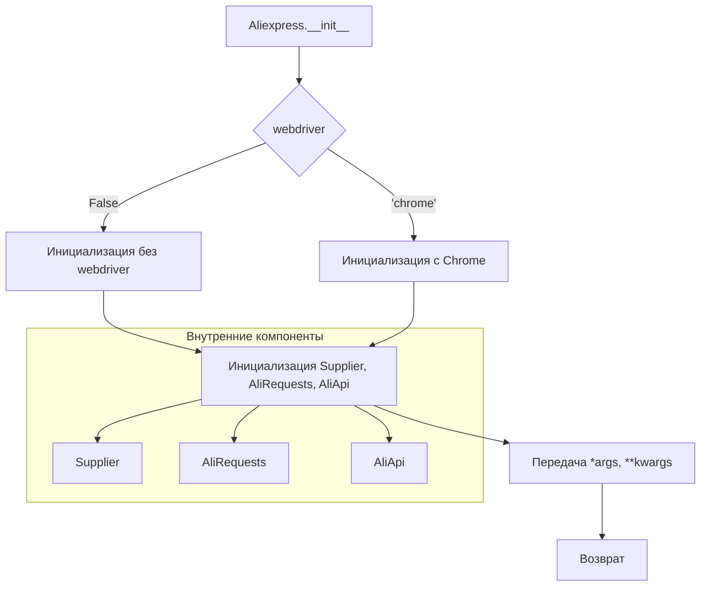

```MD
# Анализ кода модуля aliexpress

## <input code>

```rst
.. module::  src.suppliers.aliexpress
```

```
# Модуль Aliexpress

## Обзор

Модуль `aliexpress` предоставляет класс `Aliexpress`, который интегрирует функциональность из классов `Supplier`, `AliRequests` и `AliApi` для работы с AliExpress. Он предназначен для выполнения задач, связанных с парсингом и взаимодействием с API AliExpress.

## Оглавление

- [Модуль Aliexpress](#модуль-aliexpress)
- [Класс Aliexpress](#класс-aliexpress)
  - [Метод __init__](#метод-__init__)

## Класс Aliexpress

### `Aliexpress`

**Описание**: Базовый класс для работы с AliExpress. Объединяет возможности классов `Supplier`, `AliRequests` и `AliApi` для удобного взаимодействия с AliExpress.

**Примеры использования**:

```python
# Запуск без вебдрайвера
a = Aliexpress()

# Вебдрайвер Chrome
a = Aliexpress('chrome')

# Режим Requests
a = Aliexpress(requests=True)
```

### Метод `__init__`

**Описание**: Инициализирует класс `Aliexpress`.

**Параметры**:

- `webdriver` (bool | str, optional): Определяет режим использования вебдрайвера. Возможные значения:
  - `False` (по умолчанию): Без вебдрайвера.
  - `'chrome'`: Вебдрайвер Chrome.
  - `'mozilla'`: Вебдрайвер Mozilla.
  - `'edge'`: Вебдрайвер Edge.
  - `'default'`: Системный вебдрайвер по умолчанию.
- `locale` (str | dict, optional): Настройки языка и валюты. По умолчанию `{'EN': 'USD'}`.
- `*args`: Дополнительные позиционные аргументы.
- `**kwargs`: Дополнительные именованные аргументы.

**Примеры**:

```python
# Запуск без вебдрайвера
a = Aliexpress()

# Вебдрайвер Chrome
a = Aliexpress('chrome')
```

**Возвращает**:
- Не возвращает значения.

**Вызывает исключения**:
- Возможны исключения, связанные с инициализацией вебдрайвера или ошибки при взаимодействии с AliExpress.

# <алгоритм>

Алгоритм работы `__init__` класса `Aliexpress`:

1. Принимает опциональные аргументы `webdriver`, `locale`, `*args`, `**kwargs`.

2. **Обработка webdriver**: Определяет, использовать ли вебдрайвер.
   - Если `webdriver` — `'chrome'`, `'mozilla'`, `'edge'` или `'default'`, выбирается соответствующий вебдрайвер.
   - Если `webdriver` равно `False`, вебдрайвер не используется.

3. **Настройка Locale**:
   - Если `locale` передан, он используется.
   - В противном случае используется локаль по умолчанию `{'EN': 'USD'}`.

4. **Инициализация внутренних компонентов**: Создаются экземпляры `Supplier`, `AliRequests`, `AliApi`.  Этот шаг подразумевает  инициализацию необходимых ресурсов для работы (соединения с базой данных, установку параметров, etc.).

5. **Передача параметров**: Передаёт аргументы `*args` и `**kwargs` созданным экземплярам `Supplier`, `AliRequests` и `AliApi`.


## <mermaid>



**Объяснение диаграммы:**

Диаграмма описывает процесс инициализации класса `Aliexpress`.  Она показывает, как на основе значения `webdriver` выбирается тип инициализации (с вебдрайвером или без), а затем создаются и инициализируются экземпляры классов `Supplier`, `AliRequests`, `AliApi`.  Наконец, аргументы `*args` и `**kwargs` передаются внутренним компонентам, и метод возвращает значение.


## <explanation>

**Импорты**: Отсутствуют явные импорты в представленном коде.  `.. module:: src.suppliers.aliexpress` указывает на то, что данный код является частью модуля `src.suppliers.aliexpress` внутри более крупного проекта.

**Классы**:
- **`Aliexpress`**:  Основной класс для работы с AliExpress.  Он объединяет функциональность `Supplier`, `AliRequests`, и `AliApi` в единый интерфейс.  Инициализация производится в методе `__init__`.

**Функции**:
- **`__init__`**:  Инициализирует экземпляр `Aliexpress`.  Ключевой функцией является определение поведения (`webdriver`, `locale`) и создание необходимых подключаемых классов.

**Переменные**:
- `webdriver`: Определяет, будет ли использоваться вебдрайвер для работы с AliExpress. Это строка, определяющая тип вебдрайвера или `False`, если вебдрайвер не нужен.
- `locale`: Хранит настройки языка и валюты.


**Возможные ошибки/улучшения**:

- **Обработка ошибок**:  Не описана обработка исключений при инициализации вебдрайвера или других ошибок во время взаимодействия с AliExpress. Необходимо добавить `try...except` блоки для перехвата и обработки ошибок.
- **Логирование**:  Введение логирования поможет отследить ход выполнения, особенно в случае возникновения проблем.
- **Дополнение документации**: Необходимо дополнить документацию деталями о классах `Supplier`, `AliRequests`, `AliApi`. Необходимо четко описать их функциональность, взаимодействие и зависимости.

**Связь с другими компонентами проекта**:
- Модуль `aliexpress` зависит от классов `Supplier`, `AliRequests`, и `AliApi`.  Они, вероятно, находятся в других модулях (`src.suppliers`, или `src.utils`, etc.) этого проекта.   Это указывает на то, что проект имеет модульную архитектуру и разделение ответственности.

**Дальнейшие шаги**:
Необходим анализ кода файлов `Supplier`, `AliRequests`, `AliApi` для полного понимания работы модуля `aliexpress`.  Следует найти их определения.  Без этих данных сложно делать выводы о полной функциональности и связях с другими частями проекта.