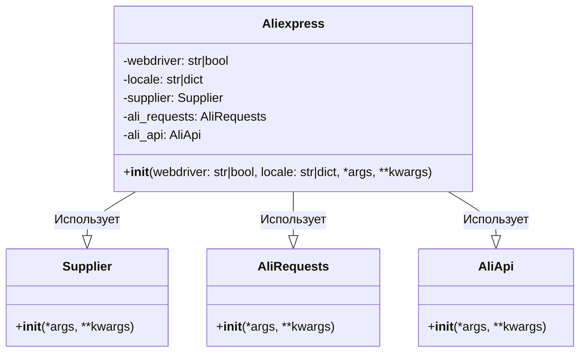

# Анализ кода модуля `aliexpress`

## <алгоритм>

### Шаги алгоритма:

1.  **Инициализация**:
    *   **Входные данные**: Опциональные параметры `webdriver` (тип браузера или `False`), `locale` (словарь или строка), `*args`, `**kwargs`.
    *   **Пример**:
        *   `a = Aliexpress()` - без веб-драйвера, локаль по умолчанию.
        *   `a = Aliexpress('chrome', locale={'RU':'RUB'})` - с Chrome, локаль RU/RUB
        *   `a = Aliexpress(requests=True)` - с Requests, локаль по умолчанию.
        
2.  **Определение режима WebDriver**:
    *   **Условие**: Проверка значения параметра `webdriver`.
    *   **Примеры**:
        *   `webdriver == 'chrome'` - использование веб-драйвера Chrome.
        *    `webdriver == 'mozilla'` - использование веб-драйвера Mozilla.
        *   `webdriver == 'edge'` - использование веб-драйвера Edge.
        *   `webdriver == 'default'` - использование системного веб-драйвера.
        *   `webdriver == False` - веб-драйвер не используется (используется `requests`).
        
3.  **Настройка Locale**:
    *   **Условие**: Проверка наличия и типа параметра `locale`.
    *   **Примеры**:
        *    `locale = {'EN': 'USD'}` - установка английского языка и доллара США.
        *   `locale = 'RU'` - установка русского языка (валюта по умолчанию или указанная).
        *    `locale` не передан - использование локали по умолчанию {'EN': 'USD'}.
        
4.  **Инициализация компонентов**:
    *   **Действие**: Создание экземпляров классов `Supplier`, `AliRequests` и `AliApi`.
    *   **Пример**:
        *   `self.supplier = Supplier(...)` - создание объекта Supplier.
        *    `self.ali_requests = AliRequests(...)` - создание объекта AliRequests.
        *   `self.ali_api = AliApi(...)` - создание объекта AliApi.
    
5. **Передача аргументов**:
    *   **Действие**: Передача `*args` и `**kwargs` в инициализированные компоненты (`Supplier`, `AliRequests`, `AliApi`).
    *   **Пример**: `self.supplier = Supplier(*args, **kwargs)`

### Поток данных:

```mermaid
graph LR
    A[Начало: Инициализация Aliexpress] --> B{Проверка webdriver};
    B -- chrome/mozilla/edge/default --> C[Инициализация Webdriver];
    B -- False --> D[Без Webdriver];
    C --> E{Проверка locale};
    D --> E;
    E -- locale передан --> F[Установка locale];
    E -- locale не передан --> G[locale по умолчанию {'EN': 'USD'}];
    F --> H[Инициализация Supplier, AliRequests, AliApi];
    G --> H;
    H --> I[Передача *args, **kwargs в компоненты];
    I --> J[Конец: Aliexpress инициализирован];
```

## <mermaid>



### Объяснение зависимостей в `mermaid` диаграмме:

*   **`Aliexpress`**:
    *   Это основной класс модуля `aliexpress`.
    *   Имеет атрибуты: `webdriver` (определяет, используется ли веб-драйвер и какой), `locale` (словарь или строка с настройками языка/валюты) и экземпляры `Supplier`, `AliRequests` и `AliApi`.
    *   Имеет метод `__init__` для инициализации.
*   **`Supplier`**:
    *   Класс, представляющий поставщика (в данном случае, AliExpress).
    *   Имеет метод `__init__`, который может принимать произвольные аргументы `*args` и `**kwargs` для настройки.
*   **`AliRequests`**:
    *   Класс, отвечающий за отправку запросов к API AliExpress.
    *   Имеет метод `__init__` для инициализации.
*   **`AliApi`**:
     *   Класс, обеспечивающий взаимодействие с API AliExpress.
     *    Имеет метод `__init__` для инициализации.

*   **Связи**:
    *   `Aliexpress` **использует** `Supplier`, `AliRequests` и `AliApi`. Это показано стрелками с ромбом (агрегация), указывая на то, что `Aliexpress` включает в себя экземпляры этих классов.

## <объяснение>

### Импорты:

*   `.. module:: src.suppliers.aliexpress`
    *   Это директива reStructuredText, которая указывает, что этот документ относится к модулю `src.suppliers.aliexpress` внутри проекта.
    *   Прямые импорты не видны в предоставленном фрагменте, но подразумевается, что `Supplier`, `AliRequests` и `AliApi` импортируются из соответствующих мест в проекте `src`.
    *   Эти импорты обеспечивают доступ к классам, необходимым для работы с AliExpress.

### Классы:

*   **`Aliexpress`**:
    *   **Роль**: Основной интерфейс для работы с AliExpress. Он координирует работу `Supplier`, `AliRequests` и `AliApi`, упрощая использование функциональности.
    *   **Атрибуты**:
        *   `webdriver` (str | bool): Определяет использование веб-драйвера. Может быть `False` (без веб-драйвера) или строкой (`'chrome'`, `'mozilla'`, `'edge'`, `'default'`) для выбора типа веб-драйвера.
        *   `locale` (str | dict): Настройки языка и валюты.
        *   `supplier` (Supplier): Экземпляр класса `Supplier`.
        *   `ali_requests` (AliRequests): Экземпляр класса `AliRequests`.
        *    `ali_api` (AliApi): Экземпляр класса `AliApi`.
    *   **Методы**:
        *   `__init__(self, webdriver=False, locale={'EN': 'USD'}, *args, **kwargs)`: Конструктор класса, который инициализирует атрибуты, создаёт экземпляры `Supplier`, `AliRequests` и `AliApi` и передает в них дополнительные аргументы.
    *   **Взаимодействие**:
        *   Класс `Aliexpress` является точкой входа для взаимодействия с AliExpress. Он использует классы `Supplier`, `AliRequests` и `AliApi` для выполнения конкретных задач.

### Функции:

*   **`__init__(self, webdriver=False, locale={'EN': 'USD'}, *args, **kwargs)`**:
    *   **Аргументы**:
        *   `webdriver` (bool | str, optional): Управляет использованием веб-драйвера. По умолчанию `False` (без веб-драйвера).
        *   `locale` (str | dict, optional): Настройки локали. По умолчанию `{'EN': 'USD'}`.
        *   `*args`: Произвольные позиционные аргументы.
        *   `**kwargs`: Произвольные именованные аргументы.
    *   **Возвращаемое значение**: Ничего не возвращает (`None`).
    *   **Назначение**: Инициализация экземпляра класса `Aliexpress`, настройка веб-драйвера, локали и внутренних компонентов.
    *   **Примеры**:
        *   `a = Aliexpress()`: Инициализация без веб-драйвера, локаль по умолчанию.
        *   `a = Aliexpress('chrome', locale={'RU': 'RUB'})`: Инициализация с веб-драйвером Chrome и локалью RU/RUB.
        *    `a = Aliexpress(requests=True)`: Инициализация с Requests, без веб-драйвера, локаль по умолчанию.
   
### Переменные:

*   `webdriver`:
    *   **Тип**: `bool` или `str`.
    *   **Использование**: Определяет, как будут выполняться запросы к AliExpress (через веб-драйвер или напрямую).
*    `locale`:
    *   **Тип**: `str` или `dict`.
    *   **Использование**: Определяет настройки языка и валюты для работы с AliExpress.

### Потенциальные ошибки/улучшения:

*   **Обработка ошибок**:
    *   Хотя упоминаются возможные исключения, нет явной обработки ошибок. Необходимо добавить `try-except` блоки для перехвата и обработки исключений.
    *   Стоит реализовать логирование ошибок для облегчения отладки.
*   **Абстракция**:
    *   Можно создать отдельные методы для инициализации каждого компонента (`Supplier`, `AliRequests`, `AliApi`) для более модульного кода.
*   **Логирование**:
    *   Добавление подробного логирования при инициализации и использовании каждого компонента может упростить отладку.

### Связь с другими компонентами проекта:

*   Этот модуль (`aliexpress`) является частью более крупного проекта и зависит от:
    *   `src.suppliers.Supplier`: Для общих функций поставщика.
    *   `src.suppliers.aliexpress.AliRequests`: Для отправки запросов к API AliExpress.
    *   `src.suppliers.aliexpress.AliApi`: Для работы с API AliExpress.
    *   `webdriver` (если используется): Для управления браузером, если необходимо (зависимость от соответствующего пакета).

Этот анализ обеспечивает детальное понимание кода и его роли в проекте, включая потенциальные проблемы и области для улучшения.