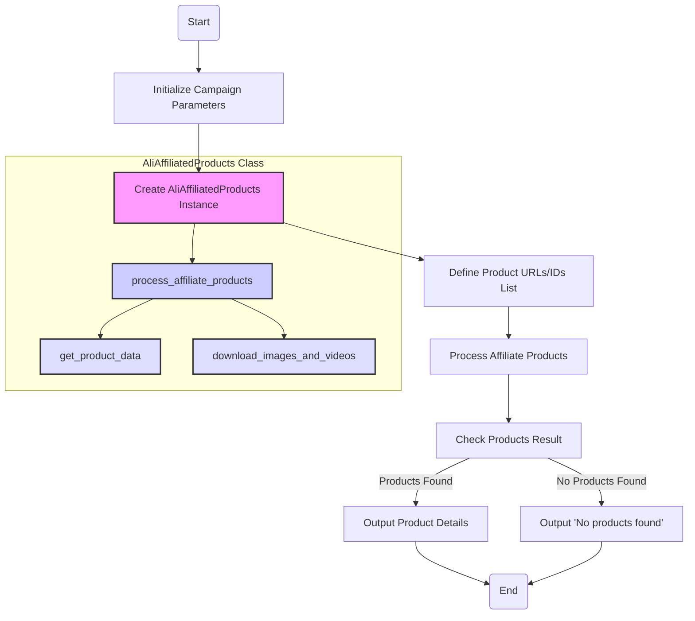

## <алгоритм>

1. **Начало**: Запускается функция `main()`.
2. **Инициализация параметров**:
    - Задаются параметры рекламной кампании: `campaign_name` (например, "summer_sale_2024"), `campaign_category` (например, "electronics"), `language` ("EN"), `currency` ("USD").
    - Создается экземпляр класса `AliAffiliatedProducts` с этими параметрами.
    
   *Пример:*
        ```python
        campaign_name = "summer_sale_2024"
        campaign_category = "electronics"
        language = "EN"
        currency = "USD"
        parser = AliAffiliatedProducts(campaign_name, campaign_category, language, currency)
        ```

3. **Определение списка продуктов**:
    - Создается список `prod_urls`, содержащий идентификаторы продуктов и URL-адреса.
    
   *Пример:*
        ```python
        prod_urls = [
            '123',
            'https://www.aliexpress.com/item/123.html',
            '456',
            'https://www.aliexpress.com/item/456.html',
        ]
        ```
   
4. **Обработка продуктов**:
    - Вызывается метод `process_affiliate_products` у экземпляра `AliAffiliatedProducts` с передачей списка `prod_urls`.
    - Метод `process_affiliate_products` обрабатывает каждый URL или ID, извлекает данные продукта, включая партнерские ссылки, загружает изображения и видео.

   *Пример:*
   ```python
    products = parser.process_affiliate_products(prod_urls)
    ```

5. **Проверка результатов**:
    - Проверяется, вернул ли метод `process_affiliate_products` список продуктов (т.е. не пустой ли он).
    - Если список не пуст, выводится количество обработанных продуктов.
    - Для каждого продукта в списке:
        - Выводится ID продукта, партнерская ссылка, локальный путь к сохраненному изображению.
        - Если есть локальный путь к сохраненному видео, то он тоже выводится.
    - Если список пуст, выводится сообщение "No affiliate products found."
   *Пример:*
    ```python
    if products:
        print(f"Received {len(products)} affiliate products.")
        for product in products:
            print(f"Product ID: {product.product_id}")
            print(f"Affiliate Link: {product.promotion_link}")
            print(f"Local Image Path: {product.local_saved_image}")
            if product.local_saved_video:
                print(f"Local Video Path: {product.local_saved_video}")
            print()
    else:
        print("No affiliate products found.")
    ```

6. **Завершение**: Функция `main()` завершает работу.

## <mermaid>


**Объяснение зависимостей `mermaid`:**

1.  **Start**: Начало выполнения программы.
2.  **Initialize Campaign Parameters**: Инициализация параметров рекламной кампании, таких как `campaign_name`, `campaign_category`, `language` и `currency`. Эти параметры используются для настройки объекта `AliAffiliatedProducts`.
3.  **Create AliAffiliatedProducts Instance**: Создание экземпляра класса `AliAffiliatedProducts` с заданными параметрами.
4. **Define Product URLs/IDs List**: Создание списка `prod_urls`, который содержит идентификаторы продуктов и/или URL-адреса.
5.  **Process Affiliate Products**: Вызов метода `process_affiliate_products` объекта `AliAffiliatedProducts` для обработки списка продуктов, получения партнерских ссылок, загрузки изображений и видео.
6.  **Check Products Result**: Проверка, были ли найдены и обработаны какие-либо продукты.
7.  **Output Product Details**: Вывод деталей каждого обработанного продукта, включая ID, партнерскую ссылку, пути к локально сохраненным изображениям и видео.
8.  **Output 'No products found'**: Вывод сообщения о том, что не было найдено ни одного продукта.
9.  **End**: Завершение выполнения программы.

**Внутри класса AliAffiliatedProducts:**
    - **`process_affiliate_products`**: основной метод для обработки списка товаров.
    - **`get_product_data`**: метод для получения данных о товаре с использованием API
    - **`download_images_and_videos`**: метод для загрузки изображений и видео

**Зависимости:**
Диаграмма показывает, как данные передаются между разными блоками и какие основные функции используются внутри класса `AliAffiliatedProducts`. 
В целом диаграмма демонстрирует последовательность действий, начиная от инициализации параметров до обработки результатов.

## <объяснение>

### Импорты:
- `from src.suppliers.aliexpress.affiliated_products_generator import AliAffiliatedProducts`: Импортирует класс `AliAffiliatedProducts` из модуля `affiliated_products_generator.py`, расположенного в каталоге `src/suppliers/aliexpress`. Это основной класс, который используется для обработки аффилированных продуктов AliExpress.

### Классы:
-   `AliAffiliatedProducts`:
    -   **Роль**: Класс предназначен для обработки списка продуктов, получения партнерских ссылок и загрузки связанных с ними изображений и видео.
    -   **Атрибуты**: Класс имеет атрибуты для хранения параметров рекламной кампании (`campaign_name`, `campaign_category`, `language`, `currency`). Эти атрибуты устанавливаются при создании экземпляра класса.
    -   **Методы**:
        -   `__init__(self, campaign_name, campaign_category, language, currency)`: Конструктор класса, который инициализирует атрибуты объекта.
        -   `process_affiliate_products(self, product_urls)`: Метод, который принимает список URL-адресов или идентификаторов продуктов, обрабатывает их, получает партнерские ссылки и скачивает изображения/видео. Метод возвращает список объектов, представляющих обработанные продукты.
        - Дополнительные методы которые вызываются в `process_affiliate_products` - `get_product_data` и `download_images_and_videos`.

### Функции:
-   `main()`:
    -   **Аргументы**: Нет.
    -   **Возвращаемое значение**: Нет.
    -   **Назначение**: Главная функция, которая демонстрирует, как использовать класс `AliAffiliatedProducts`. Функция создает экземпляр класса, задает список URL-адресов продуктов, обрабатывает их и выводит результаты.
- Дополнительно в коде используются методы класса `AliAffiliatedProducts`:`process_affiliate_products`, `get_product_data` и `download_images_and_videos`.

### Переменные:
-   `campaign_name` (str): Название рекламной кампании.
-   `campaign_category` (str): Категория товаров для кампании (может быть `None`).
-   `language` (str): Язык для рекламной кампании.
-   `currency` (str): Валюта для рекламной кампании.
-   `parser` (AliAffiliatedProducts): Экземпляр класса `AliAffiliatedProducts`.
-   `prod_urls` (list): Список строк, представляющих URL-адреса или идентификаторы продуктов.
-   `products` (list): Список объектов, представляющих обработанные продукты, полученный из `process_affiliate_products`.
-   `product` (object): Переменная, используемая в цикле для итерации по списку обработанных продуктов,  атрибуты: `product_id`, `promotion_link`, `local_saved_image`, `local_saved_video`.

### Потенциальные ошибки и области для улучшения:

1.  **Обработка ошибок**: Код не содержит явной обработки ошибок, таких как неправильные URL-адреса продуктов, ошибки сети, ошибки при загрузке медиафайлов и т.д. Было бы полезно добавить блоки try-except для обработки таких ситуаций.
2.  **Логирование**:  Отсутствует логирование действий. Добавление логирования помогло бы отслеживать ошибки и ход выполнения программы.
3. **Валидация данных**: Отсутствует валидация входных данных (например `prod_urls`), что может привести к сбоям.
4. **Асинхронность**: Загрузка изображений и видео может занять много времени, что сделает программу медленной. Использование асинхронного кода для этих операций могло бы повысить производительность.

### Взаимосвязь с другими частями проекта:

-   Этот модуль (`affiliated_products_generator.py`) предназначен для работы с API AliExpress, поэтому он зависит от библиотек или модулей, которые обеспечивают HTTP-запросы.
-   Загруженные изображения и видео сохраняются локально, вероятно, для дальнейшего использования в рекламных материалах.
-  Класс `AliAffiliatedProducts` использует общие настройки проекта `src.gs`, которые не были представлены в этом коде.
-  Цепочка зависимостей: `example_usage.py` -> `AliAffiliatedProducts` ->  модули для  API запросов и обработки данных(не отображенные в коде).

В целом, этот код представляет собой хороший пример использования класса `AliAffiliatedProducts` для получения партнерских ссылок и связанных с ними медиафайлов. Добавление обработки ошибок, логирования и асинхронности улучшит надежность и производительность.