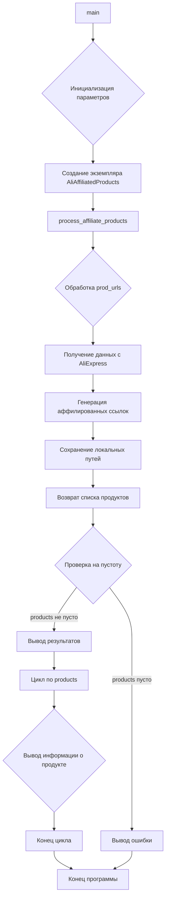

```MD
# <input code>

```python
## \file hypotez/src/suppliers/aliexpress/_examples/affiliated_products_generator.py
# -*- coding: utf-8 -*-\
#! venv/Scripts/python.exe
#! venv/bin/python/python3.12

"""
.. module: src.suppliers.aliexpress._examples 
	:platform: Windows, Unix
	:synopsis:

"""
MODE = 'dev'


"""
	:platform: Windows, Unix
	:synopsis:

"""


"""
	:platform: Windows, Unix
	:synopsis:

"""


"""
  :platform: Windows, Unix

"""
"""
  :platform: Windows, Unix
  :platform: Windows, Unix
  :synopsis:
"""MODE = 'dev'
  
""" module: src.suppliers.aliexpress._examples """


# пример_использования.py

from src.suppliers.aliexpress.affiliated_products_generator import AliAffiliatedProducts

def main():
    # Задайте параметры рекламной кампании
    campaign_name = "summer_sale_2024"
    campaign_category = "electronics"  # Можно задать None, если категория не нужна
    language = "EN"  # Язык для кампании
    currency = "USD"  # Валюта для кампании

    # Создайте экземпляр класса AliAffiliatedProducts
    parser = AliAffiliatedProducts(
        campaign_name,
        campaign_category,
        language,
        currency
    )

    # Пример URL продуктов или их ID
    prod_urls = [
        '123',
        'https://www.aliexpress.com/item/123.html',
        '456',
        'https://www.aliexpress.com/item/456.html',
    ]

    # Обработайте продукты и получите список продуктов с аффилированными ссылками
    products = parser.process_affiliate_products(prod_urls)

    # Проверьте результаты
    if products:
        print(f"Получено {len(products)} аффилированных продуктов.")
        for product in products:
            print(f"Продукт ID: {product.product_id}")
            print(f"Аффилированная ссылка: {product.promotion_link}")
            print(f"Локальный путь к изображению: {product.local_saved_image}")
            if product.local_saved_video:
                print(f"Локальный путь к видео: {product.local_saved_video}")
            print()
    else:
        print("Не удалось получить аффилированные продукты.")

if __name__ == "__main__":
    main()
```

# <algorithm>

Алгоритм работы кода:

1. **Инициализация:**
   - Определяются параметры рекламной кампании (campaign_name, campaign_category, language, currency).
   - Создается экземпляр класса `AliAffiliatedProducts`, принимающий параметры кампании.
   - Создается список `prod_urls` с URL или ID продуктов.
2. **Обработка продуктов:**
   - Метод `process_affiliate_products` (предполагается в классе `AliAffiliatedProducts`) обрабатывает список `prod_urls`.  В методе предполагается:
     - Получение данных о продуктах с AliExpress (по URL или ID).
     - Генерация аффилированных ссылок.
     - Сохранение локальных путей к изображениям и видео.
     - Возврат списка объектов `Product`.
3. **Вывод результатов:**
   - Если список `products` не пуст:
     - Выводятся сообщения об успешном получении продуктов.
     - Для каждого продукта выводится его ID, аффилированная ссылка, локальный путь к изображению и видео (если присутствует).
   - В противном случае выводится сообщение об ошибке.

**Пример данных:**

Входные данные: `prod_urls` = `['123', 'https://www.aliexpress.com/item/123.html', '456', 'https://www.aliexpress.com/item/456.html']`.
Выходные данные: Список `products` с объектами `Product`, содержащими аффилированные ссылки, пути к изображениям и видео.

# <mermaid>



**Объяснение зависимостей (из диаграммы):**

* `main` - функция, вызывающая `AliAffiliatedProducts.process_affiliate_products`.
* `AliAffiliatedProducts` - класс, содержащий `process_affiliate_products` для обработки URL продуктов.
* `process_affiliate_products` - метод класса, который взаимодействует с внешними источниками данных AliExpress для получения аффилированных ссылок.


# <explanation>

**Импорты:**

```python
from src.suppliers.aliexpress.affiliated_products_generator import AliAffiliatedProducts
```

Импортирует класс `AliAffiliatedProducts` из модуля `affiliated_products_generator` внутри пакета `aliexpress` из подпакета `suppliers` в проекте `src`.  Это указывает на структуру проекта, где `src` - корневая папка, содержащая подпапки `suppliers`, `aliexpress` и т.д.

**Классы:**

* **`AliAffiliatedProducts`:**  Предполагается, что этот класс содержит методы для взаимодействия с API AliExpress, генерации аффилированных ссылок, сохранения локальных изображений и видео. Атрибуты (campaign_name, campaign_category, language, currency) хранят параметры кампании.

**Функции:**

* **`main()`:**  Основная функция программы. Она инициализирует параметры кампании, создает экземпляр класса `AliAffiliatedProducts`, вызывает метод `process_affiliate_products`, а затем обрабатывает результат и выводит информацию.

**Переменные:**

* `campaign_name`, `campaign_category`, `language`, `currency`: Строковые переменные, хранящие параметры рекламной кампании.
* `prod_urls`: Список строк, содержащих URL или ID продуктов.
* `products`: Список объектов `Product` (предполагаемый тип), содержащих информацию об обработанных продуктах.

**Возможные ошибки и улучшения:**

* **Отсутствует реализация класса `AliAffiliatedProducts` и метода `process_affiliate_products`:** Код не содержит реализации класса `AliAffiliatedProducts` или метода `process_affiliate_products`. Это означает, что код неполный и не будет выполняться без дополнительной реализации этих элементов.
* **Обработка ошибок:** Необходимо добавить обработку ошибок, чтобы код не выходил из строя при проблемах с подключением к API AliExpress, некорректных URL или другими ошибками.
* **Логирование:** Для отладки и мониторинга процесса следует добавить логирование, чтобы отслеживать этапы выполнения.
* **Тестирование:** Код должен быть протестирован, чтобы проверить его правильную работу с разными наборами данных и различных сценариев.
* **Управление ресурсами:** Необходимо явно освобождать ресурсы, если используются внешние библиотеки или API.

**Цепочка взаимосвязей:**

Код является частью более крупной системы, предполагающей использование API AliExpress для генерации аффилированных ссылок,  возможно, для целей маркетинга.  Другие части системы могут включать в себя хранение данных о продуктах, системы управления кампаниями и отчетности.  Анализ всей системы потребует дополнительного контекста.