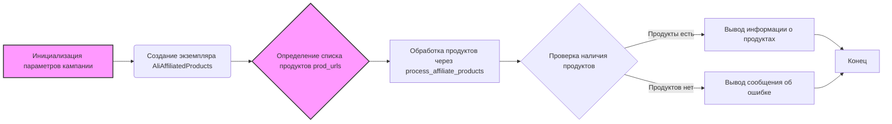

## Анализ кода `affiliated_products_generator.ru.md`

### <алгоритм>

1. **Инициализация параметров кампании:**
   - Задаются параметры рекламной кампании: `campaign_name` (название кампании, например, "summer_sale_2024"), `campaign_category` (категория, например, "electronics"), `language` (язык, например, "EN") и `currency` (валюта, например, "USD").
   - Пример: `campaign_name = "summer_sale_2024"`, `campaign_category = "electronics"`, `language = "EN"`, `currency = "USD"`

2. **Создание экземпляра `AliAffiliatedProducts`:**
   - Создается объект класса `AliAffiliatedProducts` с заданными параметрами кампании.
   - Пример: `parser = AliAffiliatedProducts(campaign_name, campaign_category, language, currency)`

3. **Определение списка продуктов:**
   - Создается список `prod_urls`, содержащий URL-адреса продуктов или их ID.
   - Пример: `prod_urls = ['123', 'https://www.aliexpress.com/item/123.html', '456', 'https://www.aliexpress.com/item/456.html']`

4. **Обработка продуктов:**
   - Вызывается метод `process_affiliate_products` объекта `AliAffiliatedProducts` для обработки списка продуктов. Этот метод возвращает список объектов с информацией о продуктах, включая аффилированные ссылки и локальные пути к изображениям и видео.
   - Пример: `products = parser.process_affiliate_products(prod_urls)`

5. **Проверка и вывод результатов:**
   - Проверяется, вернул ли метод `process_affiliate_products` список продуктов. Если список не пуст:
     - Выводится количество обработанных продуктов.
     - Для каждого продукта в списке:
       - Выводится ID продукта.
       - Выводится аффилированная ссылка.
       - Выводится локальный путь к изображению.
       - Если есть локальный путь к видео, он также выводится.
   - Если список пуст, выводится сообщение об ошибке.

6. **Запуск программы:**
   - Функция `main()` вызывается при запуске скрипта, если он является основным.

### <mermaid>

**Объяснение `mermaid` диаграммы:**

-   `graph LR`: Определяет тип диаграммы как направленный граф слева направо.
-   `A[Инициализация параметров кампании]`: Обозначает начальный этап, где устанавливаются параметры кампании.
-   `B(Создание экземпляра AliAffiliatedProducts)`: Обозначает создание объекта класса `AliAffiliatedProducts`.
-   `C{Определение списка продуктов prod_urls}`: Обозначает этап, где создается список URL-адресов или ID продуктов.
-   `D[Обработка продуктов через process_affiliate_products]`: Обозначает вызов метода для обработки продуктов и получения аффилированных ссылок.
-   `E{Проверка наличия продуктов}`: Обозначает условный блок для проверки, были ли обработаны продукты.
-   `F[Вывод информации о продуктах]`: Обозначает вывод информации о каждом продукте, включая ID, ссылку и пути к файлам.
-   `G[Вывод сообщения об ошибке]`: Обозначает вывод сообщения об ошибке, если продукты не были найдены.
-   `H[Конец]`: Обозначает конец выполнения скрипта.
-   `classDef params fill:#f9f,stroke:#333,stroke-width:2px`: Определяет стиль для классов `A` и `C`, чтобы выделить их.
-   `class A,C params`: Применяет определенный стиль к классам `A` и `C`.

**Зависимости, импортируемые при создании диаграммы:**

Диаграмма не импортирует никаких внешних зависимостей. Она использует только синтаксис `mermaid` для описания блок-схемы.

### <объяснение>

**Импорты:**

-   `from src.suppliers.aliexpress.affiliated_products_generator import AliAffiliatedProducts`:
    -   Импортирует класс `AliAffiliatedProducts` из модуля `affiliated_products_generator.py`, расположенного в пакете `src.suppliers.aliexpress`.
    -   Этот класс отвечает за обработку продуктов AliExpress и получение аффилированных ссылок.

**Классы:**

-   `AliAffiliatedProducts`:
    -   Роль: класс является основным компонентом для генерации аффилированных ссылок. Он инкапсулирует логику взаимодействия с API AliExpress для получения аффилированных ссылок, сохранения изображений и видео.
    -   Атрибуты: класс принимает атрибуты при инициализации: `campaign_name`, `campaign_category`, `language`, и `currency`, которые определяют параметры рекламной кампании.
    -   Методы: важным методом является `process_affiliate_products`, который принимает список URL-адресов или идентификаторов продуктов, обрабатывает их и возвращает список объектов продуктов с информацией об аффилированных ссылках, изображениях и видео.
    -   Взаимодействие: класс взаимодействует с API AliExpress (детали этого взаимодействия в примере кода не видны, но предполагаются).

**Функции:**

-   `main()`:
    -   Аргументы: не принимает аргументов.
    -   Возвращаемое значение: не возвращает значения.
    -   Назначение: основная функция скрипта, отвечает за настройку параметров кампании, создание объекта `AliAffiliatedProducts`, обработку списка продуктов и вывод результатов.
    -   Пример: вызывает `AliAffiliatedProducts` и `process_affiliate_products` для демонстрации использования класса.
-   `process_affiliate_products`:
    -   Аргументы: принимает список `prod_urls` (строки содержащие URL или ID).
    -   Возвращаемое значение: возвращает список объектов продуктов с информацией об аффилированных ссылках, изображениях и видео.
    -   Назначение: обрабатывает каждый продукт из списка, получает информацию о продукте и генерирует аффилированную ссылку.
    -   Пример: внутри main(), `products = parser.process_affiliate_products(prod_urls)`

**Переменные:**

-   `campaign_name` (str): Название рекламной кампании.
-   `campaign_category` (str): Категория товаров рекламной кампании. Может быть `None`.
-   `language` (str): Язык для рекламной кампании.
-   `currency` (str): Валюта для рекламной кампании.
-   `parser` (AliAffiliatedProducts): Экземпляр класса `AliAffiliatedProducts`.
-   `prod_urls` (list): Список URL-адресов продуктов или их идентификаторов.
-   `products` (list): Список объектов продуктов, возвращенных методом `process_affiliate_products`.

**Потенциальные ошибки и области для улучшения:**

-   **Обработка ошибок:** Код не содержит обработки ошибок, таких как ошибки при запросе API AliExpress или проблемы с сохранением файлов. Необходимо добавить `try-except` блоки для обработки исключений.
-   **Логирование:** Отсутствует логирование, что может затруднить отладку и мониторинг. Было бы полезно добавить логирование ошибок и важных событий.
-   **Управление запросами:** Неясно, как обрабатываются запросы к API AliExpress, особенно если список продуктов очень большой. Возможно, стоит добавить механизмы управления запросами (например, очереди или задержки).
-   **Асинхронность:** Выполнение запросов в синхронном режиме может быть неэффективным. Рассмотрение асинхронных запросов может улучшить производительность.

**Цепочка взаимосвязей с другими частями проекта:**

-   Данный файл является примером использования класса `AliAffiliatedProducts`, который предположительно находится в модуле `affiliated_products_generator.py` (внутри `src/suppliers/aliexpress`).
-   Предполагается, что `AliAffiliatedProducts` зависит от других модулей, которые отвечают за взаимодействие с API AliExpress, а также за сохранение и обработку файлов. (данные детали не видны в предоставленном коде).
-   В рамках проекта `hypotez`, этот файл показывает, как можно интегрировать модуль обработки аффилированных ссылок AliExpress.