## <алгоритм>

**1. `test_check_and_process_affiliate_products`:**
   - **Начало:** Вызывается тестовая функция `test_check_and_process_affiliate_products` с фикстурой `ali_affiliated_products` в качестве аргумента.
   - **Мокирование:** Мокируется метод `process_affiliate_products` объекта `ali_affiliated_products`.
   - **Вызов тестируемого метода:** Вызывается метод `check_and_process_affiliate_products` объекта `ali_affiliated_products` с входными данными `prod_urls`.
   - **Проверка:** Утверждается, что мокированный метод `process_affiliate_products` был вызван ровно один раз с аргументом `prod_urls`.
   - **Завершение:** Тест завершается.
   
   _Пример:_
   ```
   ali_affiliated_products = AliAffiliatedProducts(...)
   prod_urls = ["https://www.aliexpress.com/item/123.html", "456"]
   # Мокирование process_affiliate_products
   # Вызов ali_affiliated_products.check_and_process_affiliate_products(prod_urls)
   # Проверка вызова mock_process.assert_called_once_with(prod_urls)
   ```

**2. `test_process_affiliate_products`:**
   - **Начало:** Вызывается тестовая функция `test_process_affiliate_products` с фикстурой `ali_affiliated_products` в качестве аргумента.
   - **Подготовка моков:** Создается моковый список продуктов `mock_product_details`.
   - **Множественное мокирование:**
     - Мокируется метод `retrieve_product_details` объекта `ali_affiliated_products`, возвращающий `mock_product_details`.
     - Мокируется функция `ensure_https` для возвращения входных `prod_urls`.
     - Мокируются функции `save_png_from_url`, `save_video_from_url` и `j_dumps`.
   - **Вызов тестируемого метода:** Вызывается метод `process_affiliate_products` объекта `ali_affiliated_products` с входными данными `prod_urls`.
   - **Проверка:**
     - Утверждается, что длина возвращенного списка `processed_products` равна 1.
     - Утверждается, что `product_id` первого элемента списка `processed_products` равен `"123"`.
   - **Завершение:** Тест завершается.
   
    _Пример:_
    ```
   ali_affiliated_products = AliAffiliatedProducts(...)
   prod_urls = ["https://www.aliexpress.com/item/123.html", "456"]
   mock_product_details = [SimpleNamespace(product_id="123", ...)]
   # Мокирование retrieve_product_details, ensure_https, save_png_from_url, save_video_from_url, j_dumps
   # Вызов processed_products = ali_affiliated_products.process_affiliate_products(prod_urls)
   # Проверка assert len(processed_products) == 1 и assert processed_products[0].product_id == "123"
   ```
    
**3. Общий поток данных:**
   -  `ali_affiliated_products` (объект класса `AliAffiliatedProducts`) создается фикстурой `ali_affiliated_products`.
   - В тесте `test_check_and_process_affiliate_products`, `ali_affiliated_products` вызывает  `check_and_process_affiliate_products` с `prod_urls`. `check_and_process_affiliate_products` вызывает `process_affiliate_products` (мокируется для теста).
   -  В тесте `test_process_affiliate_products`, `ali_affiliated_products` вызывает  `process_affiliate_products` с `prod_urls`. `process_affiliate_products` вызывает `retrieve_product_details` (мокируется), `ensure_https` (мокируется), `save_png_from_url` (мокируется), `save_video_from_url` (мокируется), `j_dumps`(мокируется)
   - Данные о продуктах из `mock_product_details` обрабатываются и возвращаются в виде `processed_products`.
   -  Тесты проверяют, что методы вызываются правильно и возвращают ожидаемые данные.

```mermaid
graph LR
    A[Начало теста test_check_and_process_affiliate_products] --> B(Создание экземпляра AliAffiliatedProducts);
    B --> C(Мокирование process_affiliate_products);
    C --> D(Вызов check_and_process_affiliate_products с prod_urls);
    D --> E(Проверка вызова мокированного process_affiliate_products);
    E --> F[Конец теста test_check_and_process_affiliate_products];
    
    G[Начало теста test_process_affiliate_products] --> H(Создание экземпляра AliAffiliatedProducts);
    H --> I(Подготовка моковых данных mock_product_details);
    I --> J(Мокирование retrieve_product_details);
    J --> K(Мокирование ensure_https);
    K --> L(Мокирование save_png_from_url);
    L --> M(Мокирование save_video_from_url);
        M --> N(Мокирование j_dumps);
    N --> O(Вызов process_affiliate_products с prod_urls);
    O --> P(Проверка длины processed_products);
    P --> Q(Проверка product_id в processed_products);
    Q --> R[Конец теста test_process_affiliate_products];
    
    style A fill:#f9f,stroke:#333,stroke-width:2px
        style F fill:#ccf,stroke:#333,stroke-width:2px
        style G fill:#f9f,stroke:#333,stroke-width:2px
        style R fill:#ccf,stroke:#333,stroke-width:2px
    
```

## <mermaid>


### Объяснение зависимостей в mermaid:

- **Начало/Конец тестов**: Блоки `Начало теста ...` и `Конец теста ...` обозначают начало и конец выполнения каждого тестового случая.
- **Создание экземпляра AliAffiliatedProducts**:  `AliAffiliatedProducts` является основным классом, который используется в тестах. 
- **Мокирование**: Блоки, начинающиеся с `Мокирование`, показывают, что в тестах используются `unittest.mock.patch` для замены реальных зависимостей на моки, чтобы изолировать тестируемый код. Это необходимо, чтобы убедиться, что тест проверяет конкретно метод, который тестируется, а не полагается на работоспособность внешних зависимостей.
  - `process_affiliate_products` мокируется в первом тесте, чтобы проверить, что `check_and_process_affiliate_products` вызывает его с правильными параметрами.
  - `retrieve_product_details`, `ensure_https`, `save_png_from_url`, `save_video_from_url`, `j_dumps` мокируются во втором тесте, чтобы контролировать их поведение и убедиться, что `process_affiliate_products` работает с ними правильно.
- **Вызов метода**: Блоки `Вызов ...` обозначают вызовы тестируемых методов: `check_and_process_affiliate_products` и `process_affiliate_products`.
- **Проверка**: Блоки `Проверка ...` обозначают проверки (assert), которые выполняются после вызова тестируемых методов для проверки правильности работы.

## <объяснение>

### Импорты:
-   `pytest`: Фреймворк для написания тестов.
-   `unittest.mock`: Модуль для создания моков и патчей в тестах.
-   `src.suppliers.aliexpress.affiliated_products_generator.AliAffiliatedProducts`: Класс, который тестируется, для генерации аффилированных продуктов.
-   `types.SimpleNamespace`: Используется для создания простых объектов с атрибутами для моковых данных.

### Классы:

-   `AliAffiliatedProducts`:
    -   **Роль:** Класс для работы с аффилированными продуктами AliExpress. Он обрабатывает ссылки на продукты, извлекает детали и сохраняет информацию.
    -   **Атрибуты:**
        -   `campaign_name`: Название кампании.
        -   `category_name`: Название категории.
        -   `language`: Язык.
        -   `currency`: Валюта.
    -   **Методы:**
        -   `check_and_process_affiliate_products(prod_urls)`: Проверяет и обрабатывает ссылки на продукты, вызывая `process_affiliate_products`.
        -   `process_affiliate_products(prod_urls)`: Обрабатывает каждую ссылку на продукт, извлекает детали и возвращает список обработанных продуктов.
        -   `retrieve_product_details(product_url)`:  Метод, который предположительно извлекает детали продукта по ссылке (в тестах мокируется).

### Функции:

-   `ali_affiliated_products()`:
    -   **Аргументы:** Нет.
    -   **Возвращаемое значение:** Экземпляр класса `AliAffiliatedProducts` с заданными параметрами кампании, категории, языка и валюты.
    -   **Назначение:** Фикстура Pytest, предоставляющая объект `AliAffiliatedProducts` для тестов.
    -   **Пример:** `ali_affiliated_products = ali_affiliated_products()`
-   `test_check_and_process_affiliate_products(ali_affiliated_products)`:
    -   **Аргументы:** Экземпляр `AliAffiliatedProducts` из фикстуры.
    -   **Возвращаемое значение:** Нет.
    -   **Назначение:** Тестирует метод `check_and_process_affiliate_products` класса `AliAffiliatedProducts`, убеждаясь, что он вызывает `process_affiliate_products` с правильными параметрами.
    -   **Пример:** `test_check_and_process_affiliate_products(ali_affiliated_products)`
-   `test_process_affiliate_products(ali_affiliated_products)`:
    -   **Аргументы:** Экземпляр `AliAffiliatedProducts` из фикстуры.
    -   **Возвращаемое значение:** Нет.
    -   **Назначение:** Тестирует метод `process_affiliate_products` класса `AliAffiliatedProducts`, проверяя, правильно ли он обрабатывает продукты и возвращает результаты.
    -   **Пример:** `test_process_affiliate_products(ali_affiliated_products)`

### Переменные:
-   `MODE`: Строка, значение `'dev'`. Используется для определения режима работы приложения.
-   `campaign_name`, `category_name`, `language`, `currency`: Строки, определяющие параметры экземпляра `AliAffiliatedProducts`.
-   `prod_urls`: Список строк, содержащий примеры ссылок на товары.
-   `mock_product_details`: Список объектов `SimpleNamespace`, представляющий моковые детали товара.
-   `ali_affiliated_products`: Экземпляр `AliAffiliatedProducts`, полученный с помощью фикстуры `ali_affiliated_products`
-   `processed_products`: Список, полученный в результате вызова `ali_affiliated_products.process_affiliate_products(prod_urls)`.

### Потенциальные ошибки и области для улучшения:

1.  **Жестко заданные параметры:** Параметры (`campaign_name`, `category_name`, `language`, `currency`, `prod_urls`) в тестах заданы жестко. Можно использовать параметризацию для более гибкого тестирования.
2.  **Мокирование внешних зависимостей**: Код мокирует функции `ensure_https`, `save_png_from_url`, `save_video_from_url` и `j_dumps`. В реальном коде может понадобиться протестировать их интеграцию.
3.  **Отсутствие тестов исключений:** Нет тестов, которые бы проверяли, как код обрабатывает исключения при извлечении информации о продукте.
4.  **Недостаток проверок:** Тесты проверяют только наличие одного продукта в результате и его `product_id`. Хорошо бы добавить проверки других атрибутов продукта.
5. **Обработка невалидных URL**:  Тесты не покрывают ситуацию, когда в `prod_urls` есть невалидные URL-адреса.

### Цепочка взаимосвязей с другими частями проекта:

-   Этот файл находится в поддиректории `_pytests` и предназначен для тестирования модуля `src.suppliers.aliexpress.affiliated_products_generator`.
-   `AliAffiliatedProducts`  взаимодействует с функциями `ensure_https`, `save_png_from_url`, `save_video_from_url` и `j_dumps`, расположенными, вероятно, в том же модуле или в смежных файлах.
-   Тесты используют фреймворк `pytest` и `unittest.mock` для тестирования функциональности.