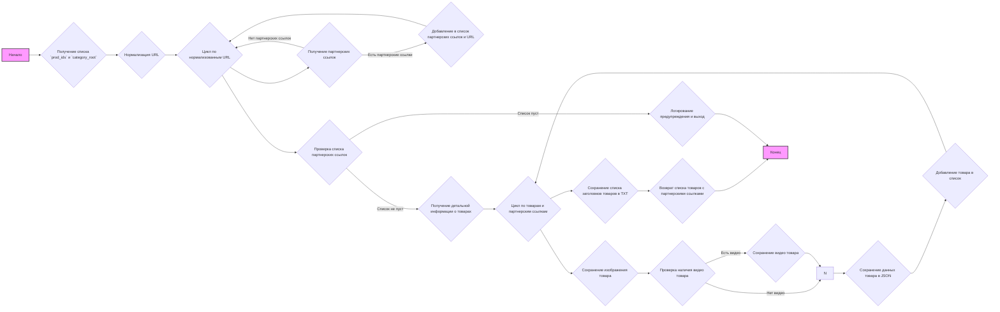
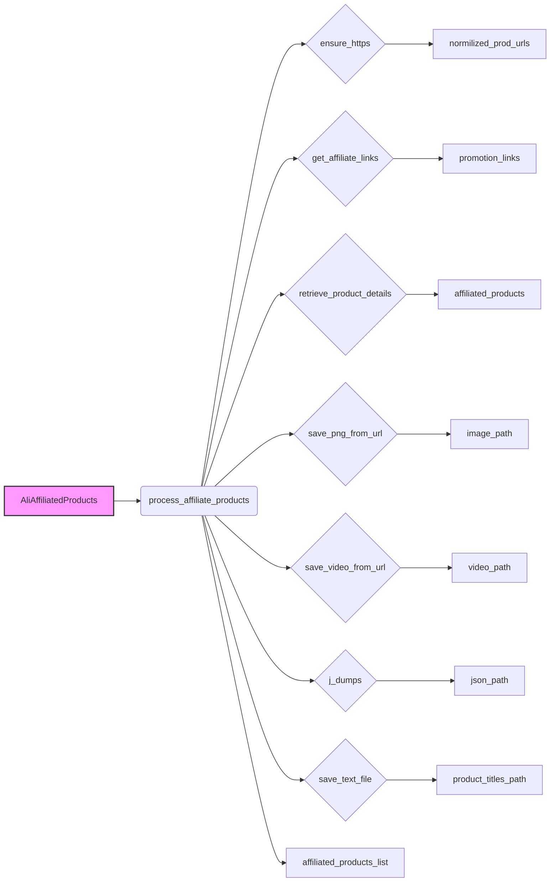

## Анализ кода `hypotez/src/suppliers/aliexpress/affiliated_products_generator.py`

### 1. <алгоритм>

**Блок-схема:**

**Примеры для логических блоков:**

*   **B (Получение списка `prod_ids` и `category_root`)**:
    *   `prod_ids`: `["https://aliexpress.com/item/12345.html", "12346"]`
    *   `category_root`: `/path/to/category`
*   **C (Нормализация URL)**:
    *   Вход: `["https://aliexpress.com/item/12345.html", "12346"]`
    *   Выход: `["https://aliexpress.com/item/12345.html", "https://aliexpress.com/item/12346.html"]`
*   **E (Получение партнерских ссылок)**:
    *   Вход: `"https://aliexpress.com/item/12345.html"`
    *   Выход: `[SimpleNamespace(promotion_link="https://s.click.aliexpress.com/e/_d12345")]` или `[]` (если нет партнерских ссылок)
*   **I (Получение детальной информации о товарах)**:
    *   Вход: `["https://aliexpress.com/item/12345.html"]`
    *   Выход: `[SimpleNamespace(product_title="Product Title", product_id="12345", product_main_image_url="http://example.com/image.png", product_video_url="http://example.com/video.mp4")]`
*   **K (Сохранение изображения товара)**:
    *   Вход: `product_main_image_url="http://example.com/image.png", image_path="/path/to/category/images/12345.png"`
    *   Действие: Сохраняет изображение в указанный путь.
*   **M (Сохранение видео товара)**:
    *   Вход: `product_video_url="http://example.com/video.mp4", video_path="/path/to/category/videos/12345.mp4"`
    *   Действие: Сохраняет видео в указанный путь.
*   **O (Сохранение данных товара в JSON)**:
    *   Вход: `product=SimpleNamespace(...), path="/path/to/category/EN_USD/12345.json"`
    *   Действие: Сохраняет данные товара в JSON-файл.
*   **Q (Сохранение списка заголовков товаров в TXT)**:
    *   Вход: `product_titles=["Product 1 Title", "Product 2 Title"], path="/path/to/category/EN_USD/product_titles.txt"`
    *   Действие: Сохраняет заголовки в текстовый файл.

**Поток данных:**

1.  Список `prod_ids` и путь `category_root` поступают в функцию `process_affiliate_products`.
2.  `prod_ids` нормализуются в список URL-адресов.
3.  Для каждого URL запрашиваются партнерские ссылки.
4.  Из полученных ссылок извлекаются `promotion_link`.
5.  Получаются детализированные данные о товарах на основе `prod_urls`.
6.  В цикле для каждого товара:
    *   Сохраняются изображения и видео.
    *   Данные сохраняются в JSON.
    *   Товар добавляется в результирующий список.
7.  Список заголовков товаров сохраняется в текстовый файл.
8.  Возвращается список товаров с партнерскими ссылками.

### 2. <mermaid>

**Анализ зависимостей `mermaid`:**

*   `AliAffiliatedProducts`: Класс, содержащий метод `process_affiliate_products`.
*   `process_affiliate_products`: Метод, обрабатывающий список идентификаторов или URL товаров.
*   `ensure_https`: Функция, гарантирующая, что URL-адреса начинаются с `https://`.
*   `normilized_prod_urls`: Список нормализованных URL-адресов.
*   `get_affiliate_links`: Метод, получающий партнерские ссылки.
*   `promotion_links`: Список полученных партнерских ссылок.
*   `retrieve_product_details`: Метод, получающий детальную информацию о товарах.
*   `affiliated_products`: Список объектов SimpleNamespace, содержащих информацию о товарах.
*   `save_png_from_url`: Функция, сохраняющая изображение по URL.
*   `image_path`: Путь к сохраненному изображению.
*   `save_video_from_url`: Функция, сохраняющая видео по URL.
*   `video_path`: Путь к сохраненному видео.
*   `j_dumps`: Функция, сохраняющая данные в JSON-формате.
*  `json_path`: Путь к JSON файлу
*   `save_text_file`: Функция, сохраняющая текст в файл.
*   `product_titles_path`: Путь к файлу для сохранения заголовков товаров.
*   `affiliated_products_list`: Результирующий список объектов SimpleNamespace с данными о товарах.

**Описание зависимостей:**

*   `AliAffiliatedProducts` использует метод `process_affiliate_products` для обработки товаров.
*   `process_affiliate_products` вызывает `ensure_https` для нормализации URL, `get_affiliate_links` для получения партнерских ссылок, `retrieve_product_details` для получения деталей товаров, `save_png_from_url` для сохранения изображений, `save_video_from_url` для сохранения видео, `j_dumps` для сохранения данных в JSON и `save_text_file` для сохранения заголовков товаров.
*   Поток данных идет от `AliAffiliatedProducts` к `affiliated_products_list` через последовательность вызовов функций.

### 3. <объяснение>

**Импорты:**

*   `asyncio`: Для асинхронного программирования (не используется напрямую в предоставленном коде, но может использоваться внутри вызываемых методов).
*   `datetime`: Для работы с датой и временем (не используется в предоставленном коде).
*   `html`: Для работы с HTML (не используется в предоставленном коде).
*   `pathlib.Path`: Для работы с путями к файлам и директориям.
*   `urllib.parse.urlparse`: Для разбора URL-адресов.
*   `types.SimpleNamespace`: Для создания простых объектов с атрибутами.
*   `typing.List`: Для аннотации типов.
*   `src.logger.logger.logger`: Для логирования событий.
*   `src.gs`: Глобальные настройки (не используется напрямую в предоставленном коде).
*   `src.suppliers.aliexpress.AliApi`: Базовый класс для работы с AliExpress API.
*   `src.suppliers.aliexpress.campaign.html_generators`: Модуль, содержащий классы для генерации HTML-кода (не используется в предоставленном коде, но может использоваться в контексте проекта).
*  `src.suppliers.aliexpress.utils.ensure_https`:  Функция для нормализации URL, приведения их к виду https.
*   `src.product.product_fields.ProductFields as f`: Константы для полей продукта.
*   `src.utils.image.save_png_from_url`: Функция для сохранения PNG-изображений из URL.
*   `src.utils.video.save_video_from_url`: Функция для сохранения видео из URL.
*   `src.utils.file`: Модуль с функциями для работы с файлами (получение имен директорий/файлов, чтение/запись текстовых файлов).
*   `src.utils.jjson`: Функции для работы с JSON (сериализация и десериализация).
*   `src.utils.printer.pprint`: Функция для красивого вывода (не используется в предоставленном коде).

**Классы:**

*   `AliAffiliatedProducts(AliApi)`:
    *   **Роль**: Класс для сбора данных о товарах с партнерскими ссылками с AliExpress.
    *   **Атрибуты**:
        *   `language` (str): Язык для кампании.
        *   `currency` (str): Валюта для кампании.
    *   **Методы**:
        *   `__init__(self, language='EN', currency='USD', *args, **kwargs)`: Инициализирует класс, устанавливает язык и валюту, вызывает конструктор родительского класса.
        *   `async process_affiliate_products(self, prod_ids: list[str], category_root: Path | str) -> list[SimpleNamespace]`: Основной метод для обработки списка URL/идентификаторов товаров. Получает партнерские ссылки, сохраняет изображения, видео и метаданные товаров.

**Функции:**

*   `__init__(self, language='EN', currency='USD', *args, **kwargs)`:
    *   **Аргументы**: `language` (str), `currency` (str), `*args`, `**kwargs`.
    *   **Возвращаемое значение**: None.
    *   **Назначение**: Инициализация экземпляра класса `AliAffiliatedProducts`.
    *   **Пример**: `AliAffiliatedProducts(language='RU', currency='RUB')`.
*   `async process_affiliate_products(self, prod_ids: list[str], category_root: Path | str) -> list[SimpleNamespace]`:
    *   **Аргументы**: `prod_ids` (list[str]) - список URL/идентификаторов товаров, `category_root` (Path|str) - путь к папке категории.
    *   **Возвращаемое значение**: list[SimpleNamespace] - список объектов, содержащих информацию о товарах с партнерскими ссылками.
    *   **Назначение**: Главная функция, получающая информацию о товарах, обрабатывающая их, сохраняющая изображения и видео, и формирующая список с данными.
    *   **Пример**: `await obj.process_affiliate_products(prod_ids=["https://example.com/item/123", "456"], category_root="/path/to/category")`
* `ensure_https(urls: list[str]) -> list[str]`:
    *   **Аргументы**: `urls` (list[str]) - список URL.
    *  **Возвращаемое значение**:  `list[str]` - список URL приведенный к виду `https://aliexpress.com/item/<product_id>.html`.
    *  **Назначение**: Приводит все URL к виду `https://aliexpress.com/item/<product_id>.html`
* `save_png_from_url(url: str, path: Path) -> None`:
    *   **Аргументы**:  `url` (str)  - URL изображения, `path` (Path) - Путь для сохранения.
    *   **Возвращаемое значение**: None
    *   **Назначение**:  Сохраняет изображение из URL.
* `save_video_from_url(url: str, path: Path) -> None`:
    *    **Аргументы**: `url` (str) - URL видео,  `path` (Path) - Путь для сохранения.
    *   **Возвращаемое значение**: None
    *   **Назначение**: Сохраняет видео из URL.
* `save_text_file(data: list[str], path: Path) -> None`:
    *  **Аргументы**:  `data` (list[str]) - Список строк для сохранения, `path` (Path) - Путь для сохранения.
    * **Возвращаемое значение**: None.
    * **Назначение**: Сохраняет строки из списка в текстовый файл.
*  `j_dumps(obj: object, path: Path) -> None`:
    *   **Аргументы**: `obj` (object) - Объект для сериализации, `path` (Path) - Путь для сохранения.
    *   **Возвращаемое значение**: None
    *    **Назначение**: Сериализует объект в JSON и сохраняет в файл.

**Переменные:**

*   `MODE = 'dev'`: Режим работы (не используется в коде).
*   `_promotion_links`: Временный список для хранения партнерских ссылок.
*   `_prod_urls`: Временный список для хранения URL-адресов товаров.
*   `normilized_prod_urls`: Нормализованный список URL.
*  `print_flag`: Флаг для переключения печати (не используется в предоставленном коде)
*   `_affiliated_products`: Временный список для хранения данных о товарах.
*   `affiliated_products_list`: Результирующий список объектов SimpleNamespace, содержащий информацию о товарах с партнерскими ссылками.
*   `product_titles`: Список заголовков товаров.
*   `image_path`: Путь к сохраненному изображению.
*   `video_path`: Путь к сохраненному видео.
* `product_titles_path`: Путь к файлу для сохранения заголовков товаров.

**Потенциальные ошибки и области для улучшения:**

1.  **Обработка ошибок:**
    *   Код не обрабатывает исключения при сохранении изображений, видео и данных в JSON. Необходимо добавить блоки `try-except` для более надежной работы.
2.  **Логирование:**
    *   Логирование выполнено, но можно добавить больше контекстной информации и использовать разные уровни логирования (DEBUG, INFO, WARNING, ERROR) для более детального отслеживания процесса.
3. **Асинхронность:**
    *  Метод `process_affiliate_products` является асинхронным, но в нем нет вызовов `await` для потенциальных блокирующих операций (вызовы к api, загрузка изображений, видео). Это может замедлить работу программы. Необходимо добавить вызовы `await` для функций, которые поддерживают асинхронность.
4. **Зависимость от внешних API**:
    *   Код зависит от API AliExpress, который может меняться. Необходимо предусмотреть механизм для адаптации к изменениям API.
5. **Отсутствие комментариев**:
    * Код содержит не все необходимые комментарии. Необходимо добавить комментарии, объясняющие назначение каждого блока кода, особенно для сложных выражений.

**Взаимосвязь с другими частями проекта:**

*   Класс `AliAffiliatedProducts` является частью модуля `src.suppliers.aliexpress`, который отвечает за взаимодействие с AliExpress.
*   Класс наследует от `AliApi`, который содержит базовые методы для работы с AliExpress API.
*   Используются утилиты из `src.utils` для работы с файлами, изображениями, видео и JSON.
*   Для логирования используется модуль `src.logger.logger`.

**Цепочка взаимосвязей:**

1.  `AliAffiliatedProducts` -> `AliApi` (наследование).
2.  `AliAffiliatedProducts` -> `src.utils.image` (сохранение изображений).
3.  `AliAffiliatedProducts` -> `src.utils.video` (сохранение видео).
4.  `AliAffiliatedProducts` -> `src.utils.file` (работа с файлами).
5.  `AliAffiliatedProducts` -> `src.utils.jjson` (работа с JSON).
6. `AliAffiliatedProducts` -> `src.logger.logger` (логирование).
7. `AliAffiliatedProducts` -> `src.suppliers.aliexpress.utils.ensure_https` (нормализация URL).

Этот анализ обеспечивает полное понимание функциональности кода, его зависимостей и потенциальных улучшений.