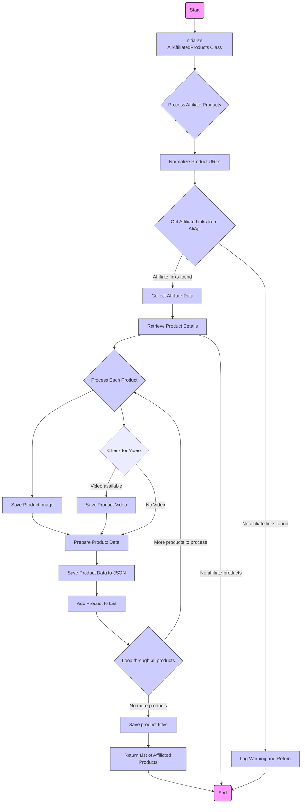
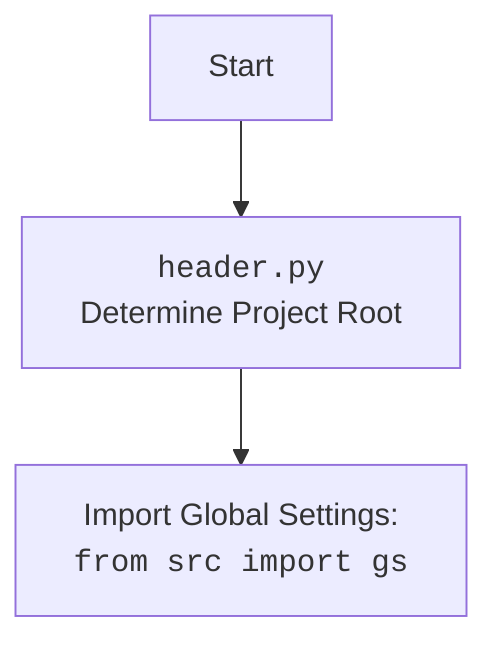

## ИНСТРУКЦИЯ:

Анализируй предоставленный код подробно и объясни его функциональность. Ответ должен включать три раздела:

1.  **<алгоритм>**: Опиши рабочий процесс в виде пошаговой блок-схемы, включая примеры для каждого логического блока, и проиллюстрируй поток данных между функциями, классами или методами.
2.  **<mermaid>**: Напиши код для диаграммы в формате `mermaid`, проанализируй и объясни все зависимости,
    которые импортируются при создании диаграммы.
    **ВАЖНО!** Убедитесь, что все имена переменных, используемые в диаграмме `mermaid`,
    имеют осмысленные и описательные имена. Имена переменных вроде `A`, `B`, `C`, и т.д., не допускаются!

    **Дополнительно**: Если в коде есть импорт `import header`, добавьте блок `mermaid` flowchart, объясняющий `header.py`:
    ```mermaid
    flowchart TD
        Start --> Header[<code>header.py</code><br> Determine Project Root]

        Header --> import[Import Global Settings: <br><code>from src import gs</code>]
    ```

3.  **<объяснение>**: Предоставьте подробные объяснения:
    -   **Импорты**: Их назначение и взаимосвязь с другими пакетами `src.`.
    -   **Классы**: Их роль, атрибуты, методы и взаимодействие с другими компонентами проекта.
    -   **Функции**: Их аргументы, возвращаемые значения, назначение и примеры.
    -   **Переменные**: Их типы и использование.
    -   Выделите потенциальные ошибки или области для улучшения.

Дополнительно, постройте цепочку взаимосвязей с другими частями проекта (если применимо).

Это обеспечивает всесторонний и структурированный анализ кода.
## Формат ответа: `.md` (markdown)
**КОНЕЦ ИНСТРУКЦИИ**

### <алгоритм>

1.  **Инициализация `AliAffiliatedProducts`**:
    -   Принимает `language` (по умолчанию 'EN') и `currency` (по умолчанию 'USD').
    -   Инициализирует родительский класс `AliApi` с языком и валютой.
    -   Сохраняет язык и валюту в атрибуты экземпляра.
    -   Пример: `aff_products = AliAffiliatedProducts(language='RU', currency='RUB')`
2.  **`process_affiliate_products`**:
    -   Принимает список `prod_ids` (список URL или ID продуктов) и `category_root` (путь к корневой директории категории).
    -   Приводит все `prod_ids` к виду `https://aliexpress.com/item/<product_id>.html` используя функцию `ensure_https`.
    -   Итерируется по нормализованным `prod_urls`:
        -   Получает аффилированные ссылки, вызывая метод `get_affiliate_links` родительского класса (`AliApi`).
        -   Если аффилированные ссылки найдены, добавляет `promotion_link` в `_promotion_links`, а `prod_url` в `_prod_urls`.
        -   Логгирует найденные аффилированные ссылки
    -   Если нет аффилированных ссылок, логгирует предупреждение и возвращает `None`.
        -   Пример: `prod_ids = ["http://example.com/123", "123456789"]`, после нормализации: `prod_urls = ["https://aliexpress.com/item/123.html", "https://aliexpress.com/item/123456789.html"]`
    -   Получает детали продуктов из аффилированных ссылок с помощью  `self.retrieve_product_details`, сохраняя их в `_affiliated_products`.
        -   Пример: `_affiliated_products` содержит список `SimpleNamespace` объектов, где каждый объект содержит данные продукта (название, описание, картинки и т.д.)
    -   Если  `_affiliated_products` пуст, то возвращает `None`
    -   Итерируется по `_affiliated_products` и `_promotion_links` параллельно (используя `zip`):
        -   Добавляет название продукта в список `product_titles`
        -   Добавляет аффилированную ссылку в атрибут `promotion_link` продукта.
        -   Создает путь для сохранения изображения, скачивает изображение и сохраняет путь к нему в атрибут `local_saved_image` продукта.
        -   Если есть видео, создает путь для сохранения видео, скачивает видео и сохраняет путь к нему в атрибут `local_saved_video`.
        -   Логирует название продукта.
        -   Сохраняет информацию о продукте в JSON файл в папке `/<category_root>/<language>_<currency>`.
        -   Добавляет продукт в `affiliated_products_list`.
    -   Сохраняет список названий продуктов в текстовый файл `product_titles.txt`.
    -   Возвращает `affiliated_products_list` с аффилированными продуктами.
        -   Пример: `affiliated_products_list` содержит список `SimpleNamespace` объектов, каждый из которых содержит всю необходимую информацию о продукте (название, описание, аффилированная ссылка, путь к картинке и видео).

### <mermaid>



**Анализ зависимостей:**

*   `asyncio`: Используется для асинхронного программирования, что позволяет параллельно обрабатывать несколько продуктов.
*   `datetime`: Используется для работы с датой и временем.
*   `html`: Используется для обработки HTML-контента.
*   `pathlib.Path`: Используется для работы с путями к файлам и каталогам.
*   `urllib.parse.urlparse`: Используется для разбора URL.
*   `types.SimpleNamespace`: Используется для создания простых объектов, к которым можно добавлять произвольные атрибуты.
*   `typing.List`: Используется для аннотации типов.
*   `src.logger.logger.logger`: Используется для логирования событий.
*   `src.gs`: Глобальные настройки проекта.
*   `src.suppliers.aliexpress.AliApi`: Базовый класс для работы с API AliExpress.
*   `src.suppliers.aliexpress.campaign.html_generators`: Содержит классы для генерации HTML-шаблонов (не используется в этом коде).
*    `src.suppliers.aliexpress.utils.ensure_https`: Функция для приведения URL к протоколу https
*   `src.product.product_fields.ProductFields`:  Содержит константы с названиями полей продуктов (не используется в этом коде).
*   `src.utils.image.save_png_from_url`: Функция для скачивания и сохранения изображений в формате PNG.
*   `src.utils.video.save_video_from_url`: Функция для скачивания и сохранения видео.
*   `src.utils.file`: Содержит функции для работы с файлами (получение имен директорий, файлов, чтение и запись текстовых файлов).
*   `src.utils.jjson`: Содержит функции для сериализации и десериализации JSON.
*  `src.utils.printer.pprint`: Функция для форматированного вывода данных

Все эти зависимости так или иначе завязаны на работу с сетью, файловой системой и данными, что типично для подобного рода задач.


### <объяснение>

**Импорты:**

*   `asyncio`: Библиотека для асинхронного программирования. Позволяет выполнять несколько задач параллельно, что повышает эффективность при работе с сетевыми запросами и файловыми операциями.
*   `datetime`: Модуль для работы с датами и временем. Может использоваться для логгирования или для добавления временных меток к данным (в этом коде не используется напрямую).
*   `html`:  Модуль для работы с HTML (в данном коде не используется, но может пригодиться для дальнейшего анализа веб-страниц).
*   `pathlib.Path`: Модуль для работы с файловыми путями в объектно-ориентированном стиле, что делает код более читаемым и переносимым.
*   `urllib.parse.urlparse`: Функция для разбора URL на составляющие части (протокол, хост, путь и т.д.). Полезна для извлечения информации из URL.
*   `types.SimpleNamespace`: Класс для создания объектов, атрибуты которых можно устанавливать и получать. Удобен для представления простых структур данных.
*   `typing.List`: Используется для указания типов, что повышает читаемость кода и помогает обнаруживать ошибки на этапе разработки.
*   `from src.logger.logger import logger`: Импорт логгера для записи сообщений о ходе выполнения программы и возможных ошибках.
*   `from src import gs`: Импорт глобальных настроек проекта. Эти настройки могут включать различные параметры, необходимые для работы программы.
*   `from src.suppliers.aliexpress import AliApi`: Импорт базового класса для работы с API AliExpress. Обеспечивает базовую функциональность для доступа к данным AliExpress.
*   `from src.suppliers.aliexpress.campaign.html_generators import ProductHTMLGenerator, CategoryHTMLGenerator, CampaignHTMLGenerator`: Импорт классов для генерации HTML-шаблонов (не используются в текущем коде, но могут использоваться в других частях проекта).
*  `from src.suppliers.aliexpress.utils.ensure_https import ensure_https`: Импорт функции для приведения URL к протоколу https
*   `from src.product.product_fields import ProductFields as f`:  Импорт enum с полями для работы с продуктами (не используется в этом коде).
*   `from src.utils.image import save_png_from_url`: Импорт функции для скачивания и сохранения изображений в формате PNG.
*   `from src.utils.video import save_video_from_url`: Импорт функции для скачивания и сохранения видео.
*   `from src.utils.file import get_directory_names, get_filenames, read_text_file, save_text_file`: Импорт функций для работы с файлами.
*   `from src.utils.jjson import j_loads_ns, j_dumps`: Импорт функций для сериализации и десериализации JSON.
*   `from src.utils.printer import pprint`: Функция для форматированного вывода данных

**Классы:**

*   `AliAffiliatedProducts(AliApi)`:
    *   **Роль**: Класс для сбора данных о продуктах с аффилированными ссылками с AliExpress.
    *   **Атрибуты**:
        *   `language: str`: Язык для поиска продуктов.
        *   `currency: str`: Валюта для поиска продуктов.
    *   **Методы**:
        *   `__init__(self, language='EN', currency='USD', *args, **kwargs)`: Инициализирует класс, устанавливая язык и валюту.
        *   `async def process_affiliate_products(self, prod_ids: list[str], category_root: Path | str) -> list[SimpleNamespace]`: Основной метод для обработки списка ID или URL продуктов, получения их аффилированных ссылок, скачивания изображений/видео и сохранения данных.

**Функции:**

*   `__init__(self, language='EN', currency='USD', *args, **kwargs)`:
    *   **Аргументы**:
        *   `language: str | dict` -  язык (по умолчанию 'EN').
        *   `currency: str` - валюта (по умолчанию 'USD').
    *   **Назначение**: Инициализирует экземпляр класса, устанавливая язык и валюту, а также вызывая конструктор родительского класса.
    *   **Пример**: `aff_products = AliAffiliatedProducts(language='RU', currency='RUB')`
*    `async def process_affiliate_products(self, prod_ids: list[str], category_root: Path | str) -> list[SimpleNamespace]`
    *   **Аргументы**:
        *   `prod_ids: list[str]`: Список идентификаторов продуктов (или URL) с AliExpress.
        *   `category_root: Path | str`: Путь к корневой директории категории.
    *   **Возвращает**: `list[SimpleNamespace]`: Список объектов, содержащих данные о продуктах с аффилированными ссылками, сохраненными изображениями и видео.
    *   **Назначение**:
        1.  Получает аффилированные ссылки для списка продуктов.
        2.  Получает детальную информацию о продуктах.
        3.  Скачивает и сохраняет изображения и видео.
        4.  Сохраняет данные о продуктах в JSON файлы.
        5.  Возвращает список объектов с информацией о продуктах.
    *   **Пример**:

        ```python
        prod_ids = ["https://aliexpress.com/item/123.html", "456"]
        category_root = Path("./output/electronics")
        products = await aff_products.process_affiliate_products(prod_ids, category_root)
        for product in products:
            print(product.product_title, product.promotion_link, product.local_saved_image)
        ```

**Переменные:**

*   `_promotion_links: list`: Список аффилированных ссылок.
*   `_prod_urls: list`: Список нормализованных URL продуктов.
*   `normilized_prod_urls`: Список URL преобразованных к виду `https://aliexpress.com/item/<product_id>.html`.
*    `print_flag`: Флаг для переключения печати в одну строку
*   `_affiliated_products: List[SimpleNamespace]`: Список объектов с детальной информацией о продуктах.
*   `affiliated_products_list:list[SimpleNamespace]`: Список объектов, содержащий конечный результат работы.
*   `product_titles:list`: Список названий товаров.
*   `image_path: Path`: Путь к сохраненному изображению продукта.
*   `video_path: Path`: Путь к сохраненному видео продукта.
*   `suffix: str`: расширение файла для видео

**Потенциальные ошибки и области для улучшения:**

*   **Обработка ошибок:** В коде есть некоторые места с логгированием ошибок, но нет полноценной обработки исключений (например, при скачивании изображений или видео). Стоит добавить блоки try-except для более надежной работы.
*   **Дублирование кода:** Логика обработки изображений и видео похожа, можно вынести ее в отдельную функцию для избежания дублирования.
*   **Оптимизация:** Параллельная обработка продуктов могла бы ускорить выполнение программы.
*    **Не используется enum ProductFields**: в коде есть импорт `from src.product.product_fields import ProductFields as f`, но он не используется, его можно удалить.

**Взаимосвязь с другими частями проекта:**

*   Использует `AliApi` для работы с API AliExpress.
*   Использует `logger` для логирования событий.
*   Использует `gs` для получения глобальных настроек.
*   Использует функции из `src.utils` для скачивания, сохранения файлов и работы с JSON.

Этот код является частью системы сбора данных о продуктах AliExpress, которая позволяет получать аффилированные ссылки, скачивать изображения и видео, а также сохранять информацию о продуктах для дальнейшего использования.