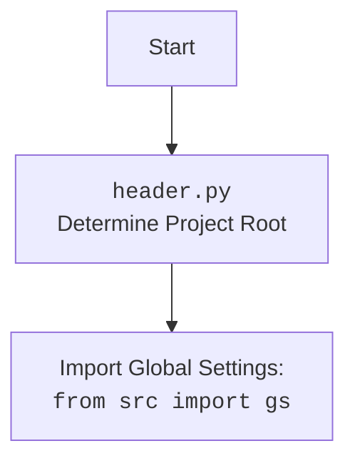

## <алгоритм>

1.  **Инициализация `AliApi`:**
    *   Создается экземпляр класса `AliApi`.
    *   При инициализации, класс получает параметры `language` (язык) и `currency` (валюта). По умолчанию `en` и `usd`.
    *   Из `gs.credentials.aliexpress` загружаются учетные данные `api_key`, `secret` и `tracking_id`.
    *   Вызывается конструктор родительского класса `AliexpressApi` с полученными данными.
    *   Инициализируются менеджеры для категорий и кампаний (закомментировано).
    *   Пример:
        ```python
        api = AliApi(language='ru', currency='eur')
        ```
2.  **`retrieve_product_details_as_dict`:**
    *   Функция принимает список `product_ids`.
    *   Вызывает метод `retrieve_product_details` родительского класса `AliexpressApi`, получая список объектов `SimpleNamespace` с деталями продукта.
    *   Конвертирует каждый `SimpleNamespace` в словарь с помощью `vars(ns)`.
    *   Возвращает список словарей, представляющих детали продукта.
    *   Пример:
        ```python
        product_ids = [12345, 67890]
        product_details = api.retrieve_product_details_as_dict(product_ids)
        # product_details будет списком словарей
        ```
3.  **`get_affiliate_links`:**
    *   Функция принимает `links` (строка или список ссылок) и `link_type` (тип партнерской ссылки, по умолчанию 0).
    *   Вызывает метод `get_affiliate_links` родительского класса `AliexpressApi`.
    *   Возвращает список объектов `SimpleNamespace` с партнерскими ссылками.
    *   Пример:
        ```python
        links = ['https://example.com/product1', 'https://example.com/product2']
        affiliate_links = api.get_affiliate_links(links)
        # affiliate_links будет списком SimpleNamespace
        ```

## <mermaid>

```mermaid
flowchart TD
    Start[Начало] --> AliApiInit[Инициализация AliApi]
    AliApiInit --> LoadCredentials[Загрузка API ключа, секрета и tracking_id]
    LoadCredentials --> ParentInit[Инициализация AliexpressApi с ключами]
    ParentInit --> EndInit[Конец инициализации]

    EndInit --> retrieve_product_details_as_dict[Вызов retrieve_product_details_as_dict]
    retrieve_product_details_as_dict --> CallParentRetrieve[Вызов retrieve_product_details родительского класса]
    CallParentRetrieve --> ConvertToDict[Конвертация SimpleNamespace в dict]
    ConvertToDict --> ReturnDictList[Возврат списка словарей]

    EndInit --> get_affiliate_links[Вызов get_affiliate_links]
    get_affiliate_links --> CallParentAffiliate[Вызов get_affiliate_links родительского класса]
    CallParentAffiliate --> ReturnSimpleNamespaceList[Возврат списка SimpleNamespace]

    ReturnDictList --> End[Конец]
    ReturnSimpleNamespaceList --> End
    
    
    classDef library fill:#f9f,stroke:#333,stroke-width:2px
    class AliApiInit, LoadCredentials, ParentInit, EndInit, CallParentRetrieve, ConvertToDict, CallParentAffiliate, ReturnDictList, ReturnSimpleNamespaceList library
```



**Объяснение зависимостей `mermaid`:**

*   `Start`, `End`: Начало и конец процесса.
*   `AliApiInit`: Инициализация класса `AliApi`.
*   `LoadCredentials`: Загрузка учетных данных API из `gs`.
*   `ParentInit`: Инициализация родительского класса `AliexpressApi`.
*   `EndInit`: Конец процесса инициализации.
*   `retrieve_product_details_as_dict`: Вызов метода для получения деталей продукта в формате словаря.
*   `CallParentRetrieve`: Вызов метода родительского класса для получения деталей продукта.
*   `ConvertToDict`: Преобразование `SimpleNamespace` в `dict`.
*   `ReturnDictList`: Возвращение списка словарей.
*   `get_affiliate_links`: Вызов метода для получения партнерских ссылок.
*   `CallParentAffiliate`: Вызов метода родительского класса для получения партнерских ссылок.
*   `ReturnSimpleNamespaceList`: Возвращение списка `SimpleNamespace` объектов.

## <объяснение>

**Импорты:**

*   `re`: Модуль для работы с регулярными выражениями (используется не в этом файле, возможно в родительском классе `AliexpressApi`).
*   `json`: Модуль для работы с JSON-данными.
*   `asyncio`: Модуль для асинхронного программирования.
*   `pathlib.Path`: Модуль для работы с путями к файлам и каталогам.
*   `typing.List, Dict`: Модуль для аннотаций типов.
*   `types.SimpleNamespace`:  Модуль для создания простых объектов, к которым можно обращаться через атрибуты.
*   `requests.get, post`: Модуль для отправки HTTP-запросов.
*   `src`:  Импортирует пакет `src`, который содержит общие настройки и утилиты проекта.
    *   `src.gs`:  Глобальные настройки проекта, содержат, например, учетные данные для API.
    *   `src.utils.jjson.j_loads_ns, j_loads, j_dumps`: Функции для работы с JSON, с поддержкой SimpleNamespace.
    *   `src.utils.printer.pprint`: Функция для красивой печати данных.
    *   `src.utils.convertors.json.json2csv`: Функция для конвертации JSON в CSV формат.
    *   `src.logger.logger`: Модуль для логирования событий.
*   `.api.AliexpressApi`:  Импортирует базовый класс `AliexpressApi` из текущего пакета (`suppliers.aliexpress`).
*   `src.db.manager_categories.AliexpressCategory, CategoryManager`:  Импортирует классы для управления категориями товаров в базе данных.
*   `src.db.manager_coupons_and_sales.ProductCampaignsManager`:  Импортирует класс для управления акциями и скидками в базе данных.

**Классы:**

*   `AliApi(AliexpressApi)`:
    *   Наследуется от `AliexpressApi`.
    *   `manager_categories: CategoryManager`: Менеджер для управления категориями товаров.
    *   `manager_campaigns: ProductCampaignsManager`: Менеджер для управления акциями и скидками.
    *   `__init__(self, language='en', currency='usd', *args, **kwargs)`:
        *   Конструктор класса.
        *   Принимает параметры `language` и `currency` для API.
        *   Загружает `api_key`, `secret` и `tracking_id` из `gs.credentials.aliexpress`.
        *   Вызывает конструктор родительского класса `AliexpressApi`.
        *   Инициализирует менеджеры базы данных (закомментировано).
    *   `retrieve_product_details_as_dict(self, product_ids: list) -> dict | dict | None`:
        *   Принимает список ID продуктов.
        *   Вызывает `self.retrieve_product_details` родительского класса.
        *   Конвертирует список `SimpleNamespace` в список словарей.
        *   Возвращает список словарей или `None`.
    *   `get_affiliate_links(self, links: str | list, link_type: int = 0, **kwargs) -> List[SimpleNamespace]`:
        *   Принимает список ссылок (или строку) и тип партнерской ссылки.
        *   Вызывает метод родительского класса `get_affiliate_links`.
        *   Возвращает список `SimpleNamespace` с партнерскими ссылками.

**Функции:**

*   Все функции являются методами класса `AliApi`, описаны выше.

**Переменные:**

*   `credentials`:  Содержит учетные данные для API AliExpress. Загружается из `gs`.
*   `api_key`, `secret`, `tracking_id`: Строки, представляющие учетные данные для API.
*   `language`, `currency`: Строки, представляющие язык и валюту для API.
*   `product_ids`: Список идентификаторов продуктов (используется как аргумент в `retrieve_product_details_as_dict`).
*   `links`: Строка или список ссылок на товары (используется как аргумент в `get_affiliate_links`).
*   `link_type`: Целое число, тип партнерской ссылки.
*   `prod_details_ns`: Список `SimpleNamespace` объектов, полученных от родительского класса.
*   `prod_details_dict`: Список словарей, полученных из `prod_details_ns`.

**Потенциальные ошибки и улучшения:**

*   Менеджеры базы данных закомментированы, что может привести к проблемам при их дальнейшем использовании.
*   Метод `retrieve_product_details_as_dict` возвращает  `dict | dict | None`, что не имеет смысла. Возможно, ошибка в аннотации типов. Правильно будет `list[dict] | None`.
*   Регулярное выражение `re` импортируется, но не используется в данном файле, что может указывать на ошибку.
*   Отсутствует обработка ошибок при запросах к API.
*   Нет явной обработки исключений, что может привести к неожиданному поведению программы.

**Взаимосвязи с другими частями проекта:**

*   Использует `src.gs` для загрузки глобальных настроек и учетных данных.
*   Использует `src.utils.jjson` для работы с JSON.
*   Использует `src.utils.printer` для вывода данных.
*   Использует `src.db` для работы с базой данных.
*   Наследует `AliexpressApi` из текущего пакета.

Этот код предоставляет интерфейс для работы с API AliExpress. Класс `AliApi` инкапсулирует логику для получения информации о продуктах и партнерских ссылок, используя базовый класс `AliexpressApi`. Важно раскомментировать и настроить менеджеры базы данных для полноценной работы, а также добавить обработку ошибок и исключений.