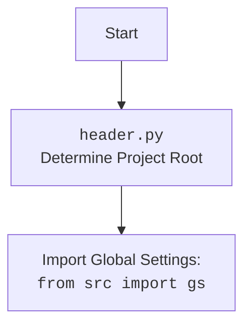

## ИНСТРУКЦИЯ:

Анализируй предоставленный код подробно и объясни его функциональность. Ответ должен включать три раздела:  

1. **<алгоритм>**: Опиши рабочий процесс в виде пошаговой блок-схемы, включая примеры для каждого логического блока, и проиллюстрируй поток данных между функциями, классами или методами.  
2. **<mermaid>**: Напиши код для диаграммы в формате `mermaid`, проанализируй и объясни все зависимости, 
    которые импортируются при создании диаграммы. 
    **ВАЖНО!** Убедитесь, что все имена переменных, используемые в диаграмме `mermaid`, 
    имеют осмысленные и описательные имена. Имена переменных вроде `A`, `B`, `C`, и т.д., не допускаются!  
    
    **Дополнительно**: Если в коде есть импорт `import header`, добавьте блок `mermaid` flowchart, объясняющий `header.py`:\
    ```mermaid
    flowchart TD
        Start --> Header[<code>header.py</code><br> Determine Project Root]
    
        Header --> import[Import Global Settings: <br><code>from src import gs</code>] 
    ```

3. **<объяснение>**: Предоставьте подробные объяснения:  
   - **Импорты**: Их назначение и взаимосвязь с другими пакетами `src.`.  
   - **Классы**: Их роль, атрибуты, методы и взаимодействие с другими компонентами проекта.  
   - **Функции**: Их аргументы, возвращаемые значения, назначение и примеры.  
   - **Переменные**: Их типы и использование.  
   - Выделите потенциальные ошибки или области для улучшения.  

Дополнительно, постройте цепочку взаимосвязей с другими частями проекта (если применимо).  

Это обеспечивает всесторонний и структурированный анализ кода.
## Формат ответа: `.md` (markdown)
**КОНЕЦ ИНСТРУКЦИИ**
## 1. <алгоритм>

```mermaid
graph LR
    A[Начало] --> B(Инициализация `AliApi`\n (конструктор `__init__`));
    B --> C{Получение данных для API\n из `gs.credentials.aliexpress`};
    C -- api_key, secret, tracking_id --> D(Инициализация базового класса `AliexpressApi`);
    D --> E{Вызов метода `retrieve_product_details_as_dict`\n с `product_ids`};
    E --> F{Вызов метода `retrieve_product_details`\n из базового класса `AliexpressApi`};
    F --> G{Получение `prod_details_ns`\n (List[SimpleNamespace])};
    G --> H{Преобразование `prod_details_ns`\n в `prod_details_dict`\n (List[dict])};
    H --> I{Возврат `prod_details_dict`};
    I --> J{Вызов метода `get_affiliate_links`\nс `links`, `link_type` и `kwargs`};
    J --> K{Вызов метода `get_affiliate_links`\nиз базового класса `AliexpressApi`};
    K --> L{Возврат списка `SimpleNamespace`};
    L --> M[Конец];
    
    subgraph "Пример: Инициализация AliApi"
    	init_example[language='ru', currency='rub']
    	B --> init_example
    end
    
    subgraph "Пример: retrieve_product_details_as_dict"
        prod_id_example[product_ids=[12345, 67890]]
        E --> prod_id_example
    end

    subgraph "Пример: get_affiliate_links"
        links_example[links='https://example.com/product1', link_type=1]
        J --> links_example
    end
```
## 2. <mermaid>
```mermaid
flowchart TD
    Start --> AliApiClass[<code>AliApi</code><br> Custom API class for AliExpress operations];
    
    AliApiClass --> InheritsFrom[Inherits from: <br><code>AliexpressApi</code><br> (from .api)];
    
    AliApiClass --> manager_categories[<code>manager_categories</code><br> <code>CategoryManager</code> <br> (from src.db.manager_categories)];
    
    AliApiClass --> manager_campaigns[<code>manager_campaigns</code><br> <code>ProductCampaignsManager</code> <br> (from src.db.manager_coupons_and_sales)];
    
    AliApiClass --> __init__[<code>__init__</code><br> (language: str, currency: str)];
    
    __init__ --> RetrieveCredentials[Retrieves credentials<br>from <code>gs.credentials.aliexpress</code> <br> (from src)];
        
    __init__ --> InitBaseClass[Initializes <code>AliexpressApi</code><br>with api_key, secret, <br>language, currency, tracking_id];
    
    AliApiClass --> retrieve_product_details_as_dict[<code>retrieve_product_details_as_dict</code><br>(product_ids: list)];
    
    retrieve_product_details_as_dict --> retrieve_product_details[Calls <code>retrieve_product_details</code> from <code>AliexpressApi</code>];
    
     retrieve_product_details --> ConvertToDict[Converts SimpleNamespace to dict];
        
    AliApiClass --> get_affiliate_links[<code>get_affiliate_links</code><br>(links: str | list, link_type: int)];
    
    get_affiliate_links --> BaseGetAffiliateLinks[Calls <code>get_affiliate_links</code> from <code>AliexpressApi</code>];

    
    subgraph "Imports from src"
        src_gs[<code>from src import gs</code><br>Global settings]
        src_utils_jjson[<code>from src.utils.jjson import j_loads_ns, j_loads, j_dumps</code><br>JSON loading/dumping utils]
        src_utils_printer[<code>from src.utils.printer import pprint</code><br>Pretty printing util]
        src_utils_convertors_json[<code>from src.utils.convertors.json import json2csv</code><br>JSON to CSV converter]
        src_logger[<code>from src.logger.logger import logger</code><br>Logging util]
        src_db_categories[<code>from src.db.manager_categories import AliexpressCategory, CategoryManager</code><br>Category DB manager]
        src_db_campaigns[<code>from src.db.manager_coupons_and_sales import ProductCampaignsManager</code><br>Campaigns DB manager]
    end

    
    AliApiClass --> src_gs
    AliApiClass --> src_utils_jjson
    AliApiClass --> src_utils_printer
    AliApiClass --> src_utils_convertors_json
    AliApiClass --> src_logger
    AliApiClass --> src_db_categories
    AliApiClass --> src_db_campaigns

    
    
    subgraph "External Imports"
        re_import[<code>import re</code><br>Regular expressions]
        json_import[<code>import json</code><br>JSON operations]
        asyncio_import[<code>import asyncio</code><br>Asynchronous I/O]
        pathlib_import[<code>from pathlib import Path</code><br>Path manipulation]
        typing_import[<code>from typing import List, Dict</code><br>Type hints]
        types_import[<code>from types import SimpleNamespace</code><br>Simple Namespace]
        requests_import[<code>from requests import get, post</code><br>HTTP requests]
    end

    AliApiClass --> re_import
    AliApiClass --> json_import
    AliApiClass --> asyncio_import
    AliApiClass --> pathlib_import
    AliApiClass --> typing_import
    AliApiClass --> types_import
    AliApiClass --> requests_import
```

## 3. <объяснение>
### Импорты:
-   `re`: Модуль для работы с регулярными выражениями, используется для обработки текста.
-   `json`: Модуль для работы с JSON-данными, используется для сериализации и десериализации данных.
-   `asyncio`: Модуль для написания асинхронного кода, может использоваться для параллельных запросов.
-   `pathlib.Path`: Класс для работы с путями в файловой системе.
-  `typing.List`, `typing.Dict`: Используются для аннотации типов, делают код более читаемым и помогают выявлять ошибки на этапе разработки.
-   `types.SimpleNamespace`: Класс для создания простых объектов с атрибутами, используется для представления данных.
-   `requests.get`, `requests.post`: Функции для отправки HTTP-запросов, используются для взаимодействия с API AliExpress.
-   `src.gs`: Глобальные настройки проекта.
-   `src.utils.jjson.j_loads_ns`, `src.utils.jjson.j_loads`, `src.utils.jjson.j_dumps`: Функции для работы с JSON, которые возвращают `SimpleNamespace`, словарь `dict` и сериализуют в `json` соответственно.
-   `src.utils.printer.pprint`: Функция для "красивой" печати, используется для отладки.
-   `src.utils.convertors.json.json2csv`: Функция для конвертации JSON в CSV формат.
-   `src.logger.logger.logger`: Объект для логирования, используется для записи событий.
-   `src.suppliers.aliexpress.api.AliexpressApi`: Базовый класс для работы с API AliExpress.
-   `src.db.manager_categories.AliexpressCategory`, `src.db.manager_categories.CategoryManager`: Классы для работы с категориями товаров в БД.
-   `src.db.manager_coupons_and_sales.ProductCampaignsManager`: Класс для работы с купонами и распродажами в БД.

### Классы:
-   `AliApi(AliexpressApi)`:
    -   **Роль**: Пользовательский класс для работы с API AliExpress. Наследуется от `AliexpressApi`, добавляя собственную логику.
    -   **Атрибуты**:
        -   `manager_categories`: Экземпляр `CategoryManager`, используется для работы с категориями товаров.
        -   `manager_campaigns`: Экземпляр `ProductCampaignsManager`, используется для работы с купонами и распродажами.
    -   **Методы**:
        -   `__init__(self, language: str = 'en', currency: str = 'usd', *args, **kwargs)`:
            -   **Аргументы**:
                -   `language` (str): Язык для API-запросов, по умолчанию 'en'.
                -   `currency` (str): Валюта для API-запросов, по умолчанию 'usd'.
            -   **Назначение**: Инициализирует экземпляр класса `AliApi`, получая учетные данные из глобальных настроек `gs.credentials.aliexpress`, инициализирует базовый класс `AliexpressApi` и при необходимости менеджеры БД.
        - `retrieve_product_details_as_dict(self, product_ids: list) -> dict | dict | None`:
            -   **Аргументы**:
                -   `product_ids` (list): Список ID товаров.
            -   **Возвращает**:
                -   `dict`: Список словарей с описанием товара.
            -  **Назначение**: Получает детальную информацию о товарах через API и преобразует полученные данные из `SimpleNamespace` в `dict`.
        -   `get_affiliate_links(self, links: str | list, link_type: int = 0, **kwargs) -> List[SimpleNamespace]`:
            -   **Аргументы**:
                -   `links` (str | list): Список ссылок на товары.
                -   `link_type` (int): Тип партнерской ссылки, по умолчанию 0.
            -   **Возвращает**:
                -   `List[SimpleNamespace]`: Список `SimpleNamespace` с партнерскими ссылками.
            -   **Назначение**: Получает партнерские ссылки для товаров, вызывает метод родительского класса `get_affiliate_links`

### Функции:

-  В данном коде нет отдельных функций, все методы принадлежат классу `AliApi`.

### Переменные:
- `credentials`: Содержит данные для доступа к API AliExpress (api_key, secret, tracking_id).
- `api_key`, `secret`, `tracking_id`: Используются для аутентификации в API AliExpress.
-   `language`, `currency`: Параметры для API запросов (язык и валюта).
-   `product_ids`: Список ID товаров для получения информации.
-   `prod_details_ns`: Список `SimpleNamespace` объектов, полученных от API.
-  `prod_details_dict`: Список `dict` объектов, полученных из `prod_details_ns`.
-  `links`: Список ссылок для получения партнерских ссылок.
-  `link_type`: Тип партнерской ссылки.
-   `kwargs`: Дополнительные параметры для получения партнерских ссылок.

### Потенциальные ошибки и области для улучшения:
-   **Обработка ошибок**: Отсутствует явная обработка ошибок при работе с API. Необходимо добавить try-except блоки для перехвата исключений, которые могут возникнуть при запросах к API или при обработке данных.
-   **Логирование**: Можно улучшить логирование, добавив запись параметров запросов и полученных ответов для более детальной отладки.
-  **Инициализация менеджеров БД**: Инициализация менеджеров БД закомментирована в методе `__init__`. Нужно продумать стратегию инициализации. Возможно, стоит вынести их инициализацию в отдельный метод или сделать ленивую загрузку.
- **Асинхронность**: Код импортирует модуль `asyncio`, но асинхронность явно не используется, стоит использовать для более быстрой обработки данных при работе с API.

### Взаимосвязь с другими частями проекта:
-   Использует `src.gs` для получения учетных данных, что обеспечивает централизованное хранение настроек.
-   Использует `src.utils.jjson` для работы с JSON, что обеспечивает консистентность в обработке JSON.
-   Использует `src.logger.logger` для логирования, что упрощает отслеживание работы кода.
-   Использует `src.db.manager_categories` и `src.db.manager_coupons_and_sales` для работы с базой данных, обеспечивая интеграцию с системой хранения данных.
-   Наследует `AliexpressApi` из `src.suppliers.aliexpress.api`, что предполагает наличие общего интерфейса для работы с API AliExpress.
- Использует `src.utils.convertors.json.json2csv` для конвертации данных, это показывает что есть потребность использовать данные в формате `csv`