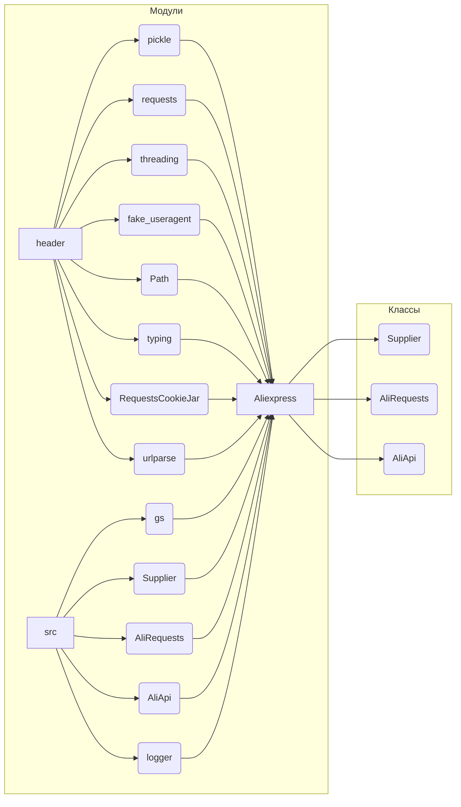

# <input code>

```python
## \file hypotez/src/suppliers/aliexpress/aliexpress.py
# -*- coding: utf-8 -*-
#! venv/Scripts/python.exe
#! venv/bin/python/python3.12

"""
.. module: src.suppliers.aliexpress 
	:platform: Windows, Unix
	:synopsis: module provides the `Aliexpress` class, which integrates functionality
from `Supplier`, `AliRequests`, and `AliApi` for working with AliExpress.

"""
MODE = 'dev'


import header
import pickle
import requests
import threading
from requests.sessions import Session
from fake_useragent import UserAgent
from pathlib import Path
from typing import Union
from requests.cookies import RequestsCookieJar
from urllib.parse import urlparse

from src import gs  
from src.suppliers.supplier import Supplier
from .alirequests import AliRequests
from .aliapi import AliApi
from src.logger import logger  

class Aliexpress(Supplier, AliRequests, AliApi):
    """
    Base class for AliExpress.

    This class combines features of the `Supplier`, `AliRequests`, and `AliApi`
    classes to facilitate interaction with AliExpress.

    **Usage examples**::

        # Run without a webdriver
        a = Aliexpress()

        # Webdriver `Chrome`
        a = Aliexpress('chrome')

        # Requests mode
        a = Aliexpress(requests=True)
    """
    ...

    def __init__(self, 
                 webdriver: bool | str = False, 
                 locale: str | dict = {'EN': 'USD'},
                 *args, **kwargs):
        """
        Initialize the Aliexpress class.

        :param webdriver: Webdriver mode. Supported values are:
            - `False` (default): No webdriver.
            - `'chrome'`: Use the Chrome webdriver.
            - `'mozilla'`: Use the Mozilla webdriver.
            - `'edge'`: Use the Edge webdriver.
            - `'default'`: Use the system's default webdriver.
        :type webdriver: bool | str

        :param locale: The language and currency settings for the script.
        :type locale: str | dict

        :param args: Additional positional arguments.
        :param kwargs: Additional keyword arguments.

        **Examples**::

            # Run without a webdriver
            a = Aliexpress()

            # Webdriver `Chrome`
            a = Aliexpress('chrome')

        """
        ...
        super().__init__(supplier_prefix = 'aliexpress', 
                         locale = locale, 
                         webdriver = webdriver, 
                         *args, **kwargs)
```

# <algorithm>

**Шаг 1**: Импортирует необходимые библиотеки.
    * `header`: Вероятно, содержит пользовательские настройки или конфигурацию.
    * `pickle`, `requests`, `threading`, `fake_useragent`, `Path`, `typing`, `RequestsCookieJar`, `urlparse`: Стандартные и сторонние библиотеки для работы с данными, HTTP-запросами, многопоточностью, обработкой файлов и URL.
    * `gs`, `Supplier`, `AliRequests`, `AliApi`, `logger`: Вероятно, пользовательские модули из пакета `src`.

**Шаг 2**: Определяет класс `Aliexpress`.
    * Наследуется от `Supplier`, `AliRequests` и `AliApi`. Это указывает на многократное наследование и объединение функциональности этих классов в одном.

**Шаг 3**: Определяет метод `__init__`.
    * Принимает параметры: `webdriver` (режим работы с драйвером), `locale` (язык/валюта), а также произвольные аргументы `*args` и `**kwargs`.
    * Вызывает `super().__init__` для инициализации родительских классов. Передает параметры `supplier_prefix`, `locale`, `webdriver`.

**Пример**:
```
a = Aliexpress(webdriver='chrome', locale={'RU': 'RUB'})
```

**Описание потока данных**:
Данные о `locale` и `webdriver` передаются в конструктор `Aliexpress`. Далее информация о выбранном `webdriver` и параметрах `locale` передаются в родительский класс `Supplier`, который предположительно использует их для инициализации и настройки.


# <mermaid>



# <explanation>

**Импорты**:

* `header`: Вероятно, файл с настройками, конфигурацией или дополнительными импортами. Без доступа к `header` невозможно точно определить его назначение.
* `pickle`, `requests`, `threading`, `fake_useragent`, `Path`, `typing`, `RequestsCookieJar`, `urlparse`: Стандартные и сторонние модули, необходимые для работы с данными, HTTP-запросами, многопоточностью, обработкой файлов, URL и типизацией.
* `gs`, `Supplier`, `AliRequests`, `AliApi`, `logger`: Модули из проекта `src`.  `Supplier` — вероятно, базовый класс для поставщиков данных, `AliRequests` и `AliApi` — классы, специфичные для AliExpress, `logger` — модуль для работы с логами.  Модуль `gs` имеет неясное назначение без доступа к исходному коду.

**Классы**:

* `Aliexpress`: Класс для работы с AliExpress.  Он комбинирует функциональность `Supplier`, `AliRequests`, и `AliApi` для интеграции разных аспектов работы с сайтом.  Используется многократное наследование.  Инициализируется через `__init__`,  где настраиваются параметры для работы (webdriver, locale).

**Функции**:

* `__init__`: Инициализирует объект `Aliexpress`.  Принимает параметры `webdriver` (для выбора драйвера, или `False` - нет webdriver), `locale` (язык/валюта) и произвольные аргументы `*args` и `**kwargs`.  Вызывает конструктор родительских классов через `super().__init__`.

**Переменные**:

* `MODE`: Переменная, вероятно, хранящая режим работы приложения (`'dev'`).  Без контекста невозможно определить смысл этой переменной.

**Возможные ошибки/улучшения**:

* Непонятно, как работает `header`. Необходимо его проанализировать.
* Классы `AliRequests` и `AliApi` не показаны в деталях. Необходимы дополнительные сведения для полного понимания логики.
* Отсутствие реализации методов классов может быть проблемным. Определенные методы должны быть реализованы для корректного функционирования.

**Взаимосвязи с другими частями проекта**:

`Aliexpress` зависит от классов `Supplier`, `AliRequests`, `AliApi`, и `gs` (и вероятно, `logger`).  Взаимодействие происходит через вызовы методов родительских классов (и `super()` вызов).  Без доступа к коду этих классов сложно проанализировать полную взаимосвязь.