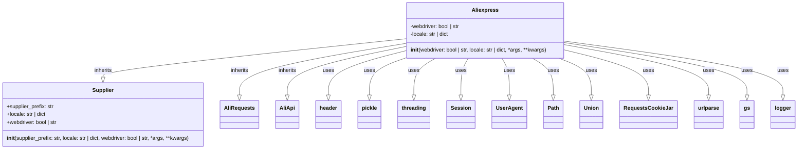

# Анализ кода `hypotez/src/suppliers/aliexpress/aliexpress.py`

## <алгоритм>

1.  **Инициализация переменных и импорт библиотек**:
    *   Импортируются необходимые библиотеки и модули: `header`, `pickle`, `threading`, `Session`, `UserAgent`, `Path`, `Union`, `RequestsCookieJar`, `urlparse`, `src.gs`, `src.suppliers.supplier.Supplier`, `src.logger.logger.logger`, `alirequests.py`, `aliapi.py`.
    *   Устанавливается режим работы ``.
2.  **Создание класса `Aliexpress`**:
    *   Класс `Aliexpress` наследуется от классов `Supplier`, `AliRequests` и `AliApi`, объединяя их функциональность.
3.  **Инициализация объекта `Aliexpress` (`__init__`)**:
    *   Принимает параметры `webdriver`, `locale` и произвольные `*args`, `**kwargs`.
    *   `webdriver`: определяет режим работы с веб-драйвером (`False` - без драйвера, `'chrome'`, `'mozilla'`, `'edge'`, `'default'`). По умолчанию `False`.
        *   Пример: `a = Aliexpress(webdriver='chrome')`
    *   `locale`: задает настройки языка и валюты. По умолчанию `{'EN': 'USD'}`.
        *   Пример: `a = Aliexpress(locale={'RU': 'RUB'})`
    *   Вызывает конструктор родительского класса `Supplier` с параметрами `supplier_prefix = 'aliexpress'`, `locale` и `webdriver`.
    *   Примеры использования:
        *   `a = Aliexpress()` - без вебдрайвера.
        *   `a = Aliexpress('chrome')` - с вебдрайвером Chrome.
        *   `a = Aliexpress(requests=True)` - в режиме запросов, если эта логика присутствует в родительских классах.

## <mermaid>

**Анализ зависимостей `mermaid`:**

*   **`Aliexpress`**: Главный класс, который наследует функциональность от `Supplier`, `AliRequests` и `AliApi`.
*   **`Supplier`**: Родительский класс, предоставляющий базовую логику для работы с поставщиками.
*   **`AliRequests`**: Класс, отвечающий за выполнение HTTP-запросов к AliExpress.
*   **`AliApi`**: Класс, предоставляющий API для взаимодействия с AliExpress.
*   **`header`**: Предположительно, модуль для работы с HTTP-заголовками.
*   **`pickle`**: Модуль для сериализации и десериализации объектов Python.
*   **`threading`**: Модуль для работы с потоками.
*   **`Session`**: Класс из библиотеки `requests`, используемый для работы с сессиями HTTP.
*   **`UserAgent`**: Класс из библиотеки `fake_useragent`, предоставляющий случайные `User-Agent` для HTTP-запросов.
*   **`Path`**: Класс из библиотеки `pathlib`, предоставляющий удобный интерфейс для работы с путями к файлам.
*   **`Union`**: Тип из модуля `typing`, используемый для указания нескольких возможных типов.
*   **`RequestsCookieJar`**: Класс из библиотеки `requests`, используемый для работы с cookie.
*   **`urlparse`**: Функция из модуля `urllib.parse`, используемая для разбора URL-адресов.
*   **`gs`**: Предположительно, модуль для глобальных настроек.
*   **`logger`**: Модуль для логирования.

## <объяснение>

**Импорты:**

*   `header`: используется для работы с заголовками HTTP запросов. Взаимодействует с `requests` и `UserAgent`.
*   `pickle`: используется для сохранения и загрузки состояния объектов, например, куки. Взаимодействует с файловой системой.
*   `threading`: используется для работы с потоками, если нужно обрабатывать запросы параллельно.
*   `requests.sessions.Session`: используется для создания сессий HTTP запросов, которые хранят куки. Взаимодействует с `requests`.
*   `fake_useragent.UserAgent`: используется для генерации случайных `User-Agent` строк, чтобы избежать блокировки. Взаимодействует с `requests` и `header`.
*   `pathlib.Path`: используется для удобной работы с путями к файлам.
*   `typing.Union`: используется для указания нескольких возможных типов для переменных.
*   `requests.cookies.RequestsCookieJar`: используется для работы с куками в HTTP запросах. Взаимодействует с `requests`.
*   `urllib.parse.urlparse`: используется для разбора URL-адресов.
*   `src.gs`: Предположительно, содержит глобальные настройки для проекта.
*   `src.suppliers.supplier.Supplier`: базовый класс для работы с поставщиками, от которого наследуется `Aliexpress`.
*   `src.suppliers.aliexpress.alirequests.AliRequests`: класс для выполнения запросов к AliExpress, от которого наследуется `Aliexpress`.
*   `src.suppliers.aliexpress.aliapi.AliApi`: класс для взаимодействия с API AliExpress, от которого наследуется `Aliexpress`.
*    `src.logger.logger.logger`: используется для записи логов работы приложения.

**Классы:**

*   `Aliexpress`:
    *   **Роль**: Основной класс для взаимодействия с AliExpress, объединяющий функциональность `Supplier`, `AliRequests` и `AliApi`.
    *   **Атрибуты**:
        *   `webdriver`: определяет режим работы с веб-драйвером.
        *   `locale`: настройки языка и валюты.
    *   **Методы**:
        *   `__init__(self, webdriver: bool | str = False, locale: str | dict = {'EN': 'USD'}, *args, **kwargs)`: конструктор класса, инициализирует атрибуты и вызывает конструктор родительского класса `Supplier`.
    *   **Взаимодействие**: Наследуется от `Supplier`, `AliRequests` и `AliApi`, использует их функциональность для работы с AliExpress.
*   `Supplier`:
    *   **Роль**: Базовый класс для всех поставщиков.
    *   **Атрибуты**:
        *   `supplier_prefix`: префикс для поставщика (`'aliexpress'`).
        *   `locale`: настройки локали.
        *   `webdriver`: настройки веб-драйвера.
    *   **Методы**:
        *   `__init__`:  конструктор, общий для всех поставщиков.
*   `AliRequests`:
     *   **Роль**: класс для выполнения запросов к AliExpress.
     *   **Атрибуты**: отсутствуют.
     *   **Методы**: методы для выполнения HTTP запросов, например получение HTML.
*   `AliApi`:
    *   **Роль**: класс для взаимодействия с API AliExpress.
     *   **Атрибуты**: отсутствуют.
     *   **Методы**: методы для работы с API AliExpress, например получение информации о товарах.

**Функции:**

*   `__init__(self, webdriver: bool | str = False, locale: str | dict = {'EN': 'USD'}, *args, **kwargs)`:
    *   **Аргументы**:
        *   `webdriver`: режим работы веб-драйвера (`False`, `'chrome'`, `'mozilla'`, `'edge'`, `'default'`).
        *   `locale`: словарь с настройками языка и валюты.
        *   `*args`, `**kwargs`: произвольные позиционные и именованные аргументы.
    *   **Возвращаемое значение**: None.
    *   **Назначение**: Инициализирует объект класса `Aliexpress`, устанавливает значения атрибутов `webdriver` и `locale`, вызывает конструктор родительского класса `Supplier`.
    *   **Примеры**:
        *   `a = Aliexpress()`: создает экземпляр класса без веб-драйвера с дефолтной локалью.
        *   `a = Aliexpress('chrome', {'RU': 'RUB'})`: создает экземпляр класса с веб-драйвером Chrome и русской локалью.
        *   `a = Aliexpress(webdriver='mozilla', locale = {'DE':'EUR'})` создает экземпляр класса с веб-драйвером Mozilla и немецкой локалью.

**Переменные:**

*   `MODE`: Строковая переменная, которая определяет режим работы. `dev` означает режим разработки.

**Потенциальные ошибки и области для улучшения:**

*   **Отсутствие реализации методов:** В коде показано только определение класса `Aliexpress` и его конструктора. Методы из `AliRequests` и `AliApi` не показаны, и не ясно, какие методы выполняют какие действия.
*   **Обработка ошибок**:  Не показано, как обрабатываются ошибки при работе с веб-драйвером, запросами или API.
*   **Конфигурация веб-драйвера**: Не определена логика конфигурации веб-драйвера (например, выбор драйвера, его опции).
*   **Логирование**: Логирование работы приложения не показано, хотя и импортирован модуль `logger`.
*   **Гибкость**:  В будущем можно добавить возможность использовать собственные сессии requests, cookies и т.д.

**Взаимосвязи с другими частями проекта:**

*   `Aliexpress` зависит от `src.suppliers.supplier.Supplier` для общей логики работы с поставщиками.
*   `Aliexpress` зависит от `src.suppliers.aliexpress.alirequests` для выполнения запросов к AliExpress.
*   `Aliexpress` зависит от `src.suppliers.aliexpress.aliapi` для работы с API AliExpress.
*   Использует `src.gs` для получения глобальных настроек.
*   Использует `src.logger.logger` для записи логов.

В целом, код определяет класс `Aliexpress`, который объединяет в себе функциональность для работы с AliExpress, однако детали реализации запросов, API и веб-драйвера не раскрываются в предоставленном фрагменте кода.