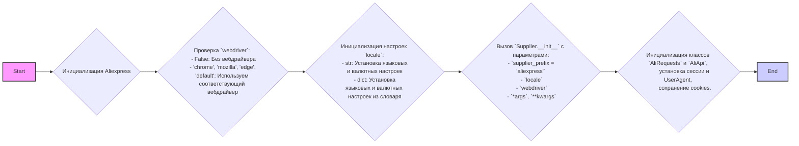
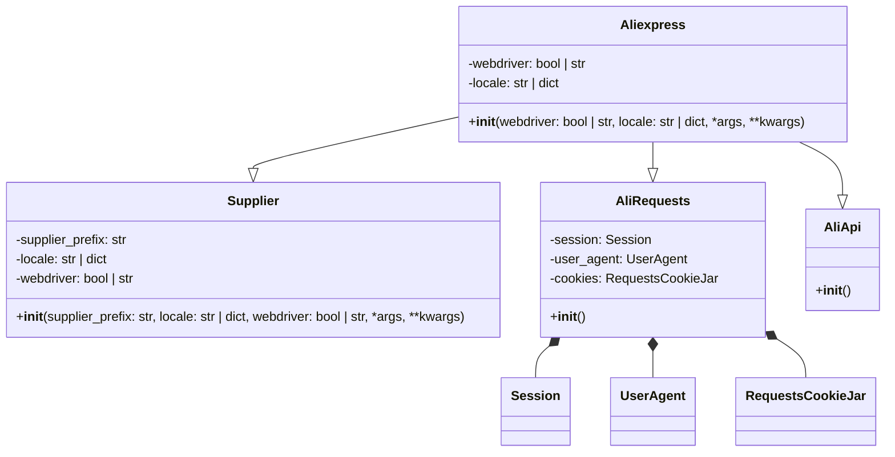
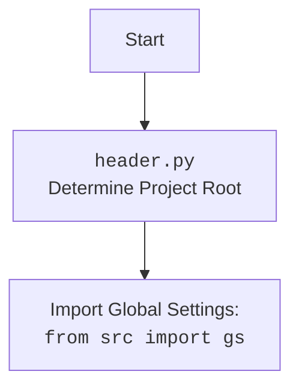

## Анализ кода `hypotez/src/suppliers/aliexpress/aliexpress.py`

### 1. **<алгоритм>**

**Блок-схема:**

**Пояснение:**

1.  **Начало**: Инициализация экземпляра класса `Aliexpress`.
2.  **Проверка `webdriver`**: Проверяется, был ли передан параметр `webdriver`. В зависимости от его значения выбирается режим работы. Например, при `webdriver = 'chrome'` будет запущен браузер Chrome, если `webdriver = False` – работа будет вестись без браузера (режим requests).
3.  **Инициализация `locale`**: Обрабатывается параметр `locale` (язык и валюта).
4.  **Вызов `Supplier.__init__`**: Вызывается конструктор родительского класса `Supplier` с заданными параметрами.
5.  **Инициализация `AliRequests` и `AliApi`**: Вызываются конструкторы родительских классов `AliRequests` и `AliApi`.
6. **Конец**: Объект `Aliexpress` создан и готов к использованию.

### 2. **<mermaid>**

**Импорты и зависимости:**

*   **`classDiagram`**: определяет структуру классов, их атрибуты и методы.
*   **`Aliexpress`**: основной класс, который объединяет функциональность других классов (`Supplier`, `AliRequests`, `AliApi`).
*   **`Supplier`**: базовый класс для поставщиков.
*   **`AliRequests`**: класс для работы с HTTP-запросами к AliExpress.
*   **`AliApi`**: класс для работы с API AliExpress.
*   **`Session`**: класс из библиотеки `requests` для управления сессиями HTTP.
*   **`UserAgent`**: класс из библиотеки `fake_useragent` для генерации случайных `User-Agent` строк.
*   **`RequestsCookieJar`**: класс из библиотеки `requests` для управления cookies.

**Дополнительно:**

### 3. **<объяснение>**

**Импорты:**

*   `import header`: Этот модуль, вероятно, содержит функционал для определения корневой директории проекта и загрузки настроек. **Цепочка взаимосвязей:**  Используется для определения глобальных настроек проекта, что важно для работы с относительными путями и ресурсами.
*   `import pickle`: Используется для сериализации и десериализации объектов Python. Обычно применяется для сохранения и загрузки состояния объектов. **Цепочка взаимосвязей:**  Может использоваться для сохранения cookies или других данных.
*   `import threading`: Используется для работы с многопоточностью. **Цепочка взаимосвязей:**  Может применяться для параллельного выполнения задач.
*   `from requests.sessions import Session`: Импортирует класс `Session` для управления HTTP-сессиями. **Цепочка взаимосвязей:**  Используется в `AliRequests` для управления запросами.
*   `from fake_useragent import UserAgent`: Импортирует класс `UserAgent` для генерации случайных User-Agent. **Цепочка взаимосвязей:**  Используется в `AliRequests`, чтобы имитировать браузер для избежания блокировок со стороны AliExpress.
*   `from pathlib import Path`: Импортирует класс `Path` для удобной работы с файловыми путями. **Цепочка взаимосвязей:**  Используется для работы с путями сохранения файлов.
*   `from typing import Union`: Используется для определения типов данных, которые могут быть разными (например, `str` или `bool`).
*   `from requests.cookies import RequestsCookieJar`: Импортирует класс `RequestsCookieJar` для управления cookie файлами. **Цепочка взаимосвязей:**  Используется в `AliRequests` для работы с cookies.
*   `from urllib.parse import urlparse`: Импортирует функцию `urlparse` для разбора URL-адресов. **Цепочка взаимосвязей:**  Используется для работы с URL-адресами.
*   `from src import gs`: Импортирует глобальные настройки проекта (предположительно). **Цепочка взаимосвязей:**  Используется для получения общих настроек проекта.
*   `from src.suppliers.supplier import Supplier`: Импортирует класс `Supplier`, базовый класс для поставщиков. **Цепочка взаимосвязей:**  `Aliexpress` наследуется от `Supplier`, что позволяет использовать его функционал.
*   `from .alirequests import AliRequests`: Импортирует класс `AliRequests`, для отправки HTTP запросов на сервер. **Цепочка взаимосвязей:**  `Aliexpress` наследуется от `AliRequests`, что позволяет использовать его функционал.
*   `from .aliapi import AliApi`: Импортирует класс `AliApi`, для работы с API AliExpress. **Цепочка взаимосвязей:**  `Aliexpress` наследуется от `AliApi`, что позволяет использовать его функционал.
*  `from src.logger.logger import logger`: Импортирует логгер для логирования. **Цепочка взаимосвязей:**  Используется для логирования действий.

**Классы:**

*   **`Aliexpress(Supplier, AliRequests, AliApi)`**:
    *   **Роль**: Главный класс, объединяющий функциональность классов `Supplier`, `AliRequests` и `AliApi` для работы с AliExpress.
    *   **Атрибуты**:
        *   `webdriver`: Определяет режим работы (с вебдрайвером или без).
        *   `locale`: Языковые и валютные настройки.
    *   **Методы**:
        *   `__init__(self, webdriver, locale, *args, **kwargs)`: Конструктор класса, инициализирует объект, вызывая конструкторы родительских классов.
    *   **Взаимодействие**: Наследует и использует методы `Supplier`, `AliRequests` и `AliApi`.
*   **`Supplier`**:
    *   **Роль**: Базовый класс для поставщиков.
    *   **Атрибуты**:
        *  `supplier_prefix`: Префикс поставщика (в данном случае 'aliexpress').
        *   `locale`: Локализация поставщика.
        *   `webdriver`: Режим работы (с вебдрайвером или без).
    *   **Методы**:
        * `__init__(self, supplier_prefix, locale, webdriver, *args, **kwargs)`: Конструктор.

*   **`AliRequests`**:
    *   **Роль**: Класс для управления HTTP запросами к AliExpress.
    *   **Атрибуты**:
        *   `session`: Объект сессии requests.
        *   `user_agent`: Объект UserAgent для генерации случайных user agents.
        *   `cookies`: Хранилище cookie файлов.
    *   **Методы**:
        *   `__init__(self)`: Инициализация сессии, UserAgent и загрузка cookie.

*   **`AliApi`**:
    *   **Роль**: Класс для взаимодействия с API AliExpress.
    *   **Атрибуты**: нет явно определенных в этом фрагменте кода.
    *   **Методы**:
        *   `__init__(self)`: Инициализация, не содержит явной логики.

**Функции:**

*   **`__init__(self, webdriver, locale, *args, **kwargs)` (в классе `Aliexpress`)**:
    *   **Аргументы**:
        *   `webdriver` (bool | str): Режим работы с вебдрайвером.
        *   `locale` (str | dict): Локализация.
        *   `*args`, `**kwargs`: Дополнительные аргументы.
    *   **Возвращаемое значение**: Нет (конструктор).
    *   **Назначение**: Инициализирует объект класса `Aliexpress`, устанавливает режим работы, локализацию, вызывает конструкторы родительских классов.
    *   **Примеры**:
        *   `a = Aliexpress()` - Создание объекта без вебдрайвера.
        *   `a = Aliexpress('chrome')` - Создание объекта с Chrome вебдрайвером.

**Переменные:**

*   `webdriver`: Тип `bool` или `str`, определяет режим работы с вебдрайвером.
*   `locale`: Тип `str` или `dict`, определяет локализацию и валюту.
*  `supplier_prefix`: Тип `str`, префикс поставщика.

**Потенциальные ошибки и области для улучшения:**

*   **Обработка ошибок**: Код не содержит явной обработки ошибок (например, при создании webdriver или выполнении HTTP-запросов).
*   **Гибкость locale**: Текущая реализация локализации может быть недостаточно гибкой. Желательно расширить ее возможности.
*   **Настройка UserAgent**: Возможность настройки user_agent или его рандомной генерации.
*   **Логирование**: Добавить больше логов для отслеживания работы скрипта.
*   **Расширение функционала `AliApi`**: Класс `AliApi` не содержит никаких методов, его следует дополнить методами для работы с API.

**Цепочки взаимосвязей:**

1.  `header.py` определяет корневую директорию проекта и загружает глобальные настройки.
2.  `Aliexpress` использует `Supplier`, `AliRequests`, `AliApi` для реализации логики работы с AliExpress.
3.  `AliRequests` использует `requests.Session` для управления HTTP-сессиями и `fake_useragent.UserAgent` для создания рандомного `User-Agent`.
4.  `logger` используется для логгирования действий.
5.  `pickle` может использоваться для хранения cookies.
6. `threading` может использоваться для асинхронной работы.

В целом, код представляет собой базовый класс для работы с AliExpress, предоставляющий абстракцию над HTTP-запросами и API. В дальнейшем требуется расширить функционал, добавить обработку ошибок и сделать его более гибким.