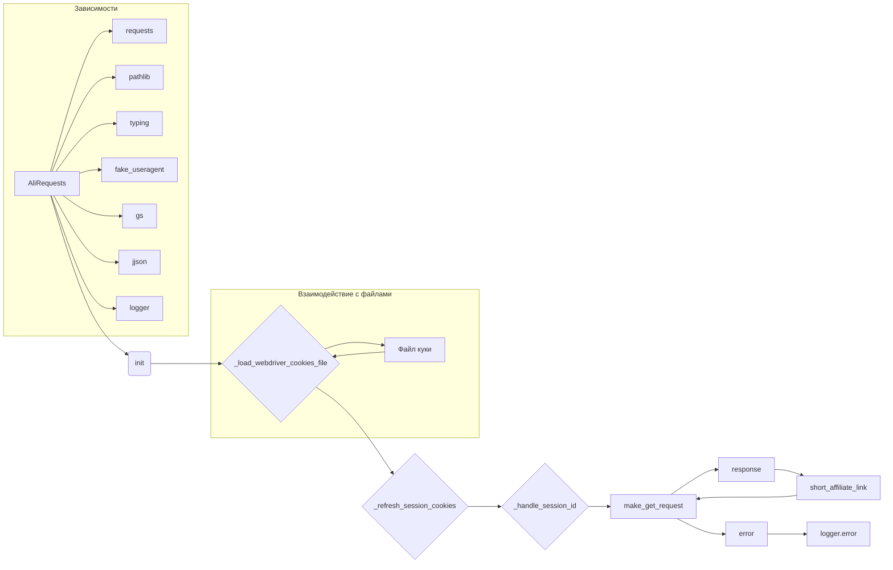

```MD
# <input code>

```python
## \file hypotez/src/suppliers/aliexpress/alirequests.py
# -*- coding: utf-8 -*-\
#! venv/Scripts/python.exe
#! venv/bin/python/python3.12

"""
.. module: src.suppliers.aliexpress 
	:platform: Windows, Unix
	:synopsis:

"""
MODE = 'dev'

import pickle
import requests
from pathlib import Path
from typing import List
from requests.cookies import RequestsCookieJar
from urllib.parse import urlparse
from fake_useragent import UserAgent

from src import gs
from src.utils.jjson import j_dumps
from src.logger import logger
# ... (rest of the code)
```

# <algorithm>

**Общая идея:** Класс `AliRequests` предназначен для работы с API AliExpress, загружая куки и осуществляя запросы.

**Шаг 1: Инициализация (`__init__`)**:
- Создается экземпляр `RequestsCookieJar` для хранения куки.
- Инициализируются `self.session_id` (None) и `self.headers` (с рандомным user-agent).
- Создается сессия `requests.Session()` для повышения эффективности.
- Загружаются куки из файла (метод `_load_webdriver_cookies_file`).

**Пример:**

```
ali_requests = AliRequests("chrome")
```

**Шаг 2: Загрузка куки (`_load_webdriver_cookies_file`)**:
- Формируется путь к файлу куки.
- Файл открывается, куки загружаются из pickle.
- Каждая кука устанавливается в `self.cookies_jar`.
- Логируется успех или ошибка загрузки.
- Вызывается `_refresh_session_cookies` для обновления сессии.

**Пример:**

```
cookie_file_path = Path(gs.dir_cookies, 'aliexpress.com', 'chrome', 'cookie')
```

**Шаг 3: Обновление сессии (`_refresh_session_cookies`)**:
- Делается запрос на страницу `https://portals.aliexpress.com`.
- Полученные куки обновляются в `self.cookies_jar`.
- Обрабатывается `JSESSIONID` (метод `_handle_session_id`).

**Пример:**

```
resp = self.session.get('https://portals.aliexpress.com', headers=self.headers, cookies=self.cookies_jar)
```

**Шаг 4: Обработка `JSESSIONID` (`_handle_session_id`)**:
- Ищется `JSESSIONID` в `response_cookies`.
- Если найден, обновляется `self.session_id` и соответствующая кука в `self.cookies_jar`.

**Пример:**

```
for cookie in response_cookies:
    if cookie.name == 'JSESSIONID':
        # ... (код обработки)
```

**Шаг 5: Выполнение GET-запроса (`make_get_request`)**:
- Обновляются куки сессии.
- Выполняется GET-запрос на указанный `url` с передачей куки и хедеров.
- Обрабатывается `JSESSIONID` в ответах.
- Возвращается `response` или `False` при ошибке.


**Шаг 6: Получение короткой ссылки (`short_affiliate_link`)**:
- Создается URL для запроса короткой ссылки.
- Выполняется GET-запрос с помощью `make_get_request`.


# <mermaid>



**Объяснение диаграммы:**

- `AliRequests` - главный класс, взаимодействует с другими компонентами.
- `init`, `_load_webdriver_cookies_file`, `_refresh_session_cookies`, `_handle_session_id`, `make_get_request` и `short_affiliate_link` - методы класса `AliRequests`.
- `requests`, `pathlib`, `typing`, `fake_useragent`, `gs`, `jjson` и `logger` - импортированные модули и классы, на которые опирается класс `AliRequests`.
-  Зависимости от файлов (куки) показаны внутри подграфа для ясности.

# <explanation>

**Импорты:**

- `requests`: Библиотека для работы с HTTP-запросами.
- `pickle`: Для сериализации и десериализации данных куки.
- `pathlib`: Для работы с путями к файлам.
- `typing`: Для указания типов данных.
- `RequestsCookieJar`: Класс для работы с куки в `requests`.
- `urllib.parse`: Для работы с URL.
- `fake_useragent`: Для генерации случайных user-agent.
- `gs`: (предположительно) Модуль из проекта, вероятно, для получения путей.
- `jjson`: (предположительно) Модуль для работы с JSON.
- `logger`: (предположительно) Модуль для логирования.


**Классы:**

- `AliRequests`: Обрабатывает запросы к AliExpress, хранит куки и сессию. Имеет методы для загрузки куки, обновления сессии, отправки запросов GET и генерации коротких ссылок.


**Функции:**

- `__init__(self, webdriver_for_cookies='chrome')`: Инициализирует объект `AliRequests`. Принимает имя драйвера (по умолчанию 'chrome').
- `_load_webdriver_cookies_file(self, webdriver_for_cookies='chrome')`: Загружает куки из файла с указанным драйвером. Возвращает `True` при успешной загрузке и `False` в случае ошибки.
- `_refresh_session_cookies(self)`: Обновляет куки сессии, делая запрос на целевую страницу.
- `_handle_session_id(self, response_cookies)`: Обрабатывает `JSESSIONID` из ответа, обновляет `self.session_id` и куки.
- `make_get_request(self, url: str, cookies: List[dict] = None, headers: dict = None)`: Отправляет GET-запрос, обновляет `self.session_id`, если это необходимо, и возвращает ответ. Возвращает ответ или `False` при ошибке.
- `short_affiliate_link(self, link_url: str)`: Создаёт URL для получения короткой аффилированной ссылки и отправляет запрос к серверу.


**Переменные:**

- `MODE`: Строка, определяющая режим работы (в данном случае 'dev').
- `cookies_jar`: Объект `RequestsCookieJar` для хранения куки.
- `session_id`: ID сессии пользователя.
- `headers`: Словарь с заголовками HTTP-запроса.
- `session`: Сессия `requests` для повышения эффективности.

**Возможные ошибки и улучшения:**

- **Обработка ошибок:** Обработка ошибок внутри каждого метода, например, `try...except` блоки, были бы желательны. В случае возникновения `requests.RequestException` , полезно указывать тип ошибки и информацию о конкретном запросе для улучшения отладки.
- **Константы:** Использование констант для часто используемых URL-адресов, например, для `https://portals.aliexpress.com` сделало бы код более читаемым и поддерживаемым.
- **Логирование:** Более подробная информация в логах может быть полезна для анализа проблем.
- **Использование флагов:** Вместо хардкодированных значений (например, `'chrome'`) стоит использовать конфигурационные файлы, что позволит легко менять настройки без изменения кода.
- **Типизация:** Подробная типизация всех параметров в методах, включая типы возвращаемых значений, улучшила бы код.


**Взаимосвязи с другими частями проекта:**

- `gs`: Вероятно, содержит пути к файлам, конфигурационные параметры или другую вспомогательную информацию.
- `utils.jjson`:  Осуществляет преобразование данных в JSON формат.
- `logger`: Модуль логирования для записи сообщений об ошибках и успехах.

В целом код хорошо структурирован, но может быть улучшен с точки зрения обработки ошибок и повышения читаемости.