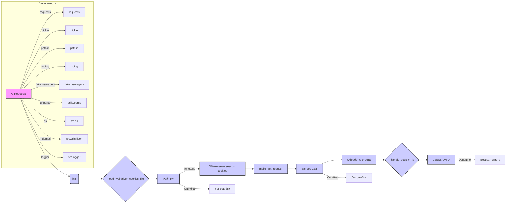

```MD
# <input code>

```python
## \file hypotez/src/suppliers/aliexpress/alirequests.py
# -*- coding: utf-8 -*-\
#! venv/Scripts/python.exe
#! venv/bin/python/python3.12

"""
.. module: src.suppliers.aliexpress 
	:platform: Windows, Unix
	:synopsis:

"""
MODE = 'dev'

import pickle
import requests
from pathlib import Path
from typing import List
from requests.cookies import RequestsCookieJar
from urllib.parse import urlparse
from fake_useragent import UserAgent

from src import gs
from src.utils.jjson import j_dumps
from src.logger import logger
class AliRequests:
    """Handles requests to AliExpress using the requests library."""

    def __init__(self, webdriver_for_cookies: str = 'chrome'):
        """ Initializes the AliRequests class.

        @param webdriver_for_cookies The name of the webdriver for loading cookies.
        """
        self.cookies_jar = RequestsCookieJar()
        self.session_id = None
        self.headers = {'User-Agent': UserAgent().random}
        self.session = requests.Session()
        
        self._load_webdriver_cookies_file(webdriver_for_cookies)

    def _load_webdriver_cookies_file(self, webdriver_for_cookies: str = 'chrome') -> bool:
        """ Loads cookies from a webdriver file.

        @param webdriver_for_cookies The name of the webdriver.
        @returns True if cookies loaded successfully, False otherwise.
        """
        cookie_file_path = Path(gs.dir_cookies, 'aliexpress.com', webdriver_for_cookies, 'cookie')

        try:
            with open(cookie_file_path, 'rb') as file:
                cookies_list = pickle.load(file)
                for cookie in cookies_list:
                    self.cookies_jar.set(
                        cookie['name'],
                        cookie['value'],
                        domain=cookie.get('domain', ''),
                        path=cookie.get('path', '/'),
                        secure=bool(cookie.get('secure', False)),
                        rest={'HttpOnly': cookie.get('HttpOnly', 'false'), 'SameSite': cookie.get('SameSite', 'unspecified')},
                        expires=cookie.get('expirationDate')
                    )
                logger.success(f"Cookies loaded from {cookie_file_path}")
                self._refresh_session_cookies()  # Refresh session cookies after loading
                return True
        except (FileNotFoundError, ValueError) as ex:
            logger.error(f"Failed to load cookies from {cookie_file_path}", ex)
            return False
        except Exception as ex:
            logger.error("An error occurred while loading cookies", ex)
            return False

    # ... (rest of the code)
```

# <algorithm>

**Пошаговая блок-схема:**

1. **Инициализация (AliRequests.__init__)**:
    * Создается экземпляр `RequestsCookieJar` для хранения куки.
    * `self.session_id` и `self.headers` инициализируются.
    * Создается сессия `requests.Session()` для повторного использования.
    * Вызывается вспомогательный метод `_load_webdriver_cookies_file`.

2. **Загрузка куки (AliRequests._load_webdriver_cookies_file)**:
    * Формируется путь к файлу с куками.
    * Попытка открыть файл на чтение в двоичном режиме (`rb`).
    * Загрузка данных из файла с помощью `pickle.load`.
    * Обработка каждой куки:
        * Создание `RequestsCookieJar` со значениями из данных из файла.
    * Если куки загружены успешно:
        * Вызов `_refresh_session_cookies`.
        * Возвращение True.
    * Если ошибка:
        * Логирование ошибки и возврат False.


3. **Обновление сессии (AliRequests._refresh_session_cookies)**:
    * Делается запрос на `https://portals.aliexpress.com`.
    * Если куки есть, они передаются в запрос.
    * Обработка ответа:
        * Вызов `_handle_session_id` для извлечения `JSESSIONID`.

4. **Обработка JSESSIONID (AliRequests._handle_session_id)**:
    * Цикл по кукам в ответе.
    * Если найдена кука `JSESSIONID`:
        * Проверка, совпадает ли значение с существующим `self.session_id`.
        * Если не совпадает, обновление `self.session_id` и добавление новой куки в `self.cookies_jar`.
        * Пометка о найденном `JSESSIONID`.
        * Выход из цикла.

5. **Делание запроса (AliRequests.make_get_request)**:
     * Обновление куки в сессии.
     * Выполнение запроса GET.
     * Обработка ответа:
         * Вызов `_handle_session_id` для обновления `JSESSIONID`.
         * Возврат ответа.
     * Обработка ошибок.


6. **Короткая ссылка (AliRequests.short_affiliate_link)**:
    * Создание URL для генерации короткой ссылки.
    * Вызов `make_get_request` для получения короткой ссылки.
    * Возврат результата.

**Пример:**

Функция `_load_webdriver_cookies_file` загружает куки из файла, содержащего список словарей.  Каждое значение  `cookie` представляет собой словарик, содержащий информацию о куке.  В коде происходит проверка, добавление, и обновление куки в `RequestsCookieJar`.


# <mermaid>



# <explanation>

**Импорты:**

* `pickle`:  Используется для сериализации и десериализации данных куки, сохраняемых в файлах.
* `requests`: Основная библиотека для отправки HTTP-запросов.
* `pathlib`: Предоставляет классы для работы с путями к файлам, делая код более читаемым и устойчивым.
* `typing`:  Используется для типов, что повышает читабельность и позволяет использовать подсказки типов.
* `requests.cookies`: Управляет куки.
* `urllib.parse`: Используется для разбора URL-адресов, обычно при анализе ответов HTTP.
* `fake_useragent`:  Генерирует случайные User-Agent строки для обхода блокировок на веб-сайтах.
* `gs`: Похоже, это собственная переменная окружения/константа для определения пути к каталогу с куками.
* `j_dumps`: Вероятно, утилита для обработки JSON-данных из сторонних источников.
* `logger`: Собственный модуль для ведения логов (возможно, с дополнительными опциями форматирования и обработки уровня логов).

**Классы:**

* `AliRequests`: Обрабатывает запросы к AliExpress.  Обладает атрибутами для хранения куки, сессионного идентификатора и заголовков.  
    * `__init__`: Инициализирует объект, загружая куки из файла.
    * `_load_webdriver_cookies_file`: Загружает куки из файла, который, похоже, содержит данные, записанные веб-драйвером. Важно, что куки не просто загружаются, но и применяются в `RequestsCookieJar`.
    * `_refresh_session_cookies`: Отправляет запрос на страницу, чтобы обновить куки, особенно `JSESSIONID`, необходимый для взаимодействия с AliExpress.
    * `_handle_session_id`: Обрабатывает куку `JSESSIONID` в ответе, обновляя значение и добавляя куки в `cookies_jar`.
    * `make_get_request`: Делает GET запрос, используя куки и дополнительные заголовки, обрабатывает ответ.
    * `short_affiliate_link`: Служебная функция для получения короткой аффилиатной ссылки.

**Функции:**


**Переменные:**

* `MODE`: Вероятно, переменная, определяющая режим работы (например, `dev`, `prod`).

**Возможные ошибки и улучшения:**

* **Обработка исключений**: Хотя код обрабатывает некоторые исключения, можно добавить более подробную обработку ошибок (например, проверку кода ответа `resp.status_code`).

* **Подсказки типов**: Можно сделать более подробные подсказки типов для аргументов и возвращаемых значений, например, указав тип `requests.Response` для `make_get_request`.

* **Повторное использование сессии**: Функция `requests.Session()` используется для хранения куки и предотвращения повторного подключения, но код можно сделать более гибким, если добавить возможность переключения между несколькими сессиями.

* **Обновление куки**: Логичнее загружать куки только один раз при инициализации и обновлять их только при необходимости, а не на каждом запросе.


**Взаимосвязи с другими частями проекта:**

Код использует модули `gs`, `j_dumps`, и `logger`, что указывает на то, что это часть более крупного проекта.  `gs` вероятно содержит конфигурационные данные, `j_dumps` - функционал для работы с JSON, а `logger` - для ведения логов.

В целом, код хорошо структурирован и обработка куки выглядит адекватной, но стоит обратить внимание на улучшение обработки ошибок и добавление более подробных подсказок типов для повышения читабельности и устойчивости кода.