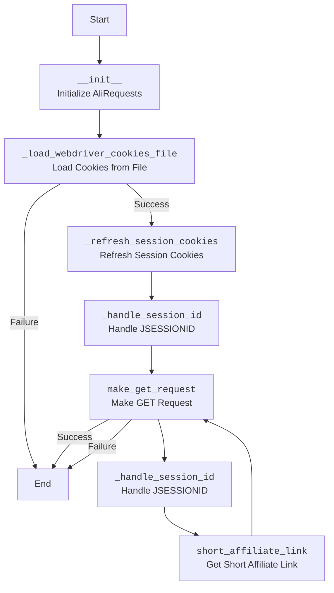
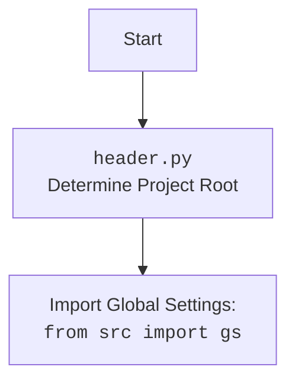

## <алгоритм>

**1. `__init__` (Инициализация класса):**
   - Создает пустой `RequestsCookieJar` для хранения куки.
   - Инициализирует `session_id` как `None`.
   - Устанавливает случайный `User-Agent` в заголовках.
   - Создает объект `requests.Session` для управления сессией.
   - Вызывает метод `_load_webdriver_cookies_file` для загрузки куки из файла.
    ```python
    # Пример:
    # class AliRequests(webdriver_for_cookies='chrome')
    # self.cookies_jar = RequestsCookieJar()
    # self.session_id = None
    # self.headers = {'User-Agent': 'Mozilla/5.0 ...'}
    # self.session = requests.Session()
    # self._load_webdriver_cookies_file(webdriver_for_cookies='chrome')
    ```

**2. `_load_webdriver_cookies_file` (Загрузка куки из файла):**
   - Формирует путь к файлу куки на основе `gs.dir_cookies`, `'aliexpress.com'`, имени вебдрайвера и имени файла `'cookie'`.
     ```python
    # Пример:
    # gs.dir_cookies = /path/to/cookies
    # webdriver_for_cookies = 'chrome'
    # cookie_file_path = /path/to/cookies/aliexpress.com/chrome/cookie
     ```
   - Открывает файл куки в бинарном режиме чтения (`'rb'`).
   - Использует `pickle.load` для десериализации списка куки.
   - Итерируется по списку куки и устанавливает каждую куку в `self.cookies_jar`.
       - Извлекает `name`, `value`, `domain`, `path`, `secure`, `HttpOnly`, `SameSite`, `expires`
       -  Если `domain`, `path`, `secure`, `expires` не существует - используется значение по умолчанию
         ```python
        # Пример:
        #   cookie = {'name': 'cookie_name', 'value': 'cookie_value', 'domain': '.aliexpress.com', 'path': '/', 'secure': True, 'HttpOnly': True, 'SameSite': 'None', 'expirationDate': 1678886400}
        #   self.cookies_jar.set(cookie['name'], cookie['value'], domain=cookie.get('domain', ''), path=cookie.get('path', '/'), secure=bool(cookie.get('secure', False)), rest={'HttpOnly': cookie.get('HttpOnly', 'false'), 'SameSite': cookie.get('SameSite', 'unspecified')}, expires=cookie.get('expirationDate'))
         ```
   - После успешной загрузки, обновляет сессионные куки вызовом `_refresh_session_cookies()`.
   - Логирует успех или неудачу в зависимости от результата.
   - Возвращает `True` при успехе, `False` при ошибке.

**3. `_refresh_session_cookies` (Обновление сессионных куки):**
   - Отправляет GET запрос на `https://portals.aliexpress.com` с заголовками и куки из `self.cookies_jar`.
      ```python
      # Пример:
      # url = 'https://portals.aliexpress.com'
      # resp = self.session.get(url, headers=self.headers, cookies=self.cookies_jar)
      ```
   - Если `self.cookies_jar` пустой, то запрос отправляется без кук.
   - Вызывает `_handle_session_id` для обработки `JSESSIONID` из кук ответа.
   - Логирует ошибки в случае неудачи запроса.

**4. `_handle_session_id` (Обработка `JSESSIONID`):**
   - Итерируется по кукам ответа.
   - Ищет куку с именем `'JSESSIONID'`.
   - Если `JSESSIONID` найден и его значение отличается от `self.session_id`, то:
     - Обновляет `self.session_id` новым значением.
     - Устанавливает куку в `self.cookies_jar`.
       - Извлекает `name`, `value`, `domain`, `path`, `secure`, `HttpOnly`, `SameSite`, `expires`
         ```python
        # Пример:
        #   cookie = {'name': 'JSESSIONID', 'value': 'new_session_id', 'domain': '.aliexpress.com', 'path': '/', 'secure': True, 'HttpOnly': True, 'SameSite': 'None', 'expires': 1678886400}
        #   self.cookies_jar.set(cookie.name, cookie.value, domain=cookie.domain, path=cookie.path, secure=cookie.secure, rest={'HttpOnly': cookie._rest.get('HttpOnly', 'false'), 'SameSite': cookie._rest.get('SameSite', 'unspecified')}, expires=cookie.expires)
        ```
     - Выходит из цикла.
   - Если `JSESSIONID` не найден, то логирует предупреждение.

**5. `make_get_request` (Выполнение GET запроса):**
   - Принимает `url`, опциональный `cookies` и `headers`.
   - Объединяет переданные заголовки с `self.headers`.
   - Обновляет `session.cookies` из `self.cookies_jar`.
   - Отправляет GET запрос с объединенными заголовками.
   - Вызывает `resp.raise_for_status()` для проверки статуса ответа.
   - Если запрос успешен, вызывает `_handle_session_id` для обработки `JSESSIONID`.
   - Возвращает объект `requests.Response` при успехе, `False` при ошибке.
   ```python
    # Пример:
    # url = 'https://example.com/api/data'
    # headers = {'X-Custom-Header': 'value'}
    # cookies = [{'name': 'custom_cookie', 'value': 'custom_value'}]
    # self.session.cookies.update(self.cookies_jar)
    # resp = self.session.get(url, headers=headers)
    # self._handle_session_id(resp.cookies)
    # return resp
    ```

**6. `short_affiliate_link` (Получение короткой аффилиатной ссылки):**
   - Формирует URL для запроса короткой аффилиатной ссылки на основе `link_url` и `track_id`.
   - Вызывает `make_get_request` с сформированным URL.
   - Возвращает результат вызова `make_get_request`.
   ```python
   # Пример:
   # link_url = 'https://example.com/product/123'
   # base_url = 'https://portals.aliexpress.com/affiportals/web/link_generator.htm'
   # track_id = 'default'
   # url = f"{base_url}?trackId={track_id}&targetUrl={link_url}"
   # return self.make_get_request(url)
    ```

## <mermaid>




**Анализ зависимостей `mermaid`:**

-   **`Start`**:  Начало процесса.
-   **`Init`**:  Инициализация класса `AliRequests`. Зависимости:
    -  `RequestsCookieJar` из `requests.cookies` для управления куками.
    -  `UserAgent` из `fake_useragent` для генерации случайного `User-Agent`.
    - `requests.Session` из `requests` для управления сессией.
    - Вызов `_load_webdriver_cookies_file` для загрузки кук.
-   **`LoadCookies`**: Загрузка кук из файла. Зависимости:
    -   `pickle` для сериализации/десериализации кук.
    -   `Path` из `pathlib` для работы с путями к файлам.
    - `gs` из `src` для доступа к глобальным настройкам.
-   **`RefreshSessionCookies`**: Обновление сессионных кук. Зависимости:
    -   `requests.Session` из `requests` для отправки HTTP запросов.
    -   `RequestsCookieJar` из `requests.cookies` для работы с куками.
-   **`HandleSessionId1`**: Обработка `JSESSIONID` после загрузки кук. Зависимости:
    -   `RequestsCookieJar` из `requests.cookies` для работы с куками.
    -   Работает с куками из `resp.cookies`
-   **`MakeGetRequest`**: Отправка GET-запроса. Зависимости:
    -   `requests.Session` из `requests` для отправки HTTP запросов.
    -   `requests.RequestException` из `requests` для отлова ошибок запроса.
    - Работает с куками из `self.cookies_jar`.
-   **`HandleSessionId2`**: Обработка `JSESSIONID` после выполнения запроса. Зависимости:
    -   `RequestsCookieJar` из `requests.cookies` для работы с куками.
-   **`ShortAffiliateLink`**: Получение сокращенной аффилиатной ссылки. Зависимости:
    -   `make_get_request` для отправки HTTP запроса.
-   **`End`**: Конец процесса.

## <объяснение>

**Импорты:**

-   `pickle`: Используется для сохранения и загрузки объектов Python (в данном случае, списка куки) в файл. Это позволяет сохранять куки между сессиями.
-   `requests`: Основная библиотека для выполнения HTTP-запросов. Используется для отправки GET-запросов на сервер AliExpress.
-   `pathlib.Path`: Обеспечивает кроссплатформенную работу с путями к файлам и директориям. Позволяет гибко управлять файлами куки.
-   `typing.List`: Используется для аннотации типов. Указывает, что переменная может быть списком.
-   `requests.cookies.RequestsCookieJar`:  Класс для хранения куки в формате, используемом библиотекой `requests`. Позволяет эффективно управлять куками.
-   `urllib.parse.urlparse`: Используется для разбора URL. (Не используется напрямую в коде, но возможно используется в `_handle_session_id` через cookie.domain и cookie.path)
-   `fake_useragent.UserAgent`: Используется для генерации случайных `User-Agent` для избежания блокировки со стороны сервера.
-   `src.gs`:  Импорт глобальных настроек проекта из модуля `src`. Используется для доступа к директории хранения кук.
-   `src.utils.jjson.j_dumps`: Функция из модуля `src.utils.jjson` для сериализации JSON. (Не используется в данном коде)
-   `src.logger.logger`:  Импорт логгера из модуля `src.logger` для логирования сообщений об ошибках и успехах.

**Класс `AliRequests`:**

-   **Роль**: Инкапсулирует логику взаимодействия с AliExpress API через HTTP-запросы. Обеспечивает управление куками и сессиями для авторизации.
-   **Атрибуты**:
    -   `cookies_jar`: Объект `RequestsCookieJar` для хранения кук.
    -   `session_id`: Идентификатор сессии, получаемый из кук `JSESSIONID`.
    -   `headers`: Словарь с HTTP-заголовками, включая случайный `User-Agent`.
    -   `session`: Объект `requests.Session` для управления сессией.
-   **Методы:**
    -   `__init__(self, webdriver_for_cookies: str = 'chrome')`: Конструктор класса. Инициализирует атрибуты и загружает куки.
    -   `_load_webdriver_cookies_file(self, webdriver_for_cookies: str = 'chrome')`: Загружает куки из файла, используя `pickle`. Возвращает `True` при успехе, `False` при ошибке.
    -   `_refresh_session_cookies(self)`: Обновляет куки сессии, делая запрос на `https://portals.aliexpress.com`.
    -   `_handle_session_id(self, response_cookies)`: Обрабатывает `JSESSIONID` из кук ответа. Сохраняет или обновляет идентификатор сессии.
    -   `make_get_request(self, url: str, cookies: List[dict] = None, headers: dict = None)`: Выполняет GET запрос с куками и заголовками. Возвращает объект `requests.Response` или `False` в случае ошибки.
    -   `short_affiliate_link(self, link_url: str)`:  Генерирует сокращенную аффилиатную ссылку, вызывая `make_get_request`. Возвращает объект `requests.Response` или `False` в случае ошибки.

**Функции:**

-   `__init__`:
    -   **Аргументы**:
        -   `webdriver_for_cookies` (str, по умолчанию `'chrome'`): Имя вебдрайвера, для которого загружаются куки.
    -   **Возвращаемое значение**: Отсутствует (метод инициализации).
    -   **Назначение**: Инициализирует объект класса `AliRequests`.
-   `_load_webdriver_cookies_file`:
    -   **Аргументы**:
        -   `webdriver_for_cookies` (str, по умолчанию `'chrome'`): Имя вебдрайвера, из которого загружаются куки.
    -   **Возвращаемое значение**: `bool`: `True` при успехе, `False` при ошибке.
    -   **Назначение**: Загружает куки из файла, используя `pickle` и устанавливает их в `self.cookies_jar`.
-  `_refresh_session_cookies`:
    -  **Аргументы**: Отсутствуют
    -  **Возвращаемое значение**: Отсутствует
    -  **Назначение**:  Обновляет куки сессии, делая запрос на `https://portals.aliexpress.com`.
-   `_handle_session_id`:
    -   **Аргументы**:
        -   `response_cookies`:  Куки, полученные в ответе от сервера.
    -   **Возвращаемое значение**: Отсутствует.
    -   **Назначение**:  Обрабатывает куку `JSESSIONID`, сохраняя или обновляя идентификатор сессии.
-   `make_get_request`:
    -   **Аргументы**:
        -   `url` (str): URL для запроса.
        -   `cookies` (List[dict], опционально): Список кук для использования.
        -   `headers` (dict, опционально): Дополнительные заголовки для запроса.
    -   **Возвращаемое значение**: `requests.Response` при успехе или `False` при ошибке.
    -   **Назначение**: Отправляет GET-запрос с заданными параметрами.
-   `short_affiliate_link`:
    -   **Аргументы**:
        -   `link_url` (str): URL для сокращения.
    -   **Возвращаемое значение**: `requests.Response` при успехе или `False` при ошибке.
    -   **Назначение**: Получает короткую аффилиатную ссылку.

**Переменные:**

-   `self.cookies_jar`: Объект `RequestsCookieJar` для хранения кук.
-   `self.session_id`: Идентификатор сессии (строка).
-   `self.headers`: Словарь с HTTP-заголовками (словарь).
-    `self.session`: Объект `requests.Session` для управления сессией.
-    `cookie_file_path`: Путь к файлу с куками (Path).
- `cookie`: Словарь кук (словарь).
- `url`: URL для запроса (строка)
- `resp`: Ответ от сервера (requests.Response)
- `base_url`: Базовый URL для создания сокращенной аффилиатной ссылки (строка)
- `track_id`: Трек ID для аффилиатной ссылки (строка)
- `link_url`: URL для сокращения (строка)

**Потенциальные ошибки и области для улучшения:**

-   Обработка ошибок: Код обрабатывает `FileNotFoundError`, `ValueError`, `requests.RequestException` и общие `Exception`, но можно добавить более специфичную обработку ошибок для разных случаев.
-   Куки: Куки обрабатываются в виде словарей, что может вызвать проблемы если структура словаря кук изменится.
-   Логирование: Добавить уровень логирования для всех действий, а не только для ошибок и успехов.
-   Рефакторинг: Можно вынести повторяющийся код для установки кук в отдельную функцию.
-   Управление сессиями: Можно добавить механизм для управления несколькими сессиями.

**Взаимосвязи с другими частями проекта:**

-   **`src.gs`**: Используется для доступа к глобальным настройкам проекта, в частности к директории хранения кук.
-   **`src.logger.logger`**: Используется для логирования событий в приложении.
-   **`src.utils.jjson`**: (Не используется в данном коде) потенциально используется для работы с JSON данными.

**Цепочка взаимосвязей:**

1.  Класс `AliRequests` инициализируется и использует глобальные настройки (`src.gs`) для определения местоположения файлов куки.
2.  Куки загружаются из файла, используя `pickle` и `pathlib.Path`.
3.  Сессионные куки обновляются, используя `requests.Session` и `RequestsCookieJar`.
4.  `JSESSIONID` обрабатывается, обеспечивая сохранение сессии.
5.  Метод `make_get_request` отправляет HTTP запросы на AliExpress с необходимыми заголовками и куками.
6.  Метод `short_affiliate_link` использует `make_get_request` для получения сокращенной ссылки.
7.  Все действия логируются через `src.logger.logger`.

Таким образом, данный код обеспечивает логику для взаимодействия с AliExpress API, используя куки и сессии для авторизации и отправки запросов, и является важной частью функциональности проекта.