## <алгоритм>

1. **Инициализация `AliRequests`**:
   - При создании экземпляра `AliRequests` вызывается метод `__init__`.
   - Создается пустой `RequestsCookieJar` для хранения куки.
   - Инициализируются `session_id` как `None` и `headers` с `User-Agent`.
   - Создается сессия `requests.Session()`.
   - Вызывается метод `_load_webdriver_cookies_file`, чтобы загрузить куки из файла.

   **Пример**:
   ```python
   ali_requests = AliRequests(webdriver_for_cookies='chrome')
   ```

2. **Загрузка куки из файла `_load_webdriver_cookies_file`**:
   - Формируется путь к файлу с куками.
   - Пытается открыть файл и загрузить куки (список словарей) с помощью `pickle`.
   - Для каждой куки в списке:
      - Добавляет куки в `self.cookies_jar` используя `set()`.
   - Вызывает метод `_refresh_session_cookies` для обновления куки в сессии.
   - В случае успеха возвращает `True`, иначе `False` (с логированием ошибок).

   **Пример**:
   ```python
   # Файл cookie существует и содержит данные
   # cookies_list = [{'name': 'cookie1', 'value': 'value1', ...}, ...]
   self._load_webdriver_cookies_file('chrome') # Загрузит куки из файла
   ```

3. **Обновление куки сессии `_refresh_session_cookies`**:
   - Выполняет GET-запрос к `https://portals.aliexpress.com` для обновления куки.
   - Если `self.cookies_jar` не пустой, то запрос выполняется с куками, иначе без них.
   - Вызывает метод `_handle_session_id` для обработки и сохранения `JSESSIONID`.

   **Пример**:
   ```python
    # self.cookies_jar имеет какие-то куки
    resp = self.session.get(url, headers=self.headers, cookies=self.cookies_jar)
    # response.cookies содержит данные о куки с JSESSIONID
   self._refresh_session_cookies() # Обновит куки в сессии и обработает JSESSIONID
   ```

4. **Обработка `JSESSIONID` `_handle_session_id`**:
   - Проходит по всем куки ответа.
   - Если кука имеет имя `JSESSIONID`:
     - Проверяет, изменился ли `JSESSIONID`. Если не изменился, то выход.
     - Обновляет `self.session_id` и добавляет куку в `self.cookies_jar`.
   - Логирует предупреждение, если `JSESSIONID` не найден.

   **Пример**:
   ```python
   # response_cookies это  requests.cookies.RequestsCookieJar
   response_cookies = [{'name': 'JSESSIONID', 'value': 'new_session_id', ...}, ...]
   self._handle_session_id(response_cookies)
   # self.session_id станет равным new_session_id
   ```

5. **Выполнение GET-запроса `make_get_request`**:
   - Принимает URL, необязательный список куки и заголовки.
   - Обновляет куки сессии.
   - Выполняет GET-запрос к указанному URL.
   - Вызывает `raise_for_status()` для проверки статуса ответа.
   - Вызывает метод `_handle_session_id` для обработки куки ответа.
   - Возвращает объект `requests.Response` в случае успеха, в противном случае `False`.

   **Пример**:
   ```python
   response = self.make_get_request(url='https://example.com', headers={'X-Custom': 'value'})
   # Вернет  requests.Response  или False
   ```

6. **Получение короткой партнерской ссылки `short_affiliate_link`**:
   - Формирует URL для получения короткой партнерской ссылки, добавляя `track_id` и `link_url`.
   - Вызывает `make_get_request` с сформированным URL и возвращает результат.

   **Пример**:
   ```python
   short_link_response = self.short_affiliate_link(link_url='https://example.com/product')
   # Вернет requests.Response или False
   ```

## <mermaid>



```mermaid
graph LR
    A[AliRequests.__init__] --> B(_load_webdriver_cookies_file)
    B --> C[pickle.load];
    C --> D[Iterate cookies]
    D --> E[self.cookies_jar.set]
    E --> F[_refresh_session_cookies];
    F --> G[requests.Session.get];
    G --> H[_handle_session_id];
    H --> I[Iterate response cookies];
    I --> J[Check if cookie.name == 'JSESSIONID'];
     J -- Yes --> K[Update session_id and cookie_jar]
    J -- No --> I
    K --> L[AliRequests.make_get_request];
    L --> M[requests.Session.get];
    M --> N[_handle_session_id];
    N --> O[requests.Response or False];
     O --> P[AliRequests.short_affiliate_link];
     P --> Q[AliRequests.make_get_request];
    Q --> R[requests.Response or False];

    style A fill:#f9f,stroke:#333,stroke-width:2px
    style R fill:#ccf,stroke:#333,stroke-width:2px
```

**Описание зависимостей `mermaid`:**

-   `AliRequests.__init__`: Инициализирует объект `AliRequests`, устанавливает начальные значения и загружает куки.
-   `_load_webdriver_cookies_file`: Загружает куки из файла, используя `pickle`.
-   `pickle.load`: Десериализует данные из файла.
-   `Iterate cookies`: Перебирает загруженные куки.
-   `self.cookies_jar.set`: Устанавливает куки в `RequestsCookieJar`.
-   `_refresh_session_cookies`: Обновляет куки сессии.
-    `requests.Session.get`: Отправляет GET запрос с куки.
-   `_handle_session_id`: Обрабатывает `JSESSIONID` из куки ответа.
-   `Iterate response cookies`: Перебирает куки ответа.
-   `Check if cookie.name == 'JSESSIONID'`: Проверяет, является ли кука `JSESSIONID`.
-   `Update session_id and cookie_jar`: Обновляет `session_id` и добавляет куку в `self.cookies_jar`.
-   `AliRequests.make_get_request`: Выполняет GET запрос с обработкой куки.
-   `requests.Session.get`: Отправляет GET запрос.
-  `requests.Response or False`:  Возвращает ответ или False.
- `AliRequests.short_affiliate_link`: Формирует URL для сокращения партнерской ссылки.

## <объяснение>

**Импорты:**

-   `pickle`: Используется для сериализации и десериализации объектов Python (в данном случае, для загрузки куки из файла). Это стандартный модуль Python.
-   `requests`: Библиотека для отправки HTTP-запросов, используется для выполнения GET-запросов к AliExpress. Сторонний модуль.
-   `pathlib.Path`: Модуль для работы с путями к файлам и каталогам, используется для построения пути к файлу с куками. Стандартный модуль.
-   `typing.List`:  Используется для аннотации типов переменных (для списка куки). Стандартный модуль.
-   `requests.cookies.RequestsCookieJar`: Используется для управления куками, которые будут отправляться с запросами. Сторонний модуль.
-   `urllib.parse.urlparse`: Модуль для разбора URL (не используется напрямую в этом коде, но импортируется). Стандартный модуль.
-   `fake_useragent.UserAgent`: Модуль для генерации случайных User-Agent, для эмуляции браузера. Сторонний модуль.
-   `src.gs`: Предположительно, пользовательский модуль для хранения общих глобальных настроек проекта, используется для получения каталога с куками.
-   `src.utils.jjson.j_dumps`: Пользовательский модуль для сериализации данных в JSON-формат (не используется напрямую в этом коде, но импортируется).
-   `src.logger.logger`: Пользовательский модуль для логирования событий, используется для вывода информации об ошибках и успешных операциях.

**Класс `AliRequests`:**

-   **Роль:** Класс предназначен для обработки HTTP-запросов к AliExpress с учетом куки и `JSESSIONID`.
-   **Атрибуты:**
    -   `cookies_jar`: Объект `RequestsCookieJar`, который хранит куки.
    -   `session_id`: Строка, представляющая идентификатор сессии `JSESSIONID`.
    -   `headers`: Словарь с заголовками по умолчанию, включая `User-Agent`.
    -   `session`: Объект `requests.Session`, используемый для хранения сессии.
-   **Методы:**
    -   `__init__(self, webdriver_for_cookies='chrome')`: Конструктор класса, инициализирует атрибуты и загружает куки.
    -   `_load_webdriver_cookies_file(self, webdriver_for_cookies='chrome')`: Загружает куки из файла.
    -   `_refresh_session_cookies(self)`: Обновляет куки сессии, выполняя GET-запрос.
    -   `_handle_session_id(self, response_cookies)`: Обрабатывает `JSESSIONID` из куки ответа.
    -   `make_get_request(self, url, cookies=None, headers=None)`: Выполняет GET-запрос с куки и обработкой `JSESSIONID`.
    -   `short_affiliate_link(self, link_url)`: Получает короткую партнерскую ссылку, вызывая `make_get_request`.

**Функции:**

-   `_load_webdriver_cookies_file(self, webdriver_for_cookies: str = 'chrome') -> bool`:
    -   **Аргументы**: `webdriver_for_cookies` (строка, имя вебдрайвера).
    -   **Возвращаемое значение**: `True` если куки успешно загружены, `False` в противном случае.
    -   **Назначение**: Загружает куки из файла, сформированного вебдрайвером.
    -   **Пример**: `self._load_webdriver_cookies_file('chrome')`
-   `_refresh_session_cookies(self)`:
    -   **Аргументы**: Нет.
    -   **Возвращаемое значение**: Нет.
    -   **Назначение**: Обновляет куки сессии, выполняя GET-запрос к порталу AliExpress.
    -    **Пример:** `self._refresh_session_cookies()`
-   `_handle_session_id(self, response_cookies)`:
    -   **Аргументы**: `response_cookies` (объект `RequestsCookieJar`).
    -   **Возвращаемое значение**: Нет.
    -   **Назначение**: Проверяет и обновляет `JSESSIONID` в сессии.
    -   **Пример**: `self._handle_session_id(resp.cookies)`
-   `make_get_request(self, url: str, cookies: List[dict] = None, headers: dict = None)`:
    -   **Аргументы**:
        -   `url` (строка, URL для GET-запроса).
        -   `cookies` (список словарей, куки для запроса, необязательный).
        -   `headers` (словарь, заголовки для запроса, необязательный).
    -   **Возвращаемое значение**: `requests.Response` если запрос успешен, `False` в противном случае.
    -   **Назначение**: Выполняет GET-запрос к указанному URL с обработкой куки и ошибок.
    -   **Пример**: `self.make_get_request('https://example.com', headers={'X-Custom': 'value'})`
-   `short_affiliate_link(self, link_url: str)`:
    -   **Аргументы**: `link_url` (строка, URL для сокращения).
    -   **Возвращаемое значение**: `requests.Response` если запрос успешен, `False` в противном случае.
    -   **Назначение**: Получает короткую партнерскую ссылку, вызывая `make_get_request`.
    -   **Пример**: `self.short_affiliate_link('https://example.com/product')`

**Переменные:**

-   `MODE`: Строка, указывающая режим работы (в данном случае, 'dev').
-   `cookie_file_path`: Объект `pathlib.Path`, хранит путь к файлу с куками.
-   `cookies_list`: Список словарей, содержащих данные куки, загруженные из файла.
-   `url`: Строка, представляющая URL для запроса.
-    `base_url`:  Строка, базовая часть URL для сокращения партнерских ссылок.
-    `track_id`: Строка, идентификатор отслеживания для партнерских ссылок.
-   `resp`: Объект `requests.Response`, хранит ответ на запрос.
-    `session_id_found`: Флаг, указывающий, был ли найден `JSESSIONID`.

**Потенциальные ошибки и области для улучшения:**

-   Обработка исключений в `_load_webdriver_cookies_file` и `make_get_request` может быть более детализированной.
-   Можно добавить поддержку других HTTP-методов (POST, PUT и т.д.) в `make_get_request`.
-   Можно вынести базовый URL для запросов в константу.
-   Можно добавить кэширование результатов запросов для сокращения количества обращений к серверу.
-   Логирование можно улучшить, добавив уровни логирования.

**Взаимосвязи с другими частями проекта:**

-   Использует `src.gs` для получения пути к файлам с куками, что подразумевает наличие общих глобальных настроек.
-   Использует `src.logger.logger` для логирования событий, что является частью общей системы логирования проекта.
-   Использует `src.utils.jjson.j_dumps`, хотя непосредственно не вызывает метод.

Таким образом, данный код представляет собой класс для управления HTTP-запросами к AliExpress с учетом куки и `JSESSIONID`, обеспечивая переиспользование и инкапсулируя логику работы с запросами.