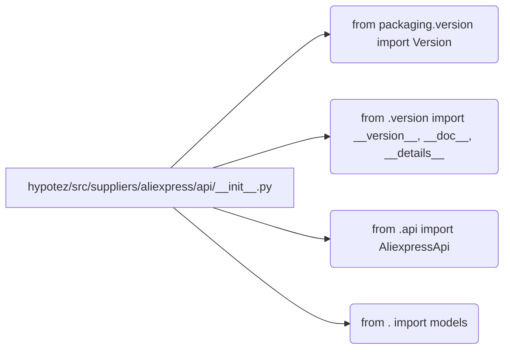

# <input code>

```python
## \file hypotez/src/suppliers/aliexpress/api/__init__.py
# -*- coding: utf-8 -*-\
#! venv/Scripts/python.exe # <- venv win
## ~~~~~~~~~~~~~\
""" module: src.suppliers.aliexpress.api """
""" Aliexpress API wrapper"""
...

...
from packaging.version import Version
from .version import __version__, __doc__, __details__  
from .api import AliexpressApi
from . import models
```

# <algorithm>

Этот код представляет собой инициализацию модуля `aliexpress.api` внутри пакета `suppliers`.  Алгоритм прост: импортируются необходимые модули.  Подробной блок-схемы нет, поскольку код содержит только импорты.  Данные не перемещаются, так как это этап инициализации, а не обработки данных.

# <mermaid>



# <explanation>

**Импорты:**

* `from packaging.version import Version`: Импортирует класс `Version` из пакета `packaging`.  Этот пакет используется для работы с версиями пакетов, вероятнее всего, для проверки версий зависимостей или управления версиями.  Связь с другими пакетами осуществляется через `packaging`.
* `from .version import __version__, __doc__, __details__`: Импортирует переменные `__version__`, `__doc__`, `__details__` из модуля `version.py` внутри текущей папки (`./version.py`).  Это, скорее всего, метаданные о модуле (версия, документация, детали).  Связь осуществляется через внутреннее импортирование.
* `from .api import AliexpressApi`: Импортирует класс `AliexpressApi` из модуля `api.py` внутри текущей папки (`./api.py`). Это, скорее всего, класс, представляющий собой интерфейс для работы с API AliExpress.  Связь осуществляется через внутреннее импортирование.
* `from . import models`: Импортирует модуль `models.py` внутри текущей папки.  Это, вероятно, модуль, содержащий классы, представляющие модели данных, используемые при взаимодействии с API AliExpress.  Связь осуществляется через внутреннее импортирование.

**Классы:**

* `AliexpressApi`: Этот класс, импортированный из `api.py`, является ключевой частью модуля.  Он, вероятно, содержит методы для взаимодействия с API AliExpress (например, для запроса данных, авторизации и обработки ответов).  Подробное описание класса `AliexpressApi` и его методов отсутствует в предоставленном коде.

**Функции:**

В предоставленном коде нет функций. Все это импортирование.

**Переменные:**

В предоставленном коде нет переменных, кроме импортированных.

**Возможные ошибки или области для улучшений:**

* Отсутствуют комментарии к коду.  Добавление пояснений к импортам и классов существенно улучшит читаемость и понимание кода.
* Отсутствие кода, содержащего бизнес-логику, затрудняет понимание назначения и работы модуля.

**Цепочка взаимосвязей с другими частями проекта:**

Модуль `aliexpress.api` зависит от модулей `version.py`, `api.py`, `models.py` из той же папки.  Эти модули, вероятно, предоставляют более подробные реализации, необходимые для работы с API AliExpress.  В зависимости от дальнейшей структуры проекта, модуль может быть частью более крупного приложения, использующего данные, полученные от API AliExpress, для других целей.  Например, для хранения товаров, сравнения цен, или реализации других бизнес-функций.

**Общий вывод:**

Код представляет собой необходимую инициализацию модуля, импортируя все необходимые компоненты для работы с API AliExpress.  Для понимания функциональности необходим код из `version.py`, `api.py`, `models.py`.