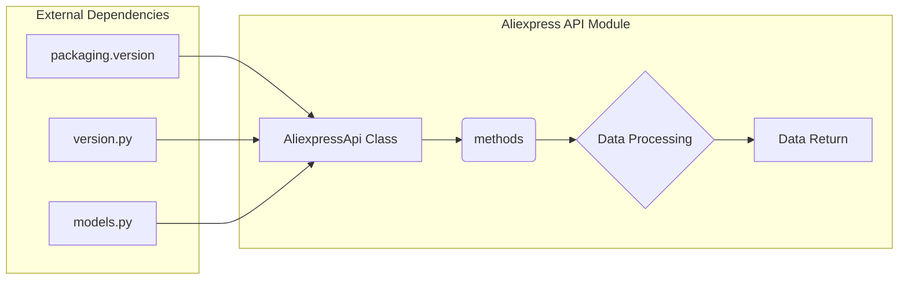

# <input code>

```python
## \file hypotez/src/suppliers/aliexpress/api/__init__.py
# -*- coding: utf-8 -*-
#! venv/Scripts/python.exe # <- venv win
## ~~~~~~~~~~~~~
""" module: src.suppliers.aliexpress.api """
""" Aliexpress API wrapper"""
...

...
from packaging.version import Version
from .version import __version__, __doc__, __details__  
from .api import AliexpressApi
from . import models
```

# <algorithm>

К сожалению, предоставленный код фрагментарный и не содержит реализации функций или классов.  Поэтому построить блок-схему алгоритма невозможно.  Наличие комментариев `...` указывает на то, что отсутствует существенная часть кода.

# <mermaid>



# <explanation>

**Импорты:**

* `from packaging.version import Version`:  Импортирует класс `Version` из библиотеки `packaging`. Эта библиотека, вероятно, используется для работы с версиями пакетов или программного обеспечения.  Связь с проектом `src` опосредованная, через зависимость от внешней библиотеки `packaging`.
* `from .version import __version__, __doc__, __details__`: Импортирует переменные `__version__`, `__doc__`, и `__details__` из модуля `version.py` из текущего пакета (`aliexpress/api`). Это, скорее всего, метаданные о версии, документации и деталях API.  Связь с `src` идет через иерархию пакетов (`src.suppliers.aliexpress.api`).
* `from .api import AliexpressApi`: Импортирует класс `AliexpressApi` из модуля `api.py` в текущем пакете. Это, вероятно, основной класс для взаимодействия с API AliExpress. Связь с `src` идет через иерархию пакетов (`src.suppliers.aliexpress.api`).
* `from . import models`: Импортирует модуль `models.py`. Вероятно, этот модуль содержит классы и функции, представляющие данные, полученные от AliExpress API.  Связь с `src` идет через иерархию пакетов (`src.suppliers.aliexpress.api`).

**Классы (предполагаемые):**

* `AliexpressApi`:  Этот класс, импортированный из `api.py`, является, скорее всего, оболочкой (wrapper) для взаимодействия с API AliExpress.  Он должен содержать методы для запросов к API, обработки ответов и, возможно, кэширования данных.  Без детального кода, невозможно точно сказать, как он взаимодействует с `src` project.

**Функции (предполагаемые):**

* Функции внутри `models.py` и `api.py`: Предполагается наличие функций, обрабатывающих полученную от API информацию,  формирующих запросы, и выполняющих другие необходимые операции.


**Переменные (предполагаемые):**

* `__version__`, `__doc__`, `__details__`:  Эти переменные содержат метаданные о модуле, такие как версия, документация, и прочая информация, относящиеся к `AliexpressApi`.

**Возможные ошибки/улучшения:**

* Не хватает кода, что делает анализ неполным.
* Без кода не представляется возможным определить, реализованы ли необходимый класс `AliexpressApi`, методы и данные для взаимодействия с API.

**Цепочка взаимосвязей (предполагаемая):**

```
src.suppliers.aliexpress.api.models.py <-> src.suppliers.aliexpress.api.api.py
src.suppliers.aliexpress.api.api.py <-> src.suppliers.aliexpress.api.__init__.py
```

В общем случае, модуль `__init__.py` в иерархии пакетов `src.suppliers.aliexpress.api` определяет импорты, необходимые для работы остальных частей кода в этом пакете.  Без реализации кода (`api.py` и `models.py`) анализ крайне ограничен и основан на предположениях.