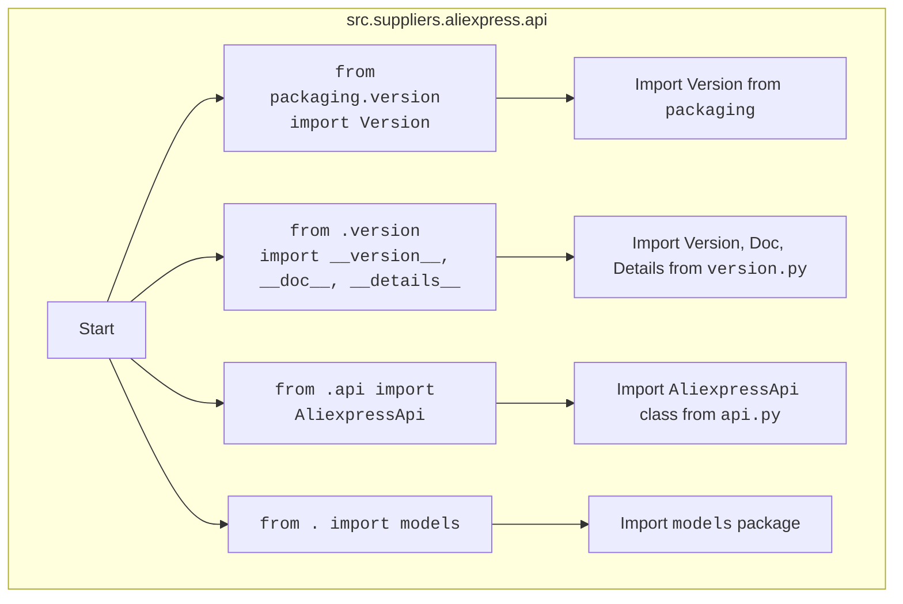

## АНАЛИЗ КОДА: `hypotez/src/suppliers/aliexpress/api/__init__.py`

### 1. <алгоритм>

1. **Импорт модулей:**
   - Импортируется `Version` из `packaging.version` для работы с версиями пакетов.
   - Импортируются `__version__`, `__doc__` и `__details__` из `src.suppliers.aliexpress.api.version`. Эти переменные, вероятно, содержат информацию о версии, документацию и дополнительные сведения о API.
   - Импортируется `AliexpressApi` из `src.suppliers.aliexpress.api.api`. Это класс, представляющий основной интерфейс для взаимодействия с AliExpress API.
   - Импортируется `models` из `src.suppliers.aliexpress.api`. Этот модуль, скорее всего, содержит классы, представляющие различные структуры данных, используемые API (например, модели продуктов, заказов и т.д.).
   
   **Пример:**
   ```python
   # from packaging.version import Version 
   # версия = Version("1.2.3") # Инициализируем версию
   
   # from .version import __version__, __doc__, __details__
   # print(__version__) # Выводит версию "0.1.0"
   # print(__doc__)  # Выводит описание API
   
   # from .api import AliexpressApi
   # api = AliexpressApi(api_key="your_api_key") # Инициализация api
   
   # from . import models
   # product = models.Product(id=123, name="Test Product") # Инициализация модели
   ```

2. **Экспорт:**
   - Все импортированные сущности (за исключением `Version`) делаются доступными для импорта из модуля `src.suppliers.aliexpress.api`.
   
   **Пример:**
   ```python
   # from src.suppliers.aliexpress import api
   # print(api.__version__) # Выведет версию
   # aliex_api = api.AliexpressApi(api_key="your_api_key")
   # product_model = api.models.Product(id=123, name="Test")
   ```

### 2. <mermaid>



**Объяснение диаграммы `mermaid`:**

*   **`Start`**: Начало процесса.
*   **`src.suppliers.aliexpress.api`**:  Граф обозначает область действия модуля.
*   **`ImportVersion`**:  Импорт класса `Version` из модуля `packaging.version`.
*   **`ImportVersionData`**: Указывает на то, что импортирован класс `Version`.
*   **`ImportVersionInfo`**: Импорт переменных `__version__`, `__doc__`, `__details__` из локального модуля `version.py`.
*   **`ImportVersionInfoData`**: Указывает на то, что импортированы переменные из модуля `version.py`.
*   **`ImportApiClass`**: Импорт класса `AliexpressApi` из локального модуля `api.py`.
*   **`ImportApiClassData`**: Указывает на то, что импортирован класс `AliexpressApi`.
*  **`ImportModels`**: Импорт модуля `models` из локального пакета `api`.
*   **`ImportModelsData`**: Указывает на то, что импортирован модуль `models`.

Диаграмма показывает зависимости внутри пакета `src.suppliers.aliexpress.api` и внешние зависимости, такие как `packaging.version`.

### 3. <объяснение>

**Импорты:**

*   `from packaging.version import Version`: Импортирует класс `Version` из пакета `packaging`. Этот класс используется для представления и сравнения версий программного обеспечения. В данном контексте он, вероятно, используется для сравнения версий API или библиотеки. Пакет `packaging` не принадлежит пакету `src` и устанавливается из вне.
*   `from .version import __version__, __doc__, __details__`: Импортирует переменные `__version__` (строка, представляющая версию), `__doc__` (строка, содержащая документацию) и `__details__` (словарь с дополнительной информацией) из модуля `version.py`, который находится в том же пакете. Это часть механизма управления версиями и документирования внутри проекта `hypotez`.
*   `from .api import AliexpressApi`: Импортирует класс `AliexpressApi` из модуля `api.py`, находящегося в том же пакете. `AliexpressApi` это ключевой класс, представляющий API для работы с AliExpress, включающий функциональность для запросов, обработки ответов, и т.д.
*   `from . import models`: Импортирует пакет `models` из того же пакета. Пакет `models` содержит классы, которые представляют структуры данных, возвращаемые AliExpress API, такие как модели продуктов, заказов и т.д. Это обеспечивает структуру данных и типов для правильной интерпретации JSON ответов API.

**Классы:**

*   `AliexpressApi`:  Это основной класс, предоставляющий интерфейс для взаимодействия с AliExpress API. Он, скорее всего, имеет методы для отправки запросов к API (например, для поиска продуктов, получения информации о заказах и т.д.). Он также может обрабатывать аутентификацию и форматирование запросов.

**Переменные:**

*   `__version__`: Строка, представляющая текущую версию пакета.
*   `__doc__`: Строка, содержащая документацию пакета или API.
*  `__details__`: Словарь содержащий дополнительную информацию о пакете.

**Взаимосвязи с другими частями проекта:**

*   Этот модуль является частью пакета `src.suppliers.aliexpress`, следовательно, он взаимодействует с другими модулями внутри этого пакета, а так же является частью более крупного проекта `hypotez`.
*   `AliexpressApi` взаимодействует с внешним API AliExpress.
*   Пакет `models` предоставляет структуру для обработки данных от API и передачи данных между модулями.

**Потенциальные ошибки и области для улучшения:**

*   Необходимо убедиться в правильной обработке ошибок API при работе с `AliexpressApi`.
*   В `models` необходимо обеспечить валидацию и проверку типов данных для предотвращения ошибок.
*   `__details__` может быть расширен с добавлением информации о требованиях к аутентификации или других специфичных настройках.

**Цепочка взаимосвязей:**

1.  **`hypotez/src/suppliers/aliexpress/__init__.py`:** Является частью пакета `aliexpress` и определяет его структуру.
2.  **`hypotez/src/suppliers/aliexpress/api/__init__.py`:** Инициализирует API, предоставляя доступ к основным компонентам.
3.  **`hypotez/src/suppliers/aliexpress/api/api.py`:** Содержит класс `AliexpressApi`, который инкапсулирует логику взаимодействия с API AliExpress.
4.  **`hypotez/src/suppliers/aliexpress/api/models.py`:** Содержит модели данных для представления ответов API.
5.  **`hypotez/src/suppliers/aliexpress/api/version.py`:** Содержит информацию о версии API.