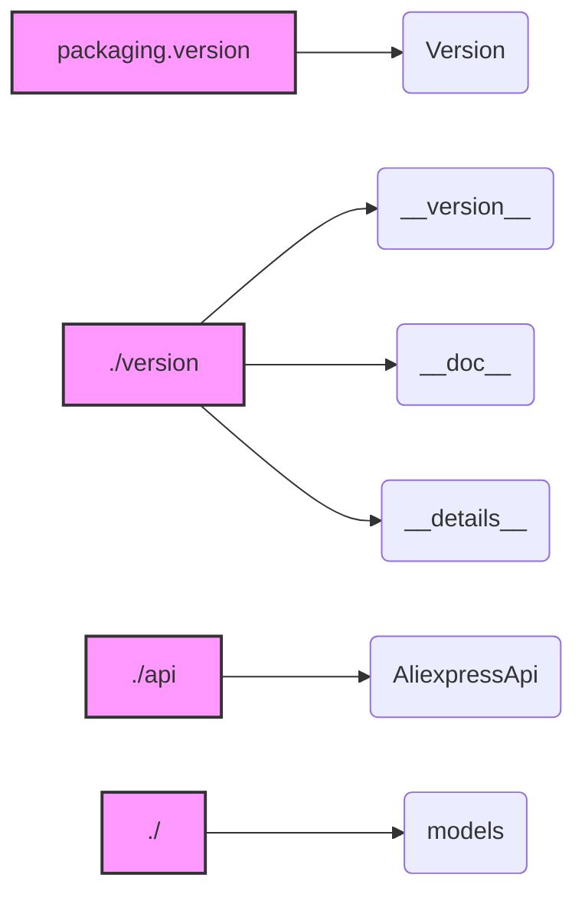

## Анализ кода `hypotez/src/suppliers/aliexpress/api/__init__.py`

### <алгоритм>
1. **Импорт модуля `packaging.version`**:
   -  Импортируется класс `Version` из модуля `packaging.version`.
   -  Пример: `from packaging.version import Version`
   -  Этот класс используется для сравнения и работы с версиями программного обеспечения.

2. **Импорт версионной информации**:
   - Импортируются переменные `__version__`, `__doc__`, `__details__` из модуля `.version`.
   -  Пример: `from .version import __version__, __doc__, __details__`
   - `__version__` содержит строку с номером текущей версии API.
   - `__doc__` строка с описанием API.
    - `__details__` содержит дополнительные детали API.

3. **Импорт класса `AliexpressApi`**:
   -  Импортируется класс `AliexpressApi` из модуля `.api`.
   -  Пример: `from .api import AliexpressApi`
   - Класс `AliexpressApi` предоставляет функциональность для взаимодействия с API AliExpress.

4. **Импорт модуля `models`**:
    - Импортируется модуль `models` из текущего пакета.
    - Пример: `from . import models`
    - Модуль `models` содержит структуры данных (классы) для представления ответов от API AliExpress.

### <mermaid>

**Описание зависимостей `mermaid`:**

*   **`packaging.version`**:  Импортируется для работы с версиями программного обеспечения. Зависимость от пакета `packaging`, содержащего класс `Version`.
*   **`./version`**:  Модуль, который содержит информацию о версии (`__version__`), документацию (`__doc__`) и дополнительные детали (`__details__`) текущего пакета.
*   **`./api`**: Модуль, который предоставляет класс `AliexpressApi` для взаимодействия с API AliExpress.
*   **`./`**: Текущий пакет, который импортирует модуль `models`, содержащий структуры данных для работы с API.

### <объяснение>

**Импорты:**

*   `from packaging.version import Version`: Импортирует класс `Version` из пакета `packaging`. Этот класс предоставляет инструменты для работы с версиями программного обеспечения, позволяя сравнивать, сортировать и т.д.
*   `from .version import __version__, __doc__, __details__`: Импортирует переменные, связанные с версионированием API, из модуля `version.py`, расположенного в том же пакете.
    *   `__version__`: Строка, содержащая текущую версию API (например, "1.0.0").
    *   `__doc__`: Строка с описанием модуля/API.
    *   `__details__`: Строка с дополнительной информацией о модуле/API.
*   `from .api import AliexpressApi`: Импортирует класс `AliexpressApi` из модуля `api.py`, расположенного в том же пакете. Этот класс является основным для работы с API AliExpress и содержит методы для отправки запросов и обработки ответов.
*   `from . import models`: Импортирует модуль `models` из текущего пакета. Этот модуль содержит классы, которые представляют структуры данных для работы с ответами API AliExpress.

**Классы:**

*   `AliexpressApi`: Класс, который предоставляет интерфейс для взаимодействия с API AliExpress. Он содержит методы для выполнения различных запросов к API, такие как получение информации о товарах, заказах, и т.д. Этот класс зависит от модуля `requests` (предположительно, т.к. это обычная практика для работы с API) и моделей данных, которые используются для представления данных ответа API.

**Функции:**
   - В данном файле нет явных функций, но импортированные модули `.api` и `.models`, предположительно, содержат функции для обработки API-запросов и ответов.

**Переменные:**

*   `__version__`: Строка, представляющая версию API.
*   `__doc__`: Строка, содержащая документацию API.
*   `__details__`: Строка, содержащая дополнительные детали о API.

**Взаимосвязь с другими частями проекта:**

*   Данный пакет `src.suppliers.aliexpress.api` является частью более крупного проекта `hypotez`.
*   Он предназначен для обеспечения доступа к API AliExpress.
*   Он зависит от модуля `packaging` для работы с версиями, модуля `requests` (предположительно) для выполнения HTTP-запросов, а также от внутренних модулей `.api` и `.models`, расположенных в том же пакете.
*   Класс `AliexpressApi` взаимодействует с API AliExpress через HTTP запросы.
*   Модуль `models` используется для структурирования и обработки данных, полученных от API.
*   Вероятно, в других частях проекта используются классы и методы из `AliexpressApi` для получения данных из AliExpress.

**Потенциальные ошибки и области для улучшения:**

*   В коде не указан явный импорт модуля `requests`, но, скорее всего,  `AliexpressApi` использует его для выполнения HTTP запросов. Необходимо явно указать его в требованиях и импортах.
*   Отсутствуют примеры использования API. Было бы полезно добавить примеры в документацию или в виде тестов.
*   Не определен способ обработки исключений, которые могут возникнуть при работе с API. Необходимо продумать механизм обработки ошибок.
*   Модуль `models` может содержать множество классов для обработки ответов API. Для облегчения работы с ними, следует предусмотреть использование `dataclasses` или `pydantic`.
*   Для более удобной отладки было бы полезно добавить возможность логирования запросов и ответов API.
*  В коде отсутствуют примеры использования или тесты, что затрудняет понимание и использование API. Необходимо добавить примеры и тесты.

**Цепочка взаимосвязей:**

`hypotez` -> `src` -> `suppliers` -> `aliexpress` -> `api` -> (`packaging`, `requests`, `AliexpressApi`, `models`)