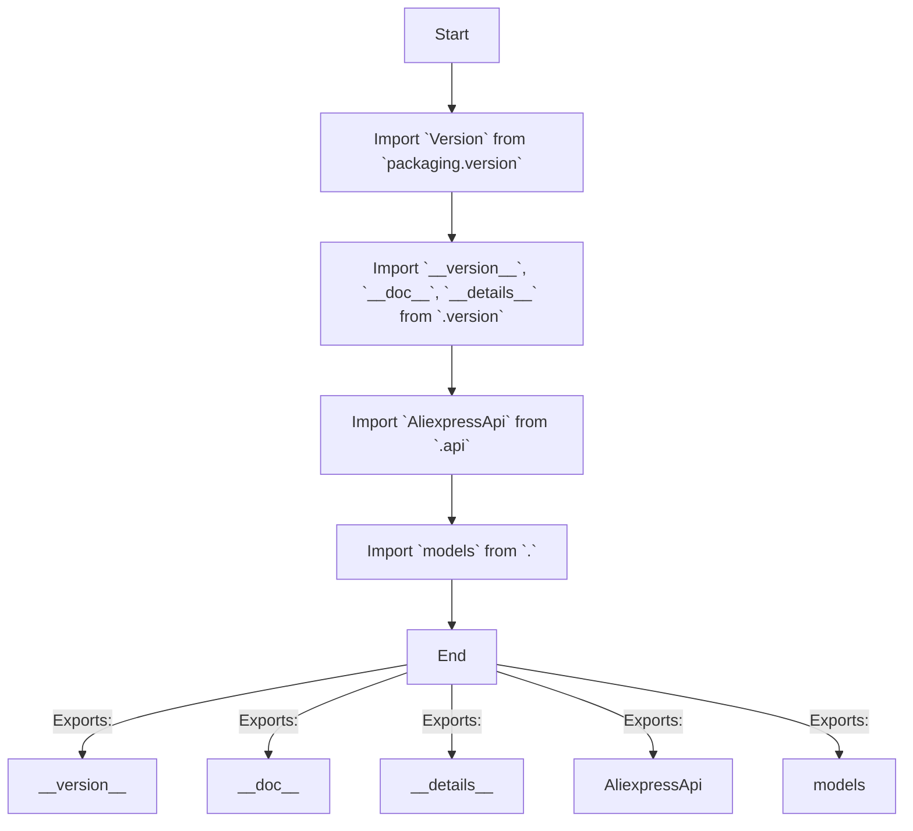

## Анализ кода `src/suppliers/aliexpress/api/__init__.py`

### 1. <алгоритм>

1. **Импорт модулей:**
    - Импортируется `Version` из библиотеки `packaging.version`. Этот класс используется для работы с версиями программного обеспечения, что позволяет сравнивать версии.
    - Из модуля `.version` импортируются переменные `__version__`, `__doc__`, и `__details__`. Эти переменные содержат информацию о версии, документации и деталях API соответственно.
    - Импортируется класс `AliexpressApi` из модуля `.api`. Этот класс, вероятно, содержит логику для взаимодействия с API Aliexpress.
    - Импортируется модуль `.models`. Этот модуль, вероятно, содержит определения структур данных (например, классы) для работы с данными, получаемыми от API Aliexpress.
2. **Экспорт:**
    - Модуль делает доступным (экспортирует) импортированные `__version__`, `__doc__`, `__details__`, `AliexpressApi` и `models` для использования в других частях проекта.
    - Это позволяет другим модулям импортировать, например, `AliexpressApi` и использовать его для взаимодействия с Aliexpress API.

**Пример:**

```python
# Предположим, что в другом модуле нужно использовать класс AliexpressApi и информацию о версии

from src.suppliers.aliexpress.api import AliexpressApi, __version__

# Создаем экземпляр класса AliexpressApi
api_client = AliexpressApi(api_key="your_api_key")

# Выводим версию API
print(f"Версия API: {__version__}")
```

### 2. <mermaid>



**Объяснение `mermaid` диаграммы:**

- Диаграмма описывает последовательность импортов, происходящих в файле `__init__.py`.
- `Start` - начало процесса.
- `ImportPackaging` - импорт класса `Version` из библиотеки `packaging.version`, который используется для сравнения версий.
- `ImportVersionInfo` - импорт переменных, связанных с версией (`__version__`), документацией (`__doc__`) и деталями (`__details__`), из файла `.version`.
- `ImportApiClass` - импорт класса `AliexpressApi` из файла `.api`. Этот класс отвечает за взаимодействие с API Aliexpress.
- `ImportModels` - импорт модуля `models`, который содержит классы, представляющие структуры данных, полученные от API.
- `End` - конец процесса импорта.
- Стрелки, помеченные `Exports:`, показывают, что эти переменные и модули экспортируются, то есть доступны для использования в других модулях, которые импортируют этот пакет.

### 3. <объяснение>

**Импорты:**

- `from packaging.version import Version`: импортирует класс `Version` из библиотеки `packaging.version`. Используется для работы с версиями, например, для сравнения версий API.
- `from .version import __version__, __doc__, __details__`: импортирует переменные `__version__` (строка, содержащая версию API), `__doc__` (строка, содержащая документацию API) и `__details__` (словарь или строка, содержащая детальную информацию об API) из модуля `version.py`, расположенного в той же директории, что и `__init__.py`. Это позволяет получить доступ к информации о версии и документации API.
- `from .api import AliexpressApi`: импортирует класс `AliexpressApi` из файла `api.py`, расположенного в той же директории, что и `__init__.py`. Этот класс, вероятно, инкапсулирует логику взаимодействия с API Aliexpress.
- `from . import models`: импортирует модуль `models` из той же директории, что и `__init__.py`. Этот модуль, вероятно, содержит определения моделей данных, используемых при взаимодействии с API Aliexpress, например, классы, представляющие структуру ответа API.

**Классы:**

- `AliexpressApi`: класс, предназначенный для взаимодействия с API Aliexpress. Он, вероятно, содержит методы для выполнения запросов к API, обработки ответов и управления аутентификацией. Позволяет унифицировать и упростить работу с API Aliexpress для других частей проекта.

**Переменные:**

- `__version__`: строка, содержащая версию текущего API.
- `__doc__`: строка, содержащая описание или документацию API.
- `__details__`: словарь или строка, содержащая дополнительную информацию об API, например, информацию о поддерживаемых методах.

**Взаимосвязи с другими частями проекта:**

- Модуль `src.suppliers.aliexpress.api` является частью более крупной системы `src.suppliers`. Он предоставляет абстракцию для взаимодействия с API Aliexpress.
- Другие модули в `src.suppliers`, например, те, которые работают с моделями продуктов, ценами или отслеживанием посылок, могут использовать `AliexpressApi` для получения данных от Aliexpress.
- Модули, использующие `src.suppliers.aliexpress.api`, могут также использовать `models` для работы с полученными данными.

**Потенциальные ошибки и области для улучшения:**

- **Не хватает описания:** Код  не содержит описания самого модуля или функциональности. Это может усложнить понимание и поддержку.
- **Отсутствие примеров:** Нет примеров использования. Это может усложнить работу для других разработчиков.
- **Жестко закодированные зависимости:** Узкая специализация на работе с API Aliexpress. Если нужно будет подключать другие API,  может потребоваться рефакторинг.

**Цепочка взаимосвязей с другими частями проекта:**

- `src.suppliers.aliexpress.api` -> `src.suppliers.aliexpress.api.api`
- `src.suppliers.aliexpress.api` -> `src.suppliers.aliexpress.api.models`
- `src.suppliers.aliexpress.api` ->  `src.suppliers.aliexpress.api.version`
- `src.suppliers.aliexpress.api` <- другие модули `src.suppliers`, нуждающиеся в данных Aliexpress.