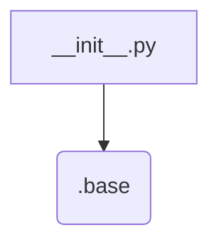
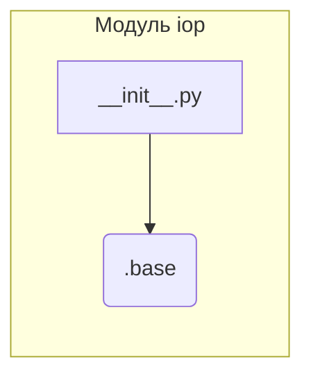

1. **<input code>**

```python
## \file hypotez/src/suppliers/aliexpress/api/_examples/iop/__init__.py
# -*- coding: utf-8 -*-
#! venv/Scripts/python.exe # <- venv win
## ~~~~~~~~~~~~~
""" module: src.suppliers.aliexpress.api._examples.iop """
from .base import
```

2. **<algorithm>**

Этот код представляет собой лишь импорт из другого модуля.  Алгоритм работы сводится к одной операции - импорту.  Нет циклов, ветвлений или каких-либо вычислений.  

Пример: Нет данных для обработки.  Внутри файла `__init__.py` просто осуществляется импорт.



3. **<mermaid>**



4. **<explanation>**

* **Импорты**: Строка `from .base import` импортирует все имена (переменные, функции, классы) из модуля `base`, который находится в том же каталоге, что и текущий файл (`.base` - это относительный путь). Это типичная практика для организации связанных модулей в Python.  `.` указывает на текущий каталог. Файл `__init__.py` часто используется для инициализации модулей, позволяя импортировать их как отдельные модули, и этот пример как раз это демонстрирует.

* **Классы**: В данном коде нет объявления классов. Импорт происходит только из модуля.

* **Функции**:  Нет объявления функций. Импорт происходит только из модуля.

* **Переменные**: Нет определения переменных. Импорт происходит только из модуля.

* **Возможные ошибки или области для улучшений**: Код крайне прост и в текущем виде не содержит ошибок. Однако, если модуль `base` содержит критические ошибки, то они могут проявляться при последующем использовании импортированных элементов. Ошибка произойдет, если модуля `base` не существует или в нем отсутствует какой-либо элемент, который пытаются импортировать.

* **Цепочка взаимосвязей**: Модуль `iop` зависит от модуля `.base`.  Предполагается, что модуль `.base` содержит определения функций или классов, которые используются в других модулях внутри пакета `src.suppliers.aliexpress.api._examples`.

**Дополнительные пояснения**:

Файл `__init__.py` в Python используется как средство организации и группировки связанных модулей в один логический пакет.  Без этого файла, папка не была бы распознана как пакет, и вы не смогли бы импортировать другие модули из неё.  Предполагается, что в `base` содержатся вспомогательные классы или функции, которые используются в модуле `iop`.  Этот импорт создает необходимую связь между этими модулями.


**Выводы**: Код представляет собой базовый импорт из другого файла, что является типичным способом структурирования кода в больших проектах.