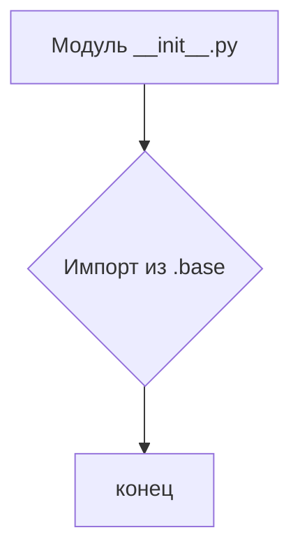
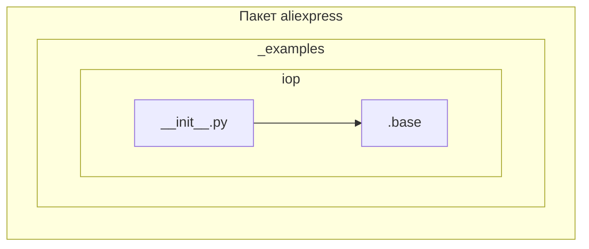

```MD
1. **<input code>**

```python
## \file hypotez/src/suppliers/aliexpress/api/_examples/iop/__init__.py
# -*- coding: utf-8 -*-\
#! venv/Scripts/python.exe # <- venv win
## ~~~~~~~~~~~~~\
""" module: src.suppliers.aliexpress.api._examples.iop """
from .base import
```

2. **<algorithm>**

Этот код представляет собой *пустой* модуль `__init__.py` в пакете `iop` внутри пакета `_examples` модуля `aliexpress`.  Модуль `__init__.py` используется для инициализации пакета Python. В этом случае он не содержит никакой логики, кроме импорта из другого модуля.

Блок-схема простая:


Пример: Данные *не* передаются между функциями или классами, т.к. код не содержит функциональности.

3. **<mermaid>**



**Объяснение зависимостей:**

Модуль `__init__.py` в папке `iop` импортирует модуль `base` из того же пакета. Это указывает на то, что модуль `base` находится в подпапке `aliexpress/api/_examples/iop/` внутри проекта.

4. **<explanation>**

* **Импорты:**
    `from .base import` -  Этот импорт подключает (использует) модуль `base` из текущей подпапки `aliexpress/api/_examples/iop/`.  Важно, что `.` перед `base` указывает, что модуль `base` находится в том же пакете, что и текущий модуль `__init__.py`. Это типичная структура для организации Python-проектов, где подпапки `src/suppliers/aliexpress/api/_examples/iop/` представляют собой отдельные части функциональности.

* **Классы/Функции/Переменные:**
    В данном коде *нет* определений классов или функций. Только импорт из другого файла.  Таким образом нет атрибутов, методов или аргументов, которые можно было бы описать.  Отсутствие реализации в данном файле `__init__.py` подразумевает, что  вся логика и данные находятся в других файлах проекта, в частности в `base.py`.

* **Возможные ошибки или улучшения:**
    Код очень прост, и в нем нет явных ошибок.  Возможно, в будущем `__init__.py` в пакете `iop` будет содержать дополнительные импорты, определять константы или предоставлять какой-то интерфейс для других модулей.  В идеале `base.py` должен содержать документированные функции или классы, которые импортируются, для лучшей читаемости и понимания кода.


**Цепочка взаимосвязей:**

Проект организован иерархически.  Модуль `base` предоставляет функциональность, которая используется в модулях внутри подпапки `iop`.  Связь осуществляется через импорт.  Возможно, в других частях проекта (`__init__.py` других пакетов, например) также есть импорты, которые создают связь между разными частями системы. Чтобы получить полную картину, требуется проанализировать другие `__init__.py` и другие файлы в `aliexpress`.