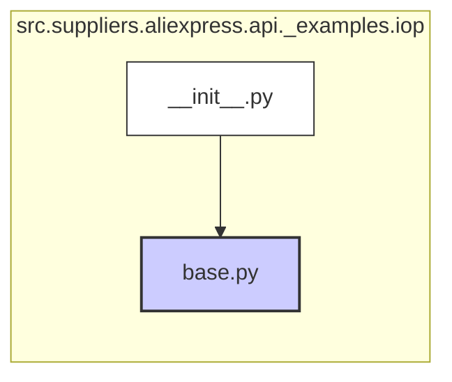

## Анализ кода `hypotez/src/suppliers/aliexpress/api/_examples/iop/__init__.py`

### 1. <алгоритм>

1.  **Импорт:**
    *   `from .base import **`:  Импортирует все имена (классы, функции, переменные и т.д.) из модуля `base.py`, находящегося в той же директории.

2.  **Конец:** Завершение модуля.

**Пример:**

Предположим, что `base.py` содержит следующий код:

```python
# file: base.py

class BaseClass:
    def __init__(self, value):
        self.value = value

    def get_value(self):
        return self.value

def some_function(x):
    return x * 2

CONSTANT = 10
```
Тогда после выполнения `from .base import **` в `__init__.py` мы можем обращаться к `BaseClass`, `some_function`, и `CONSTANT` напрямую.

### 2. <mermaid>


**Описание:**

*   Диаграмма показывает зависимости в директории `src.suppliers.aliexpress.api._examples.iop`.
*   `__init__.py` импортирует всё из модуля `base.py`.
*   Связь изображена стрелкой, показывающей направление зависимости `__init__.py` -> `base.py`.
*   Классы `pythonClass`, `pythonModule`, `pythonFile` определяют стили для визуализации, например:
    *   `pythonFile` - стилизует обычные файлы python
    *   `pythonModule` - стилизует файлы, которые выступают как модули
    *   `pythonClass` - стилизует классы.

### 3. <объяснение>

*   **Импорты:**
    *   `from .base import **`: Этот импорт импортирует все публичные имена из модуля `base.py`, расположенного в той же директории, что и файл `__init__.py`. Это означает, что после такого импорта в `__init__.py` можно использовать все классы, функции, переменные и прочие элементы, определенные в `base.py`. В контексте пакета `src.suppliers.aliexpress.api._examples.iop`, `base.py`, вероятно, содержит базовые классы или общие функции, необходимые для примеров, связанных с AliExpress API.

*   **Файл `__init__.py`:**
    *   Этот файл является файлом инициализации пакета в Python. Его наличие в директории `src.suppliers.aliexpress.api._examples.iop` превращает ее в Python-пакет.
    *   В данном случае, он делает всё, что находится в модуле `base.py`, доступным как часть пакета `iop`.
    *   Это позволяет импортировать элементы из `base.py` через более удобный путь, например,  `from src.suppliers.aliexpress.api._examples.iop import SomeClass`.

*   **Взаимосвязи с другими частями проекта:**
    *   Этот пакет `_examples.iop` вероятно предназначен для примеров использования API, поэтому он не взаимодействует непосредственно с другими частями проекта, кроме как потенциально через базовые классы или функции, определенные в `base.py`.
    *   Он также может зависеть от пакетов, которые предоставляют реализацию AliExpress API (они должны импортироваться в `base.py`, если это необходимо).

*   **Потенциальные проблемы:**
    *   `import *`  может усложнить отслеживание того, откуда импортируется конкретное имя, и привести к конфликтам имен.
    *   Необходимо убедиться, что в `base.py`  нет избыточных элементов, которые не будут использоваться.

* **Примеры использования:**
   ```python
   # src/suppliers/aliexpress/api/_examples/iop/__init__.py
   from .base import *

   # src/suppliers/aliexpress/api/_examples/iop/base.py
   class BaseExample:
       def __init__(self, value):
           self.value = value

       def get_value(self):
           return self.value

   # где-то в коде проекта
   from src.suppliers.aliexpress.api._examples.iop import BaseExample

   example = BaseExample(10)
   print(example.get_value())  # Output: 10
   ```
   Здесь мы импортируем `BaseExample` напрямую из пакета `iop`, и оно доступно благодаря `from .base import *` в `__init__.py`