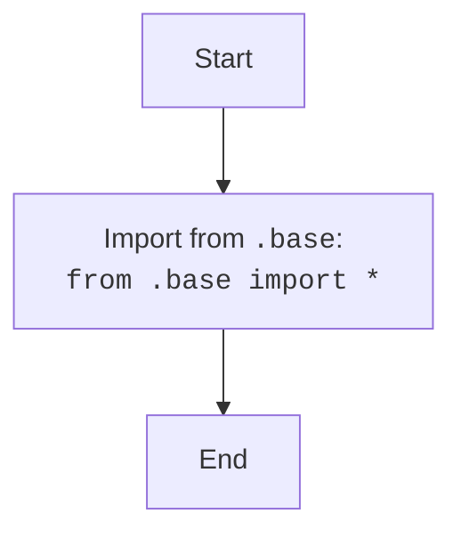

## АНАЛИЗ КОДА: `hypotez/src/suppliers/aliexpress/api/_examples/iop/__init__.py`

### <алгоритм>

1. **Импорт всех элементов из модуля `base.py`:**
   -  Файл `__init__.py` начинается с импорта всех (*) элементов из модуля `base.py`, который находится в той же директории.
   -  Пример: `from .base import *`
   -  Этот шаг позволяет сделать все переменные, функции и классы, определенные в `base.py`, доступными в пакете `iop`.
   -  Поток данных: 
      - Запрос импорта -> `__init__.py` -> Чтение `base.py` -> Импортирование всего в `__init__.py`.

### <mermaid>

### <объяснение>

**Импорты:**

- `from .base import *`:
    -   `from .base` указывает на то, что импорт происходит из модуля `base.py`, который находится в той же директории (`_examples/iop`). 
    -   `import *` означает импорт всех публичных имен (классов, функций, переменных) из модуля `base.py`. Это делает все элементы `base.py` доступными в пакете `iop` без необходимости указывать префикс `base.`.
    -   **Назначение:** Обеспечение доступа к функциональности, определенной в `base.py`.
    -   **Взаимосвязь:** Устанавливает прямую зависимость между пакетом `iop` и модулем `base.py` в рамках текущего пакета `suppliers.aliexpress.api._examples`.

**Файл `__init__.py`**

-   Файл `__init__.py` в Python является особым файлом, который делает директорию пакетом. Он может быть пустым, но в данном случае, он используется для импорта всего содержимого из `base.py`, делая его доступным как часть пакета `iop`.
-   По сути, это способ сгруппировать связанные модули.

**Потенциальные ошибки и области для улучшения:**

1.  **Импорт `*`:** Использование `import *` не рекомендуется, так как это может привести к конфликтам имен и затруднить отслеживание того, откуда импортируются имена. Лучше явно указывать импортируемые имена (`from .base import SomeClass, some_function`). Это повышает читаемость кода и предотвращает конфликты.
2. **Отсутствие документации:**  В `__init__.py` и в базовом файле `base.py` отсутствует docstring, который объясняет назначение пакета и модуля.
3. **Отсутствие исключений:**  В данном файле нет обработки исключений.
4. **Зависимость от `base.py`:** Этот файл напрямую зависит от `base.py`. Если `base.py` будет изменен, то необходимо пересмотреть и этот файл.

**Цепочка взаимосвязей:**

- `hypotez/src/suppliers/aliexpress/api/_examples/iop/__init__.py`
   -  Зависит от `hypotez/src/suppliers/aliexpress/api/_examples/iop/base.py`.

**Общее описание:**

Этот `__init__.py` файл представляет собой начальную точку для пакета `iop`, он делает доступными элементы из `base.py` в пакете. Это способствует модульности и повторному использованию кода, однако необходимо помнить о лучших практиках, например, явный импорт.