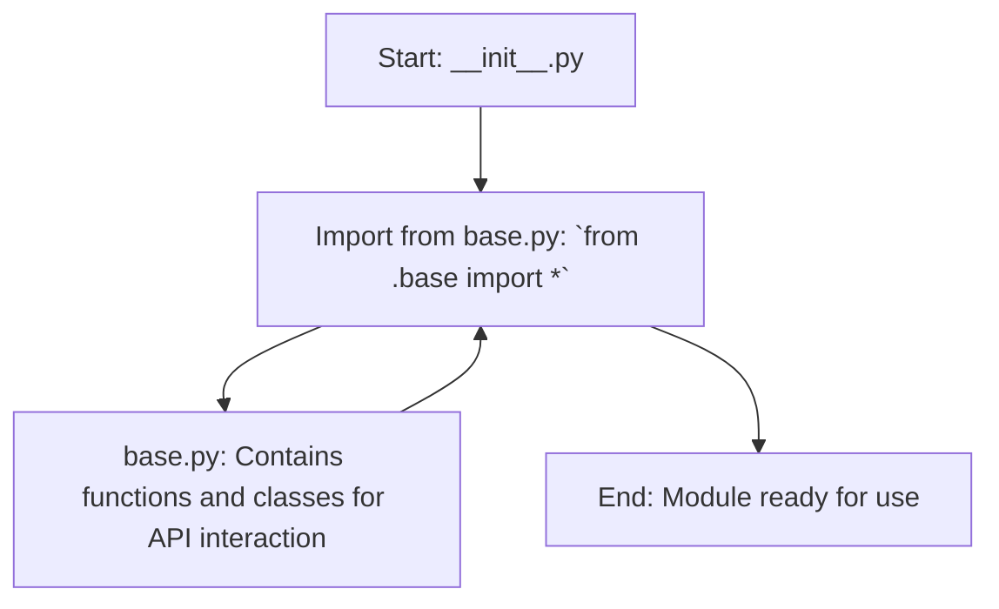

## АНАЛИЗ КОДА: `src/suppliers/aliexpress/api/_examples/iop/__init__.py`

### <алгоритм>
1. **Импорт из `base.py`**:
   - Начинается с импорта всех (*\**) символов из файла `base.py`, расположенного в текущей директории.
   - Пример: Предположим, что `base.py` содержит функцию `process_data` и класс `APIClient`. В результате импорта, эти элементы становятся доступными в текущем модуле `__init__.py`.
   - Поток данных:
     - Модуль `__init__.py` обращается к `base.py`.
     - Данные и логика из `base.py` (например, функции и классы) копируются в пространство имен `__init__.py`.
   -  Наличие `__init__.py` делает директорию `iop` пакетом Python, позволяя импортировать содержимое `base.py` как часть пакета.

### <mermaid>

### <объяснение>

#### Импорты
-   `from .base import *`:
    -   **Назначение**: Импортирует все публичные имена (классы, функции, переменные) из модуля `base.py`, который находится в той же директории.
    -   **Взаимосвязь с другими пакетами `src`**:
        -  `__init__.py` является файлом, который указывает Python, что директория `iop` должна считаться пакетом.
        -  Импортируя `base.py` через относительный импорт `.base`, модуль `__init__.py` делает все содержимое `base.py` доступным при импорте пакета `iop`.
        -  В контексте `src`, этот модуль предположительно используется как часть более крупной системы, работающей с API AliExpress.

#### Классы
-   В данном конкретном файле, классов нет, но они могут быть импортированы из `base.py`. Ожидается, что в `base.py` будут классы, связанные с инициализацией и управлением API клиента, которые будут использоваться внутри пакета `iop`.
    -   **Предполагаемая роль**:  Обеспечение базовой функциональности для работы с API AliExpress (например, отправка запросов, обработка ответов).
    -   **Атрибуты и методы**: Атрибуты могут включать настройки API (например, ключи, endpoints), а методы могут включать запросы к API, обработку данных и т.д.
    -   **Взаимодействие**:  Взаимодействуют с другими компонентами, используя импортированные классы для расширения или для настройки под конкретные задачи.

#### Функции
-   Как и в случае с классами, в `__init__.py` нет функций, но они могут быть импортированы из `base.py`.
    -   **Предполагаемые функции**: Логика для конкретных операций с API, обработка различных видов запросов и т.д.
    -   **Аргументы, возвращаемые значения, назначение и примеры**:
        -  Функции могут принимать параметры запроса, а возвращать результаты API или обработанные данные.
        -  Например:
            -  `get_product_details(product_id)`: получает детали продукта по его ID.
            -  `send_order(order_data)`: отправляет заказ в API.

#### Переменные
-   В данном файле явные переменные не определены, но из `base.py` могут быть импортированы переменные, которые могут использоваться для хранения настроек, endpoints и т.п.
    -   **Типы**:  Обычно это строки (например, ключи API), целые числа (например, timeout) и т.д.
    -   **Использование**:  Внутренние параметры для работы с API, для настроек, для управления ресурсами.

#### Потенциальные ошибки и области для улучшения:
-   **Импорт `*`**:
    -   Может привести к конфликтам имен при наличии одинаковых имен в разных модулях. Рекомендуется импортировать конкретные имена или использовать псевдонимы для импортированных имен.
-   **Отсутствие явного описания `base.py`**:
    -  Невозможно полноценно оценить логику без знания структуры `base.py`.
-  **Неизвестная структура API**:
    - Недостаточно информации о том, как именно API AliExpress используется и с какими конкретными запросами работает.

#### Взаимосвязи с другими частями проекта:
-   Предположительно, `__init__.py` из `src.suppliers.aliexpress.api._examples.iop` является частью более крупной структуры, которая, вероятно, взаимодействует с API AliExpress для получения информации о продуктах, управления заказами и так далее.
-   Модули в пакете `src.suppliers.aliexpress.api` используют `_examples/iop` в качестве примера использования API. Возможно, другие пакеты из `src` тоже могут зависеть от этого.
-   Логика `base.py` вероятно используется другими модулями в `src.suppliers.aliexpress` для организации работы с API AliExpress.