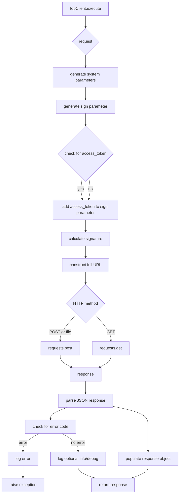

```MD
# <input code>

```python
## \file hypotez/src/suppliers/aliexpress/api/_examples/iop/base.py
# -*- coding: utf-8 -*-\
#! venv/Scripts/python.exe # <- venv win
## ~~~~~~~~~~~~~
""" module: src.suppliers.aliexpress.api._examples.iop """

'''
Created on 2018-03-21

@author: xuteng.xt
'''

import requests
import time
import hmac
import hashlib
import json
import mimetypes
import itertools
import random
import logging
import os
from os.path import expanduser
import socket
import platform

# dir = os.getenv('HOME')
dir = expanduser("~")
isExists = os.path.exists(dir + "/logs")
if not isExists:
    os.makedirs(dir + "/logs")
logger = logging.getLogger(__name__)
logger.setLevel(level = logging.ERROR)
handler = logging.FileHandler(dir + "/logs/iopsdk.log." + time.strftime("%Y-%m-%d", time.localtime()))
handler.setLevel(logging.ERROR)
# formatter = logging.Formatter('%(asctime)s - %(name)s - %(levelname)s - %(message)s')
formatter = logging.Formatter('%(message)s')
handler.setFormatter(formatter)
logger.addHandler(handler)

P_SDK_VERSION = "iop-sdk-python-20220609"

P_APPKEY = "app_key"
P_ACCESS_TOKEN = "session"
P_TIMESTAMP = "timestamp"
P_SIGN = "sign"
P_SIGN_METHOD = "sign_method"
P_PARTNER_ID = "partner_id"
P_METHOD = "method"
P_DEBUG = "debug"
P_SIMPLIFY = "simplify"
P_FORMAT = "format"

P_CODE = 'code'
P_TYPE = 'type'
P_MESSAGE = 'message'
P_REQUEST_ID = 'request_id'

# P_API_GATEWAY_URL_TW = 'https://api.taobao.tw/rest'
# P_API_AUTHORIZATION_URL = 'https://auth.taobao.tw/rest'

P_LOG_LEVEL_DEBUG = "DEBUG"
P_LOG_LEVEL_INFO = "INFO"
P_LOG_LEVEL_ERROR = "ERROR"


def sign(secret,api,parameters):
    #===========================================================================
    # @param secret
    # @param parameters
    #===========================================================================
    sort_dict = sorted(parameters)
    if("/" in api):
        parameters_str = "%s%s" % (api,str().join('%s%s' % (key, parameters[key]) for key in sort_dict))
    else:
        parameters_str = str().join('%s%s' % (key, parameters[key]) for key in sort_dict)

    h = hmac.new(secret.encode(encoding="utf-8"), parameters_str.encode(encoding="utf-8"), digestmod=hashlib.sha256)

    return h.hexdigest().upper()


def mixStr(pstr):
    if(isinstance(pstr, str)):
        return pstr
    elif(isinstance(pstr, unicode)):
        return pstr.encode('utf-8')
    else:
        return str(pstr)


def logApiError(appkey, sdkVersion, requestUrl, code, message):
    localIp = socket.gethostbyname(socket.gethostname())
    platformType = platform.platform()
    logger.error("%s^_^%s^_^%s^_^%s^_^%s^_^%s^_^%s^_^%s" % (
        appkey, sdkVersion,
        time.strftime("%Y-%m-%d %H:%M:%S", time.localtime()),
        localIp, platformType, requestUrl, code, message))


class IopRequest(object):
    def __init__(self,api_pame,http_method = 'POST'):
        self._api_params = {}
        self._file_params = {}
        self._api_pame = api_pame
        self._http_method = http_method
        self._simplify = "false"
        self._format = "json"

    def add_api_param(self,key,value):
        self._api_params[key] = value
    def add_file_param(self,key,value):
        self._file_params[key] = value
    def set_simplify(self):
        self._simplify = "true"
    def set_format(self,value):
        self._format = value;


class IopResponse(object):
    def __init__(self):
        self.type = None
        self.code = None
        self.message = None
        self.request_id = None
        self.body = None

    def __str__(self, *args, **kwargs):
        sb = "type=" + mixStr(self.type) + \
            " code=" + mixStr(self.code) + \
            " message=" + mixStr(self.message) + \
            " requestId=" + mixStr(self.request_id)
        return sb


class IopClient(object):

    log_level = P_LOG_LEVEL_ERROR
    def __init__(self, server_url,app_key,app_secret,timeout=30):
        self._server_url = server_url
        self._app_key = app_key
        self._app_secret = app_secret
        self._timeout = timeout

    def execute(self, request,access_token = None):
        # ... (rest of the code)
```

```
# <explanation>

**Импорты:**

Код импортирует необходимые библиотеки, такие как `requests` для HTTP-запросов, `time`, `hmac`, `hashlib`, `json`, и другие для работы с временем, шифрованием, данными и т.д.   `logging` для ведения журнала, `os` и `socket` для доступа к операционной системе и сетевым операциям.
Все импорты относятся к стандартной библиотеке Python или установленным пакетам (например, `requests`).

**Классы:**

* **`IopRequest`:** Представляет собой запрос к API.  Атрибуты `_api_params`, `_file_params`, `_api_pame`, `_http_method`, `_simplify`, `_format` хранят параметры запроса. Методы `add_api_param`, `add_file_param`, `set_simplify`, `set_format` позволяют добавить параметры запроса, изменить флаг упрощения и задать формат данных.
* **`IopResponse`:** Представляет ответ от API.  Атрибуты `type`, `code`, `message`, `request_id`, `body` хранят информацию о статусе запроса и данные ответа.
* **`IopClient`:** Представляет клиента для взаимодействия с API.  Атрибуты `_server_url`, `_app_key`, `_app_secret`, `_timeout` хранят параметры подключения к API. Метод `execute` выполняет запрос, обрабатывает ответ и возвращает объект `IopResponse`.


**Функции:**

* **`sign`:**  Генерирует подпись запроса с использованием секретного ключа, API и параметров. Важно, что она принимает API, параметры и secret для вычисления.
* **`mixStr`:** Преобразует различные типы данных в строку UTF-8.
* **`logApiError`:** Записывает ошибку в лог-файл с детальной информацией о запросе и ошибке.  Ключевым является `logger.error`, который отправляет лог-сообщение на обработку.

**Переменные:**

Переменные `P_*` определяют константы для параметров запроса, такие как `P_APPKEY`, `P_TIMESTAMP`,  `P_SIGN`, и т.д.


**Возможные ошибки и улучшения:**

* **Обработка ошибок:** Код включает обработку исключений `try...except`, но может быть улучшен добавлен более специфической обработкой различных типов ошибок (например, ошибки при соединении, ошибки JSON, ошибки десериализации).
* **Улучшение логирования:**  Формат логирования `%(message)s` в `formatter` очень упрощенный, рекомендуется более сложный формат логирования с `%(asctime)s`, `%(name)s`, `%(levelname)s`, для более детального анализа.
* **Защита от SQL-инъекций/XSS:** Если параметры запроса получаются из внешних источников, необходимо использовать соответствующие методы для предотвращения атак, связанных с SQL-инъекциями или XSS (например, параметризованные запросы).
* **Проверка параметров**: Код не содержит валидации входных параметров, что может привести к ошибкам. В `IopRequest` необходимо добавить проверки корректности вводимых параметров.
* **Упрощение кода**: Несколько мест могут быть улучшены за счет более ясных имён переменных и более эффективной организации кода.
* **Обработка файлов:**  Обработка файлов (`request._file_params`) может быть улучшена, добавив более детальные проверки и обработку ошибок, связанных с передачей файлов.

**Взаимосвязи:**

Код является частью SDK, вероятно, для взаимодействия с внешним API.  Запросы (`IopRequest`) обрабатываются клиентом (`IopClient`) для отправки на сервер и получения ответа, который затем преобразуется в `IopResponse` и обрабатывается.  Логирование ошибок (`logApiError`) выполняется для дальнейшей обработки и анализа проблем.

В целом код представляет собой базовый шаблон для взаимодействия с API, но требует улучшений для повышения надежности и безопасности.