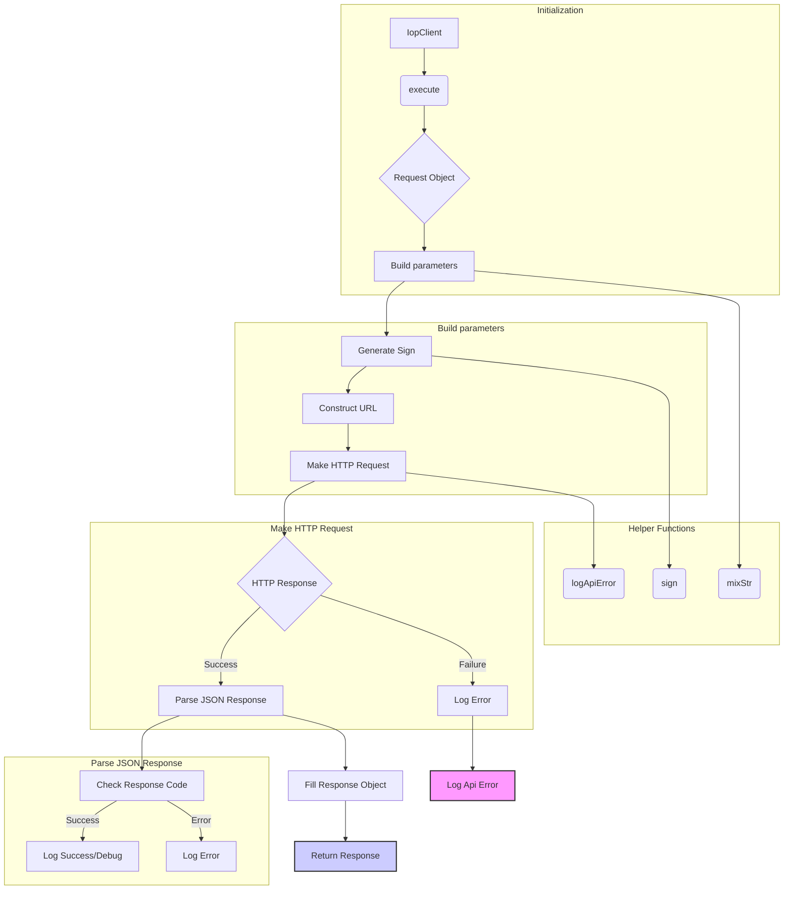

# <input code>

```python
## \file hypotez/src/suppliers/aliexpress/api/_examples/iop/base.py
# -*- coding: utf-8 -*-\
#! venv/Scripts/python.exe # <- venv win
## ~~~~~~~~~~~~~
""" module: src.suppliers.aliexpress.api._examples.iop """

'''
Created on 2018-03-21

@author: xuteng.xt
'''

import requests
import time
import hmac
import hashlib
import json
import mimetypes
import itertools
import random
import logging
import os
from os.path import expanduser
import socket
import platform

# dir = os.getenv('HOME')
dir = expanduser("~")
isExists = os.path.exists(dir + "/logs")
if not isExists:
    os.makedirs(dir + "/logs")
logger = logging.getLogger(__name__)
logger.setLevel(level = logging.ERROR)
handler = logging.FileHandler(dir + "/logs/iopsdk.log." + time.strftime("%Y-%m-%d", time.localtime()))
handler.setLevel(logging.ERROR)
# formatter = logging.Formatter('%(asctime)s - %(name)s - %(levelname)s - %(message)s')
formatter = logging.Formatter('%(message)s')
handler.setFormatter(formatter)
logger.addHandler(handler)

P_SDK_VERSION = "iop-sdk-python-20220609"

P_APPKEY = "app_key"
P_ACCESS_TOKEN = "session"
P_TIMESTAMP = "timestamp"
P_SIGN = "sign"
P_SIGN_METHOD = "sign_method"
P_PARTNER_ID = "partner_id"
P_METHOD = "method"
P_DEBUG = "debug"
P_SIMPLIFY = "simplify"
P_FORMAT = "format"

P_CODE = 'code'
P_TYPE = 'type'
P_MESSAGE = 'message'
P_REQUEST_ID = 'request_id'

# P_API_GATEWAY_URL_TW = 'https://api.taobao.tw/rest'
# P_API_AUTHORIZATION_URL = 'https://auth.taobao.tw/rest'

P_LOG_LEVEL_DEBUG = "DEBUG"
P_LOG_LEVEL_INFO = "INFO"
P_LOG_LEVEL_ERROR = "ERROR"


def sign(secret,api,parameters):
    #===========================================================================
    # @param secret
    # @param parameters
    #===========================================================================
    sort_dict = sorted(parameters)
    if("/" in api):
        parameters_str = "%s%s" % (api,str().join('%s%s' % (key, parameters[key]) for key in sort_dict))
    else:
        parameters_str = str().join('%s%s' % (key, parameters[key]) for key in sort_dict)

    h = hmac.new(secret.encode(encoding="utf-8"), parameters_str.encode(encoding="utf-8"), digestmod=hashlib.sha256)

    return h.hexdigest().upper()


def mixStr(pstr):
    if(isinstance(pstr, str)):
        return pstr
    elif(isinstance(pstr, unicode)):
        return pstr.encode('utf-8')
    else:
        return str(pstr)


def logApiError(appkey, sdkVersion, requestUrl, code, message):
    localIp = socket.gethostbyname(socket.gethostname())
    platformType = platform.platform()
    logger.error("%s^_^%s^_^%s^_^%s^_^%s^_^%s^_^%s^_^%s" % (
        appkey, sdkVersion,
        time.strftime("%Y-%m-%d %H:%M:%S", time.localtime()),
        localIp, platformType, requestUrl, code, message))


class IopRequest(object):
    def __init__(self,api_pame,http_method = 'POST'):
        self._api_params = {}
        self._file_params = {}
        self._api_pame = api_pame
        self._http_method = http_method
        self._simplify = "false"
        self._format = "json"

    def add_api_param(self,key,value):
        self._api_params[key] = value
    def add_file_param(self,key,value):
        self._file_params[key] = value
    def set_simplify(self):
        self._simplify = "true"
    def set_format(self,value):
        self._format = value;


class IopResponse(object):
    def __init__(self):
        self.type = None
        self.code = None
        self.message = None
        self.request_id = None
        self.body = None

    def __str__(self, *args, **kwargs):
        sb = "type=" + mixStr(self.type) + \
            " code=" + mixStr(self.code) + \
            " message=" + mixStr(self.message) + \
            " requestId=" + mixStr(self.request_id)
        return sb


class IopClient(object):

    log_level = P_LOG_LEVEL_ERROR
    def __init__(self, server_url,app_key,app_secret,timeout=30):
        self._server_url = server_url
        self._app_key = app_key
        self._app_secret = app_secret
        self._timeout = timeout

    def execute(self, request,access_token = None):
        # ... (rest of the code)
```



```markdown
# <explanation>

This Python code defines a client for interacting with an API (likely a Taobao-like API), specifically designed for handling requests and responses.

**Imports:**

The code imports various standard Python libraries:
- `requests`: For making HTTP requests.
- `time`: For working with time.
- `hmac`, `hashlib`: For generating cryptographic signatures.
- `json`: For handling JSON data.
- `mimetypes`, `itertools`, `random`, `logging`, `os`, `socket`, `platform`: Standard Python libraries for various tasks.

The imports from `src` are not explicitly shown, but are likely part of the project's internal structure.


**Classes:**

- **`IopRequest`:** Represents an API request.
    - `_api_params`: Dictionary holding parameters for the API call.
    - `_file_params`: Dictionary for file uploads.
    - `_api_pame`: API method name.
    - `_http_method`: HTTP method (default is POST).
    - `_simplify`, `_format`: Configuration options.
    - `add_api_param`, `add_file_param`: Methods for adding parameters.
    - `set_simplify`, `set_format`: For setting configuration options.

- **`IopResponse`:** Represents an API response.
    - `type`, `code`, `message`, `request_id`, `body`: Attributes to hold the response information.
    - `__str__`: Method for converting the response to a string.

- **`IopClient`:** The client object for interacting with the API.
    - `server_url`, `app_key`, `app_secret`:  Key parameters to access the API.
    - `timeout`: Timeout for requests.
    - `log_level`: Sets the logging level.
    - `execute`: The core method that handles the request-response cycle.


**Functions:**

- **`sign`**: Computes the signature for the request based on the secret key.
    - Arguments: secret key, API method name, parameters.
    - Returns: Signature.

- **`mixStr`**: Handles type conversion for parameters to ensure they're strings.
- **`logApiError`**: Logs API errors with relevant details (e.g., app key, timestamp, error code).
    - Crucial for debugging and monitoring.


**Variables:**

- `P_*`: Constants defining various parameters used in the API interaction. These are likely API key names.
- `logger`: A logging object to record errors and potentially debug information, improving observability.
- `dir`: Path to the log directory, allowing for easy log file management.
- `P_LOG_LEVEL_*`: Constants for controlling logging levels.

**Error Handling and Improvement:**

- The code includes a `try...except` block to catch potential errors during HTTP requests. This is good practice.
- The `logApiError` function helps track API issues.  Improving it to capture the HTTP status code and request headers would provide richer error information.
- It's good practice to validate the `jsonobj` before accessing its keys (e.g., checking if it is a dictionary).


**Relationships with other parts of the project:**

The provided code likely relies on other modules or classes within the `hypotez` project, such as data providers or configuration settings. These parts of the project are not fully visible, making it hard to trace the full project flow.


**Overall, the code is well-structured and follows good practices for API interaction and logging. The use of dedicated request and response objects makes the code more manageable and readable.**