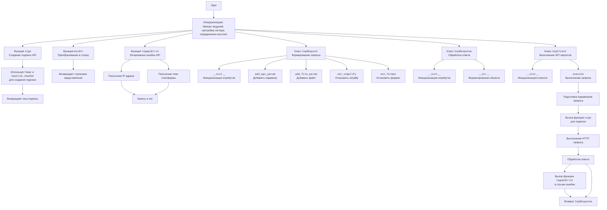

# Анализ кода `base.py`

## <алгоритм>

1.  **Инициализация:**
    *   Импортируются необходимые модули: `requests`, `time`, `hmac`, `hashlib`, `json`, `mimetypes`, `itertools`, `random`, `logging`, `os`, `socket`, `platform`.
    *   Настраивается логирование: создается директория для логов (если не существует), настраивается логгер, обработчик, и форматтер.
    *   Объявляются константы для параметров API и кодов ответов.

2.  **Функция `sign`:**
    *   Принимает `secret` (секретный ключ), `api` (путь API) и `parameters` (словарь параметров) в качестве аргументов.
    *   Сортирует параметры по ключам.
    *   Формирует строку параметров, объединяя ключи и значения.
    *   Если `api` содержит `/`, то строка параметров формируется как `<api_path><параметры>`.
    *   Используя `hmac` и `hashlib.sha256`, создает хеш-подпись на основе `secret` и строки параметров.
    *   Возвращает хеш-подпись в верхнем регистре.
    *   *Пример:* `sign("secret", "/api/method", {"param1": "value1", "param2": "value2"})` вернет `SHA256` хеш.

3.  **Функция `mixStr`:**
    *   Принимает значение `pstr`.
    *   Преобразует `pstr` в строку, обрабатывая `unicode` в `utf-8`.
    *   Возвращает строковое представление `pstr`.
    *   *Пример:* `mixStr(123)` вернет `"123"`, `mixStr(u"текст")` вернет `"текст"`

4. **Функция `logApiError`:**
   *   Принимает `appkey`, `sdkVersion`, `requestUrl`, `code` и `message` в качестве аргументов.
   *   Получает локальный IP-адрес и тип платформы.
   *   Форматирует и записывает сообщение об ошибке в лог-файл.
   *   *Пример*: `logApiError("app123", "1.0.0", "https://api.example.com", "500", "Internal Server Error")`

5.  **Класс `IopRequest`:**
    *   Представляет запрос к API.
    *   Имеет атрибуты: `_api_params` (словарь параметров API), `_file_params` (словарь файлов), `_api_pame` (путь API), `_http_method` (метод HTTP), `_simplify`, `_format`.
    *   Методы:
        *   `add_api_param(key, value)`: добавляет параметр API.
        *   `add_file_param(key, value)`: добавляет файл.
        *   `set_simplify()`: устанавливает параметр `simplify` в `true`.
        *   `set_format(value)`: устанавливает формат ответа.
    *   *Пример:*
        ```python
        request = IopRequest("/api/users", "POST")
        request.add_api_param("user_id", "123")
        request.add_file_param("avatar", open("image.png", "rb"))
        ```

6.  **Класс `IopResponse`:**
    *   Представляет ответ от API.
    *   Имеет атрибуты: `type`, `code`, `message`, `request_id`, `body`.
    *   Метод `__str__()`: форматирует объект в строку.

7.  **Класс `IopClient`:**
    *   Представляет клиента для взаимодействия с API.
    *   Имеет атрибуты: `_server_url` (URL сервера), `_app_key` (ключ приложения), `_app_secret` (секретный ключ), `_timeout` (таймаут).
    *   Имеет атрибут класса `log_level`.
    *   Метод `execute(request, access_token=None)`:
        *   Формирует системные параметры (app\_key, sign\_method, timestamp, partner\_id, method, simplify, format).
        *   Добавляет параметры отладки если `log_level` равен `P_LOG_LEVEL_DEBUG`.
        *   Добавляет access\_token, если передан.
        *   Объединяет системные и прикладные параметры.
        *   Вызывает функцию `sign` для получения подписи.
        *   Формирует полный URL запроса, включая все параметры.
        *   Отправляет HTTP-запрос (POST или GET) с параметрами и файлами, используя библиотеку `requests`.
        *   Обрабатывает ответ, извлекает `code`, `type`, `message` и `request_id` из JSON.
        *   Логирует ошибки, если `code` не равен `0`
        *   Возвращает объект `IopResponse`.
    *   *Пример:*
        ```python
        client = IopClient("https://api.example.com", "app_key", "app_secret")
        request = IopRequest("/api/users", "POST")
        request.add_api_param("user_id", "123")
        response = client.execute(request, "access_token")
        print(response)
        ```

## <mermaid>


**Дополнительно**:  `header.py` не используется в данном коде.

## <объяснение>

**Импорты:**

*   `requests`: Используется для выполнения HTTP-запросов к API.
*   `time`: Используется для получения текущего времени, например, для формирования timestamp и имени файла лога.
*   `hmac`: Используется для создания хеш-подписи с помощью алгоритма HMAC-SHA256.
*   `hashlib`: Предоставляет инструменты для хеширования, в данном случае для алгоритма SHA256.
*   `json`: Используется для обработки данных в формате JSON (сериализации и десериализации).
*   `mimetypes`: Используется для определения MIME-типа файла.
*   `itertools`: Предоставляет инструменты для работы с итераторами (не используется напрямую в данном коде, но импортирован).
*   `random`: Используется для генерации псевдослучайных чисел (не используется напрямую в данном коде, но импортирован).
*   `logging`: Используется для ведения журнала событий и ошибок.
*   `os`: Используется для работы с операционной системой, например, для создания директорий и проверки существования файлов.
*   `os.path.expanduser`:  Используется для получения домашней директории пользователя.
*    `socket`: Используется для получения IP-адреса локального хоста.
*   `platform`: Используется для получения информации о текущей операционной системе.

**Классы:**

*   **`IopRequest`**:
    *   **Роль**: Представляет запрос к API.
    *   **Атрибуты**:
        *   `_api_params`: Словарь, содержащий параметры запроса.
        *   `_file_params`: Словарь, содержащий файлы для отправки.
        *   `_api_pame`: Строка, представляющая путь API.
        *   `_http_method`: Строка, представляющая HTTP-метод (GET или POST).
        *   `_simplify`:  Строка, определяющая параметр `simplify` для API запроса.
        *   `_format`: Строка, определяющая формат ответа (`json` по умолчанию) для API запроса.
    *   **Методы**:
        *   `__init__(self, api_pame, http_method='POST')`: Конструктор, инициализирует атрибуты объекта.
        *   `add_api_param(self, key, value)`: Добавляет параметр API в словарь `_api_params`.
        *   `add_file_param(self, key, value)`: Добавляет файл в словарь `_file_params`.
        *    `set_simplify(self)`: Устанавливает параметр `simplify` в `true`.
        *    `set_format(self, value)`: Устанавливает формат ответа в значение `value`.
*   **`IopResponse`**:
    *   **Роль**: Представляет ответ от API.
    *   **Атрибуты**:
        *   `type`: Тип ответа.
        *   `code`: Код ответа.
        *   `message`: Сообщение ответа.
        *   `request_id`: ID запроса.
        *   `body`: Тело ответа.
    *   **Методы**:
        *   `__init__(self)`: Конструктор, инициализирует атрибуты объекта.
        *   `__str__(self, *args, **kwargs)`:  Возвращает строковое представление объекта.
*   **`IopClient`**:
    *   **Роль**: Клиент для взаимодействия с API.
    *   **Атрибуты**:
        *   `_server_url`: URL сервера API.
        *   `_app_key`: Ключ приложения.
        *   `_app_secret`: Секретный ключ приложения.
        *    `_timeout`: Время ожидания HTTP запроса.
        *   `log_level`: Уровень логирования (по умолчанию `ERROR`).
    *   **Методы**:
        *   `__init__(self, server_url, app_key, app_secret, timeout=30)`: Конструктор, инициализирует атрибуты объекта.
        *    `execute(self, request, access_token=None)`: Выполняет API запрос, формирует параметры, подписывает запрос, отправляет запрос и возвращает `IopResponse`.

**Функции:**

*   **`sign(secret, api, parameters)`**:
    *   **Аргументы**:
        *   `secret`: Секретный ключ приложения.
        *   `api`:  API метод.
        *   `parameters`: Словарь параметров запроса.
    *   **Возвращаемое значение**: Хеш-подпись запроса.
    *   **Назначение**: Создает подпись для API-запроса, используя HMAC-SHA256.
*   **`mixStr(pstr)`**:
    *   **Аргументы**:
        *   `pstr`: Любое значение, которое нужно преобразовать в строку.
    *   **Возвращаемое значение**: Строковое представление `pstr`.
    *   **Назначение**: Гарантирует, что все входные данные будут представлены в виде строки.
*   **`logApiError(appkey, sdkVersion, requestUrl, code, message)`**:
    *   **Аргументы**:
        *   `appkey`: Ключ приложения.
        *    `sdkVersion`: Версия SDK.
        *   `requestUrl`: URL запроса.
        *   `code`: Код ошибки.
        *   `message`: Сообщение об ошибке.
    *   **Возвращаемое значение**: None.
    *   **Назначение**: Записывает информацию об ошибке в лог-файл.

**Переменные:**
*  `P_SDK_VERSION`, `P_APPKEY`, `P_ACCESS_TOKEN`, `P_TIMESTAMP`, `P_SIGN`, `P_SIGN_METHOD`, `P_PARTNER_ID`, `P_METHOD`, `P_DEBUG`, `P_SIMPLIFY`, `P_FORMAT`: константы, которые используются в коде для обозначения параметров запроса и других настроек.
*  `P_CODE`, `P_TYPE`, `P_MESSAGE`, `P_REQUEST_ID`: константы, которые используются для доступа к полям в JSON ответа.
*  `P_LOG_LEVEL_DEBUG`, `P_LOG_LEVEL_INFO`, `P_LOG_LEVEL_ERROR`: константы, которые обозначают уровни логирования.
* `logger`: логгер для записи ошибок
* `dir`: переменная, хранящая путь к домашней директории пользователя.
* `isExists`: переменная, проверяющая существование папки `/logs`.

**Взаимосвязи:**

*   `IopClient` использует `IopRequest` для формирования запроса и `IopResponse` для обработки ответа.
*   `IopClient` использует функцию `sign` для создания подписи запроса.
*   `IopClient` и `logApiError` используют `logging` для записи ошибок.

**Потенциальные ошибки и области для улучшения:**

*   Обработка ошибок: в блоке `try-except`  метода `execute` обрабатываются все исключения. Это может затруднить отладку. Возможно, стоит конкретизировать обрабатываемые исключения.
*   Логирование: Логгер записывает только сообщения об ошибках, если response code не равен 0. Добавить логирование успешных запросов на уровне DEBUG или INFO.
*   `mixStr`: Обрабатывает только строки и unicode. Можно сделать обработку более общей, например для `bytes`.
*   Формирование URL:  Формирование URL можно улучшить с использованием `urllib.parse.urlencode`, что сделает код более читаемым и безопасным.

**Цепочка взаимосвязей:**

1.  Клиент `IopClient` инициализируется с URL сервера, ключом приложения и секретным ключом.
2.  Создается объект `IopRequest` с путем API и HTTP методом.
3.  В объект `IopRequest` добавляются параметры запроса.
4.  Вызывается метод `execute` у `IopClient`, передавая объект `IopRequest`.
5.  `execute` метод формирует системные параметры, объединяет их с параметрами из `IopRequest`.
6.  Функция `sign` генерирует подпись на основе секретного ключа и параметров.
7.  Формируется полный URL запроса, используя параметры.
8.  Отправляется HTTP-запрос с использованием `requests`.
9.  Из JSON ответа создается объект `IopResponse`.
10. В случае ошибки,  `logApiError` записывает ошибку в лог-файл.
11. `execute` возвращает объект `IopResponse`, который содержит результаты API запроса.