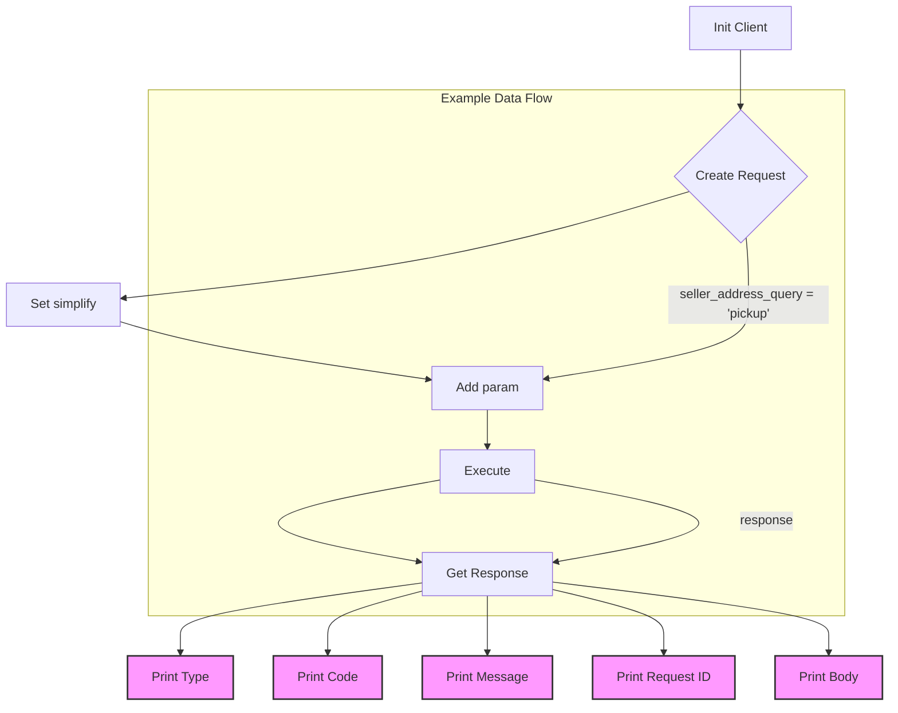
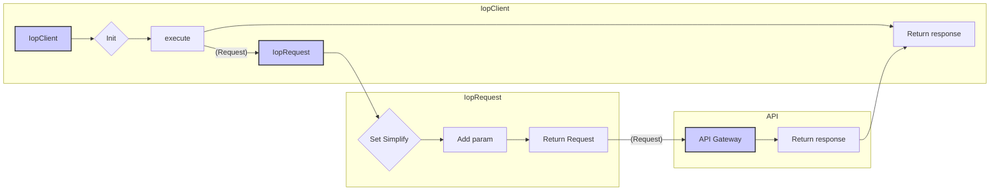

# <input code>

```python
## \file hypotez/src/suppliers/aliexpress/api/_examples/iop/test_get.py
# -*- coding: utf-8 -*-
#! venv/Scripts/python.exe # <- venv win
## ~~~~~~~~~~~~
""" module: src.suppliers.aliexpress.api._examples.iop """

import iop

# params 1 : gateway url
# params 2 : appkey
# params 3 : appSecret
client = iop.IopClient('https://api-pre.aliexpress.com/sync', '33505222', 'e1fed6b34feb26aabc391d187732af93')

# create a api request set GET mehotd
# default http method is POST
request = iop.IopRequest('aliexpress.logistics.redefining.getlogisticsselleraddresses', 'POST')
request.set_simplify()
# simple type params ,Number ,String
request.add_api_param('seller_address_query', 'pickup')

response = client.execute(request, "50000001a27l15rndYBjw6PrtFFHPGZfy09k1Cp1bd8597fsduP0RStringNormalizery0jhF6FL")

# response type nil,ISP,ISV,SYSTEM
# nil ：no error
# ISP : API Service Provider Error
# ISV : API Request Client Error
# SYSTEM : Iop platform Error
print(response.type)

# response code, 0 is no error
print(response.code)

# response error message
print(response.message)

# response unique id
print(response.request_id)

# full response
print(response.body)
```

# <algorithm>


The algorithm initializes an `IopClient` with API credentials.  It then creates an `IopRequest` specifying the API endpoint and method (POST in this case) and sets it to simplified mode.  A parameter `seller_address_query` with the value `'pickup'` is added to the request. The `execute` method is called to send the request to the API and receive the response.  Finally, the response's type, code, message, request ID, and body are printed to the console.


# <mermaid>



The diagram shows the dependencies between `IopClient`, `IopRequest`, and the API gateway. The `IopClient` interacts with the `IopRequest` to create and execute the request. The request is sent to the API gateway, which then returns the response.


# <explanation>

- **Imports**:
  - `import iop`: This line imports the `iop` module, which likely contains classes and functions for interacting with the AliExpress API through the Iop framework.  The `src` prefix suggests this `iop` module is part of the project's internal libraries, possibly located within a `hypotez/src/` directory structure.

- **Classes**:
  - `IopClient`: This class represents a client for interacting with the Iop API.  Its role is to handle the communication with the external AliExpress API.  The constructor (which is not directly shown, but inferred from the code) takes parameters for the API gateway URL, app key, and app secret, indicating authentication and connection details. The `execute` method is crucial as it sends the request to the API.
  - `IopRequest`: This class handles the construction of API requests.  It is likely responsible for formatting the request's HTTP method (which defaults to POST), endpoints (e.g., `aliexpress.logistics.redefining.getlogisticsselleraddresses`), and the addition of parameters.

- **Functions**:
  - The code does not show any custom functions besides implicit methods. The `execute` method is part of `IopClient` and likely does HTTP requests.

- **Variables**:
  - `client`: An instance of the `IopClient` class, configured with the AliExpress API endpoint and credentials.
  - `request`: An instance of `IopRequest` which sets up the request information.
  - `response`: An object containing the API response. This object likely has attributes like `type`, `code`, `message`, `request_id`, and `body` reflecting the API response data.

- **Possible Errors or Improvements**:
  - **Error Handling**: The code lacks robust error handling.  A `try...except` block should be included to catch potential exceptions during the API call (e.g., network issues, invalid credentials, API errors).
  - **Logging**: Adding logging statements would significantly improve debugging and monitoring of the API calls.
  - **Parameter Validation**: Validating the parameters before making the API call (e.g., ensuring the app key and secret are valid) could prevent unexpected behavior.
  - **Request Structure**: Understanding the precise structure of the `aliexpress.logistics.redefining.getlogisticsselleraddresses` API request is vital for creating valid requests.   The sample `seller_address_query` parameter is likely just a small example. The complete request structure likely involves multiple parameters.
  - **Documentation**:  A clear documentation string within the `IopClient` and `IopRequest` classes would be helpful for understanding their usage and parameters.


**Relationship with other parts of the project:**

The `iop` module and the classes (`IopClient`, `IopRequest`) are likely part of a larger framework for interacting with various e-commerce APIs, possibly in a project dealing with automating order fulfillment or inventory management. The `aliexpress` package (and potentially other supplier packages) provides the necessary connections for interacting with AliExpress specific APIs. The `_examples/` directory indicates that this is a testing or demo component of the overall codebase.