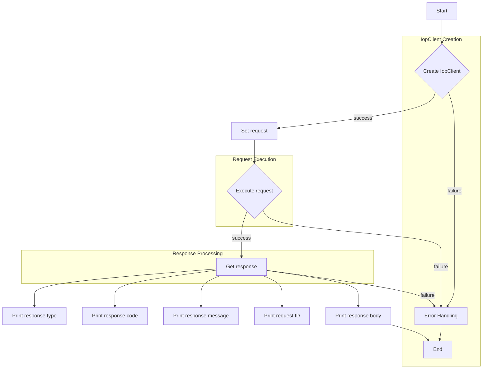

# <input code>

```python
## \file hypotez/src/suppliers/aliexpress/api/_examples/iop/test_get.py
# -*- coding: utf-8 -*-
#! venv/Scripts/python.exe # <- venv win
## ~~~~~~~~~~~~~
""" module: src.suppliers.aliexpress.api._examples.iop """

import iop

# params 1 : gateway url
# params 2 : appkey
# params 3 : appSecret
client = iop.IopClient('https://api-pre.aliexpress.com/sync', '33505222', 'e1fed6b34feb26aabc391d187732af93')

# create a api request set GET mehotd
# default http method is POST
request = iop.IopRequest('aliexpress.logistics.redefining.getlogisticsselleraddresses', 'POST')
request.set_simplify()
# simple type params ,Number ,String
request.add_api_param('seller_address_query', 'pickup')

response = client.execute(request, "50000001a27l15rndYBjw6PrtFFHPGZfy09k1Cp1bd8597fsduP0RStringNormalizery0jhF6FL")

# response type nil,ISP,ISV,SYSTEM
# nil ：no error
# ISP : API Service Provider Error
# ISV : API Request Client Error
# SYSTEM : Iop platform Error
print(response.type)

# response code, 0 is no error
print(response.code)

# response error message
print(response.message)

# response unique id
print(response.request_id)

# full response
print(response.body)
```

# <algorithm>



**Пример:**

1. Создается экземпляр `IopClient` с заданными URL, appKey и appSecret.
2. Создается `IopRequest` для запроса данных.  Метод GET задаётся явно.
3. Добавляется параметр `seller_address_query` со значением 'pickup'.
4. Вызывается метод `execute` у `IopClient`, передавая запрос.
5. Получен ответ `response`.
6. Выводятся различные атрибуты ответа (`type`, `code`, `message`, `request_id`, `body`).


# <mermaid>

```mermaid
graph LR
    subgraph IopClient
        A[IopClient] --> B{execute(request, ...)};
        B --> C[Response];
    end
    subgraph IopRequest
        D[IopRequest] --> E[set_simplify()];
        E --> F[add_api_param(seller_address_query, pickup)];
        F --> G[create GET request];
    end
    C --> H[response.type];
    C --> I[response.code];
    C --> J[response.message];
    C --> K[response.request_id];
    C --> L[response.body];
```

**Объяснение диаграммы:**

* `IopClient`:  Представляет клиента для взаимодействия с API.
* `execute`: метод, запускающий запрос.
* `IopRequest`:  Представляет сам запрос, который создается и настраивается (метод `set_simplify`, добавление параметра `seller_address_query`).
* `response`: Объект, содержащий ответ сервера, который предоставляется в различных форматах (атрибуты `type`, `code`, `message`, `request_id`, `body`).


# <explanation>

**Импорты:**

- `import iop`: Импортирует модуль `iop`, который предположительно является собственным модулем или пакетом, предназначенным для работы с API (в данном случае, с AliExpress).

**Классы:**

- `IopClient`: Представляет клиента для взаимодействия с API.  Он имеет атрибуты для URL, ключа приложения, секретного ключа приложения и методы для выполнения запросов.
- `IopRequest`: Представляет собой запрос к API. У него есть методы для настройки параметров, типа запроса, упрощения данных и др.

**Функции:**

- `client.execute(request, ...)`: Выполняет запрос, заданный объектом `request`, к API.  Он принимает запрос и дополнительные данные. Возвращает объект `Response`, содержащий ответ сервера.


**Переменные:**

- `client`: Экземпляр класса `IopClient`, конфигурированный для взаимодействия с API AliExpress.
- `request`: Объект запроса, содержащий параметры и данные для запроса.
- `response`: Объект, содержащий ответ сервера.


**Возможные ошибки и улучшения:**

- **Обработка ошибок:** Код не содержит обработку ошибок, возникших при выполнении запроса. Следует добавить обработку исключений (`try...except`) для более надежной работы.
- **Логирование:** Добавьте логирование, чтобы отслеживать выполнение запроса, в случае ошибок (например, типы ошибок API, код ошибки).
- **Детализация параметров:** В параметрах запроса можно использовать более описательные имена, чтобы было понятнее, что они представляют.
- **Тип данных:** Не ясна схема данных ответа. Лучше использовать `json` для десериализации.


**Взаимосвязи с другими частями проекта:**

- `iop`: Предполагается, что этот модуль является частью более крупного проекта, отвечающего за взаимодействие с различными API.  Он использует внутренние механизмы для обработки запросов, передачи данных и управления соединениями с API.
- `aliexpress`: Код, вероятно, входит в состав проекта, который предназначен для работы с AliExpress.

**Вывод:**

Код выполняет запрос к API AliExpress с использованием модуля `iop`.  Он демонстрирует создание клиента API, настройку запроса GET и вывод ответа. Недостаточно обработки ошибок. Не хватает ясности относительно структуры данных `response`.