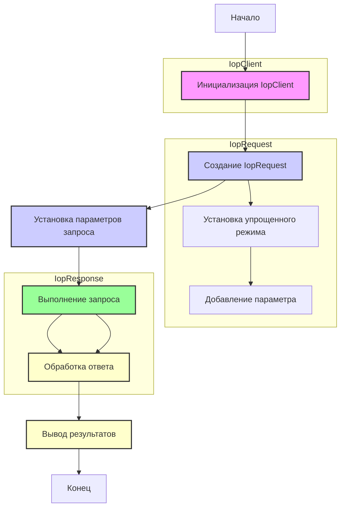

## АНАЛИЗ КОДА: `test_get.py`

### 1. `<алгоритм>`

1.  **Инициализация клиента IOP:**
    *   Создается экземпляр `IopClient` с указанием URL-адреса шлюза (`https://api-pre.aliexpress.com/sync`), ключа приложения (`33505222`) и секрета приложения (`e1fed6b34feb26aabc391d187732af93`).
    *   Пример: `client = iop.IopClient(gateway_url, app_key, app_secret)`

2.  **Создание запроса API:**
    *   Создается экземпляр `IopRequest` с указанием имени API-метода (`aliexpress.logistics.redefining.getlogisticsselleraddresses`) и HTTP-метода (`POST`).
    *   Пример: `request = iop.IopRequest(api_method, http_method)`
    *   Устанавливается упрощенный режим запроса.
    *   Добавляется параметр запроса `seller_address_query` со значением `pickup`.
    *   Пример: `request.add_api_param(parameter_name, parameter_value)`

3.  **Выполнение запроса:**
    *   Выполняется запрос API с использованием метода `client.execute()`, передавая созданный объект запроса `request` и токен авторизации `"50000001a27l15rndYBjw6PrtFFHPGZfy09k1Cp1bd8597fsduP0RStringNormalizery0jhF6FL"`.
    *   Результат помещается в переменную `response`
    *   Пример: `response = client.execute(request, auth_token)`

4.  **Обработка ответа:**
    *   Выводится тип ответа (`response.type`).
    *   Выводится код ответа (`response.code`).
    *   Выводится сообщение об ошибке (`response.message`).
    *   Выводится уникальный идентификатор запроса (`response.request_id`).
    *   Выводится полный ответ (`response.body`).
    *   Примеры:
        ```python
        print(response.type)
        print(response.code)
        print(response.message)
        print(response.request_id)
        print(response.body)
        ```

### 2. `<mermaid>`



**Объяснение зависимостей:**

*   `Start` - Начало выполнения скрипта.
*   `ClientInit`: Создание экземпляра класса `IopClient`, который используется для выполнения запросов к API.
*   `RequestCreate`: Создание экземпляра класса `IopRequest`, представляющего запрос к API.
*   `RequestSetSimplify`: Установка упрощенного режима для объекта `IopRequest`.
*   `RequestSetParams`: Установка параметров для запроса (в данном случае, параметра `seller_address_query` со значением `pickup`).
*   `ExecuteRequest`: Выполнение запроса через метод `execute` объекта `IopClient`.
*   `ResponseProcess`: Обработка полученного ответа от API, который возвращается в виде объекта `IopResponse`.
*   `OutputResponse`: Вывод данных из объекта `IopResponse` на экран (тип ответа, код ответа, сообщение об ошибке, идентификатор запроса, и тело ответа).
*   `End` - Конец выполнения скрипта.
*   `IopClient`: Объект, представляющий клиента для взаимодействия с API, ответственного за отправку запросов.
*   `IopRequest`: Объект, представляющий запрос к API с необходимыми параметрами.
*   `IopResponse`: Объект, представляющий ответ от API, содержащий информацию о статусе запроса и полученных данных.

### 3. `<объяснение>`

**Импорты:**

*   `import iop`: Импортирует модуль `iop`, который, судя по коду, предоставляет классы для работы с API (вероятно, для AliExpress). Этот модуль содержит классы `IopClient` и `IopRequest`, которые используются в коде для создания и отправки запросов.
    `iop` – это внутренний модуль, предполагается, что он находится где-то в `src`, но не указан явно при импорте.

**Классы:**

*   `IopClient`:
    *   **Роль**: Клиент для взаимодействия с API.
    *   **Атрибуты**: Принимает в конструкторе URL шлюза API, ключ приложения и секрет приложения.
    *   **Методы**:
        *   `execute(request, auth_token)`: Выполняет запрос к API, принимает объект `IopRequest` и токен авторизации. Возвращает объект ответа (`IopResponse`).
    *   **Взаимодействие**: Используется для отправки запросов, созданных с помощью `IopRequest`.

*   `IopRequest`:
    *   **Роль**: Представляет запрос к API.
    *   **Атрибуты**: Принимает имя API-метода и HTTP-метод в конструкторе.
    *   **Методы**:
        *   `set_simplify()`: Устанавливает упрощенный режим запроса.
        *   `add_api_param(param_name, param_value)`: Добавляет параметры к запросу.
    *   **Взаимодействие**: Используется для определения параметров запроса. Передается методу `execute` класса `IopClient`.

**Функции:**
В явном виде в данном примере не используются функции, но по сути `iop.IopClient()` и `iop.IopRequest()` являются вызовами конструкторов классов, а `client.execute()` - вызовом метода.

*   `IopClient(...)`: конструктор класса для инициализации клиента API.
*   `IopRequest(...)`: конструктор класса для создания объекта запроса к API.
*   `client.execute(request, auth_token)`: отправляет запрос на сервер и возвращает результат.

**Переменные:**

*   `client`: Экземпляр класса `IopClient`.
    *   **Тип**: `iop.IopClient`.
    *   **Использование**: Используется для выполнения запросов к API.
*   `request`: Экземпляр класса `IopRequest`.
    *   **Тип**: `iop.IopRequest`.
    *   **Использование**: Представляет запрос к API с определенными параметрами.
*   `response`: Объект ответа от API.
    *   **Тип**: `IopResponse` (предположительно, класс от модуля `iop`).
    *   **Использование**: Содержит информацию о результате выполнения запроса.

**Цепочка взаимосвязей с другими частями проекта:**

1.  **`iop` Module:**
    *   Предположительно, `iop` является модулем внутри проекта `src`, так как импорт выглядит как `import iop`. Этот модуль отвечает за взаимодействие с API AliExpress.
    *   Он содержит классы `IopClient`, `IopRequest`, и, возможно, `IopResponse`, а также другие классы или функции, связанные с API.

2.  **Структура проекта:**
    *   Файл `test_get.py` находится в директории `src/suppliers/aliexpress/api/_examples/iop/`. Это предполагает, что проект организован по модульному принципу, где каждая директория представляет отдельный функциональный блок (в данном случае, взаимодействие с API AliExpress через модуль `iop`).
    *   В этом примере, `iop` – это часть API-клиента для AliExpress. В структуре `src/suppliers/aliexpress/api/` также могут быть другие модули, например `auth`, `utils`, и т.д.

**Потенциальные ошибки и области для улучшения:**

*   **Обработка ошибок:** Код выводит сообщения об ошибках, но не обрабатывает их. Рекомендуется добавить обработку ошибок с помощью `try-except` блоков.
*   **Жестко закодированные данные:** Ключ приложения, секрет приложения и токен авторизации жестко закодированы в коде. Это небезопасно. Рекомендуется использовать переменные окружения или другие способы управления секретами.
*   **Логирование:** Отсутствует логирование. Добавление логирования поможет отслеживать работу кода и выявлять проблемы.
*   **Упрощенный режим:** Не совсем понятно что дает `request.set_simplify()`, необходимо больше контекста о `iop`
*   **Отсутствие документации по `iop`:** Код предполагает наличие модуля `iop`, но нет информации о его структуре и функциях.

В целом, код выполняет свою задачу – отправляет запрос к API AliExpress и выводит результат. Однако, для более надежной и безопасной работы необходимо улучшить обработку ошибок, хранение секретов, логирование и добавить больше комментариев в код.