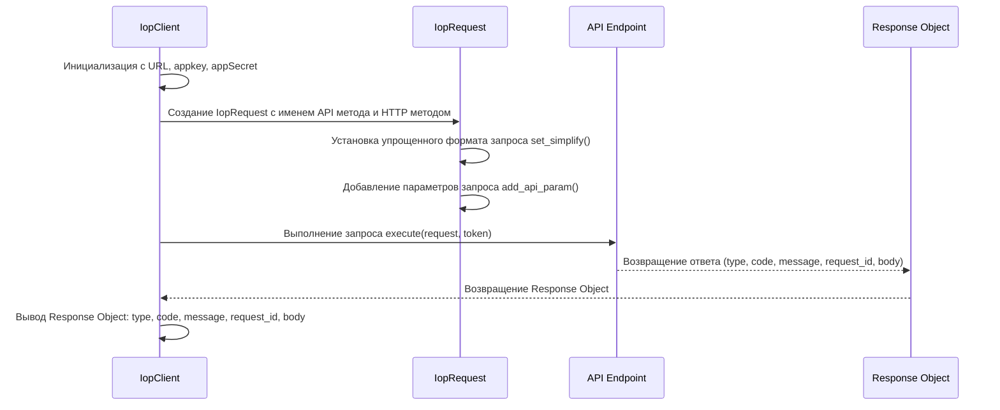

## Анализ кода `test_get.py`

### <алгоритм>

1. **Инициализация клиента `IopClient`**:
   - Создается экземпляр класса `IopClient` с параметрами: URL API (`https://api-pre.aliexpress.com/sync`), `appkey` (`33505222`) и `appSecret` (`e1fed6b34feb26aabc391d187732af93`).
   - Пример: `client = iop.IopClient('https://api-pre.aliexpress.com/sync', '33505222', 'e1fed6b34feb26aabc391d187732af93')`
2. **Создание запроса `IopRequest`**:
   - Создается экземпляр класса `IopRequest` с именем API метода (`aliexpress.logistics.redefining.getlogisticsselleraddresses`) и HTTP методом `POST`.
   - Пример: `request = iop.IopRequest('aliexpress.logistics.redefining.getlogisticsselleraddresses', 'POST')`
3. **Установка упрощенного формата запроса**:
   - Вызывается метод `set_simplify()` для упрощения формата запроса.
   - Пример: `request.set_simplify()`
4. **Добавление параметров запроса**:
   - Добавляется параметр `seller_address_query` со значением `pickup` через метод `add_api_param`.
   - Пример: `request.add_api_param('seller_address_query','pickup')`
5. **Выполнение запроса**:
   - Выполняется запрос к API с помощью метода `execute()` клиента, передавая запрос и токен (`50000001a27l15rndYBjw6PrtFFHPGZfy09k1Cp1bd8597fsduP0RStringNormalizery0jhF6FL`).
   - Пример: `response = client.execute(request,"50000001a27l15rndYBjw6PrtFFHPGZfy09k1Cp1bd8597fsduP0RStringNormalizery0jhF6FL")`
6. **Обработка ответа**:
   - Печатаются различные атрибуты ответа:
     - `response.type` (тип ошибки: nil, ISP, ISV, SYSTEM)
     - `response.code` (код ответа, 0 - нет ошибки)
     - `response.message` (сообщение об ошибке)
     - `response.request_id` (уникальный идентификатор запроса)
     - `response.body` (полный текст ответа).

### <mermaid>

**Зависимости:**

- **`IopClient`**:  Класс, предоставляющий функциональность для отправки запросов к API. 
- **`IopRequest`**: Класс, представляющий собой запрос к API, который содержит параметры запроса.
- **API Endpoint**:  Внешний API, к которому отправляется запрос.
- **Response Object**: Объект, который содержит результат запроса (тип ошибки, код, сообщение, ID запроса, тело ответа).
- **Токен**: Строка авторизации для доступа к API.

### <объяснение>

**Импорты:**

- `import iop`: Импортируется модуль `iop`, который предположительно содержит классы `IopClient` и `IopRequest`. Этот модуль является ключевой частью взаимодействия с API AliExpress.

**Классы:**

- **`IopClient`**:
    - **Роль**:  Представляет собой клиент для отправки запросов к API AliExpress. Он отвечает за установку соединения и выполнение запросов.
    - **Атрибуты**: При инициализации принимает URL API, `appkey` и `appSecret` как параметры для аутентификации и доступа к API.
    - **Методы**:
        - `__init__(gateway_url, appkey, appSecret)`: Конструктор класса, принимающий URL, ключ приложения и секретный ключ.
        - `execute(request, token)`: Выполняет API запрос, передавая экземпляр `IopRequest` и токен авторизации. Возвращает объект ответа (предположительно, экземпляр какого-то класса `Response`).
    - **Взаимодействие**: Использует `IopRequest` для создания запросов и взаимодействует с API AliExpress для выполнения этих запросов.
- **`IopRequest`**:
    - **Роль**: Представляет собой запрос к API, включая метод (POST, GET и т.д.) и параметры.
    - **Атрибуты**: При инициализации принимает имя API метода и тип HTTP запроса.
    - **Методы**:
        - `__init__(api_method, http_method)`: Конструктор класса.
        - `set_simplify()`: Устанавливает упрощенный формат запроса (детали реализации не показаны).
        - `add_api_param(param_name, param_value)`: Добавляет параметр к запросу.
    - **Взаимодействие**: Используется `IopClient` для формирования запроса к API.

**Функции:**

- В данном коде нет явных пользовательских функций, но методы классов `IopClient` и `IopRequest` выполняют определенную функциональность.

**Переменные:**

- `client`: Экземпляр класса `IopClient`, используемый для взаимодействия с API AliExpress.
- `request`: Экземпляр класса `IopRequest`, представляющий собой запрос к API.
- `response`: Объект, представляющий ответ API, содержащий различные атрибуты (тип, код, сообщение, идентификатор, тело).

**Потенциальные ошибки и улучшения:**

- **Обработка ошибок**: Код не содержит обработку ошибок, которые могут возникнуть во время выполнения запроса, таких как сетевые ошибки, ошибки аутентификации, ошибки API и т.д. Необходимо добавить `try-except` блоки для обработки этих ошибок.
- **Логирование**: Отсутствует логирование запросов и ответов. В продакшн-среде необходимо добавлять логи для отслеживания и отладки.
- **Безопасность**: Токен жестко закодирован в коде. Следует использовать более безопасные способы хранения и передачи токенов (например, через переменные окружения или файлы конфигурации).
- **Конфигурация**: URL API, `appkey` и `appSecret` также жестко закодированы. Желательно вынести их в файл конфигурации или переменные окружения для гибкости.
- **Типизация**: Код не содержит аннотаций типов, что затрудняет понимание типов переменных и возвращаемых значений. Рекомендуется использовать аннотации типов для повышения читаемости и надежности кода.
- **Абстракция**: Вынести логику обработки API запросов (например, создание запросов, обработка ответов) в отдельные функции или классы для лучшей переиспользуемости и модульности.

**Взаимосвязи с другими частями проекта:**

- Этот файл (`test_get.py`) является примером использования API AliExpress. Он является частью пакета `src.suppliers.aliexpress.api._examples.iop`, который, предположительно, является демонстрационным разделом.
- Код зависит от модуля `iop`, который, вероятно, предоставляет абстракцию для работы с API AliExpress и, возможно, является частью основного пакета `src.suppliers.aliexpress.api`.
- Данный код, скорее всего, не предназначен для прямого использования в продакшн-среде, а служит для тестирования и демонстрации.

В целом, данный код предоставляет базовый пример отправки GET запроса к API AliExpress с помощью классов `IopClient` и `IopRequest`. Однако, он нуждается в улучшениях, особенно в части обработки ошибок, безопасности, и конфигурации.