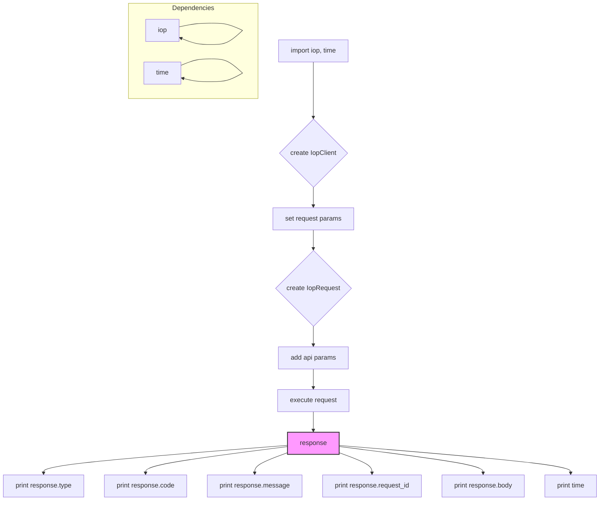

```MD
# <input code>

```python
## \file hypotez/src/suppliers/aliexpress/api/_examples/iop/test_internal.py
# -*- coding: utf-8 -*-\
#! venv/Scripts/python.exe # <- venv win
## ~~~~~~~~~~~~~\
""" module: src.suppliers.aliexpress.api._examples.iop """
"""   [File's Description]


 @section libs imports:
  - iop 
  - time 
Author(s):
  - Created by Davidka on 09.11.2023 .
"""


import iop
import time

# params 1 : gateway url
# params 2 : appkey
# params 3 : appSecret
client = iop.IopClient('https://api-pre.taobao.tw/rest', '100240', 'hLeciS15d7UsmXKoND76sBVPpkzepxex')
# client.log_level = iop.P_LOG_LEVEL_DEBUG
# create a api request set GET mehotd
# default http method is POST
request = iop.IopRequest('/product/item/get', 'GET')

# simple type params ,Number ,String
request.add_api_param('itemId','157432005')
request.add_api_param('authDO', '{"sellerId":2000000016002}')

response = client.execute(request)
#response = client.execute(request,access_token)

# response type nil,ISP,ISV,SYSTEM
# nil ：no error
# ISP : API Service Provider Error
# ISV : API Request Client Error
# SYSTEM : Iop platform Error
print(response.type)

# response code, 0 is no error
print(response.code)

# response error message
print(response.message)

# response unique id
print(response.request_id)

# full response
print(response.body)

print(str(round(time.time())) + '000')
```

# <algorithm>

**Шаг 1:** Импортируются необходимые модули `iop` и `time`.
**Шаг 2:** Создается экземпляр класса `IopClient` из модуля `iop`.  В конструктор передаются URL-адрес API-шлюза, ключ приложения (`appkey`) и секретный ключ приложения (`appSecret`).  Это инициализирует соединение с API.
**Шаг 3:** Создается экземпляр класса `IopRequest` из модуля `iop` для запроса к API. В конструктор передается путь к ресурсу (`/product/item/get`) и метод HTTP-запроса (`GET`).
**Шаг 4:** Добавляются параметры запроса (`itemId`, `authDO`) к объекту `request` с помощью метода `add_api_param`.
**Шаг 5:** Выполняется запрос к API с помощью метода `execute` объекта `client` и передается объект `request`. Результат (объект `response`) содержит данные ответа.
**Шаг 6:** Выводятся различные атрибуты объекта `response`, такие как тип ответа, код ответа, сообщение об ошибке, уникальный идентификатор запроса и тело ответа.
**Шаг 7:** Выводится отметка времени.

**Примеры:**
* **Шаг 2:** Создается клиент для доступа к API Taobao.
* **Шаг 4:** Добавляется параметр `itemId` с числовым значением.
* **Шаг 5:**  `client.execute(request)` возвращает объект `response`, содержащий ответ от API (статус, код, сообщение).

**Передача данных:**  Данные передаются между объектами через методы вызова и свойства объектов. Например, данные о запросе помещаются в объект `request`, а затем передаются `client` для выполнения. Результат (объект `response`) содержит данные, которые потом доступны для вывода.


# <mermaid>



# <explanation>

**Импорты:**

* `iop`:  Этот модуль, судя по коду,  представляет собой библиотеку для работы с API (похоже, Taobao API или подобным). Он содержит классы и функции для организации запросов, обработки ответов и работы с API Taobao.  Он является ключевым модулем для работы с API.  Необходимость импортировать `time` для отметки времени очевидна.

* `time`:  Модуль для работы со временем. Используется для записи текущего времени.

**Классы:**

* `IopClient`:  Представляет собой клиент для взаимодействия с API.  Объект инициализируется с данными для доступа к API (URL, ключи).  Метод `execute` отправляет запросы.

* `IopRequest`: Представляет собой запрос к API.  Используется для задания параметров запроса (метод, путь, параметры).


**Функции:**

* Методы класса `IopClient` (например, `execute`) : Устанавливают соединение с API, отправляют запрос и обрабатывают ответ.  Конкретная реализация этих методов внутри библиотеки `iop` не показана, но предполагается, что они занимаются сериализацией, отправкой и десериализацией данных.

* Методы класса `IopRequest` (например, `add_api_param`) :  Добавляют параметры к запросу.


**Переменные:**

* `client`: Экземпляр класса `IopClient`, используемый для взаимодействия с API.

* `request`: Экземпляр класса `IopRequest`, содержащий параметры запроса.

* `response`: Объект, содержащий ответ от API.  Важно, что это именно тот же объект, в котором хранятся данные, а не просто значения, которые распечатываются в конце.

* `itemId`, `authDO`:  Параметры запроса. В данном случае `itemId` - числовой параметр, а `authDO` - строка JSON, что предполагает передачу параметров для аутентификации.


**Возможные ошибки или улучшения:**

* **Отсутствие обработки ошибок:**  Код не содержит проверки на ошибки при выполнении запроса (`client.execute`). Необходимо добавить обработку исключений (try-except), чтобы реагировать на различные ошибки (например, проблемы с соединением, неправильные данные ответа).

* **Запись логирования:** Код использует комментарии для описания параметров. Вместо этого стоит использовать стандартные механизмы логирования Python (например, `logging`), чтобы сохранять и контролировать информацию о запросах и ответах.

* **Переменные с длинными именами**: Имена переменных `appkey` и `appSecret` могли бы быть более осмысленными, например `api_key`, `api_secret`.

**Цепочка взаимосвязей:**

Код взаимодействует с `iop` библиотекой.  `iop`  представляет собой независимый модуль или пакет, который взаимодействует с Taobao API.  В зависимости от архитектуры проекта, возможно, `iop` взаимодействует с другими частями проекта (например, через другие API или через бизнес-логику).  Без дополнительного контекста об архитектуре проекта, тяжело указать все возможные взаимосвязи.