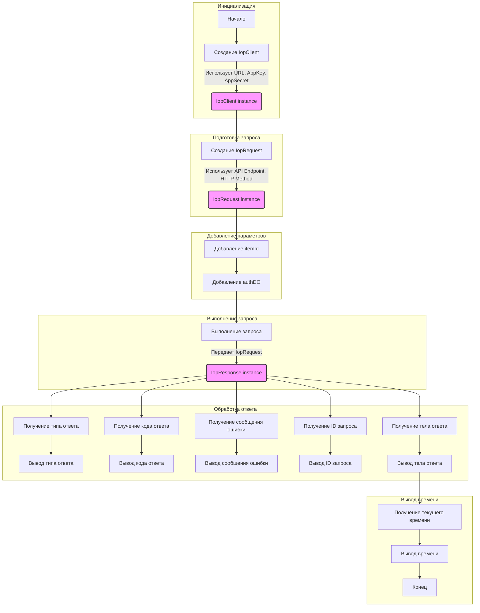

## ИНСТРУКЦИЯ:

Анализируй предоставленный код подробно и объясни его функциональность. Ответ должен включать три раздела:  

1. **<алгоритм>**: Опиши рабочий процесс в виде пошаговой блок-схемы, включая примеры для каждого логического блока, и проиллюстрируй поток данных между функциями, классами или методами.  
2. **<mermaid>**: Напиши код для диаграммы в формате `mermaid`, проанализируй и объясни все зависимости, 
    которые импортируются при создании диаграммы. 
    **ВАЖНО!** Убедитесь, что все имена переменных, используемые в диаграмме `mermaid`, 
    имеют осмысленные и описательные имена. Имена переменных вроде `A`, `B`, `C`, и т.д., не допускаются!  
    
    **Дополнительно**: Если в коде есть импорт `import header`, добавьте блок `mermaid` flowchart, объясняющий `header.py`:\
    ```mermaid
    flowchart TD
        Start --> Header[<code>header.py</code><br> Determine Project Root]
    
        Header --> import[Import Global Settings: <br><code>from src import gs</code>] 
    ```

3. **<объяснение>**: Предоставьте подробные объяснения:  
   - **Импорты**: Их назначение и взаимосвязь с другими пакетами `src.`.  
   - **Классы**: Их роль, атрибуты, методы и взаимодействие с другими компонентами проекта.  
   - **Функции**: Их аргументы, возвращаемые значения, назначение и примеры.  
   - **Переменные**: Их типы и использование.  
   - Выделите потенциальные ошибки или области для улучшения.  

Дополнительно, постройте цепочку взаимосвязей с другими частями проекта (если применимо).  

Это обеспечивает всесторонний и структурированный анализ кода.
## Формат ответа: `.md` (markdown)
**КОНЕЦ ИНСТРУКЦИИ**
```
## <алгоритм>

1.  **Инициализация клиента IopClient:**
    *   Создается экземпляр класса `IopClient` с указанием URL шлюза (`https://api-pre.taobao.tw/rest`), ключа приложения (`100240`) и секрета приложения (`hLeciS15d7UsmXKoND76sBVPpkzepxex`).
    *   Пример: `client = iop.IopClient('https://api-pre.taobao.tw/rest', '100240', 'hLeciS15d7UsmXKoND76sBVPpkzepxex')`
2.  **Создание запроса IopRequest:**
    *   Создается экземпляр класса `IopRequest` с указанием пути API (`/product/item/get`) и метода запроса (`GET`).
    *   Пример: `request = iop.IopRequest('/product/item/get', 'GET')`
3.  **Добавление параметров API:**
    *   Добавляются параметры запроса с помощью метода `add_api_param`.
    *   `itemId`: идентификатор товара (пример: `157432005`).
    *   `authDO`: JSON-строка с информацией об авторизации продавца (пример: `{"sellerId":2000000016002}`).
    *   Пример: 
        ```python
        request.add_api_param('itemId','157432005')
        request.add_api_param('authDO', '{"sellerId":2000000016002}')
        ```
4.  **Выполнение запроса:**
    *   Запрос выполняется с помощью метода `execute` клиента `IopClient`, передавая созданный объект `IopRequest`.
    *   Пример: `response = client.execute(request)`
5.  **Обработка ответа:**
    *   Выводится тип ответа (`response.type`), код ответа (`response.code`), сообщение об ошибке (`response.message`), уникальный идентификатор запроса (`response.request_id`), и тело ответа (`response.body`).
    *   Тип ответа может быть `nil` (нет ошибки), `ISP` (ошибка провайдера API), `ISV` (ошибка клиента API), `SYSTEM` (ошибка платформы Iop).
    *   Код ответа `0` означает отсутствие ошибки.
6.  **Вывод текущего времени:**
    *   Выводится текущее время в миллисекундах.
    *   Пример: `print(str(round(time.time())) + '000')`

## <mermaid>



**Объяснение диаграммы `mermaid`:**

*   **Инициализация:**
    *   `Start`: Начало программы.
    *   `CreateIopClient`: Создается экземпляр класса `IopClient`.
    *   `IopClientInstance`: Представляет созданный экземпляр `IopClient`.
*   **Подготовка запроса:**
    *   `CreateIopRequest`: Создается экземпляр класса `IopRequest`.
    *   `IopRequestInstance`: Представляет созданный экземпляр `IopRequest`.
*   **Добавление параметров:**
    *   `AddItemIdParam`: Добавляется параметр `itemId` к запросу.
    *   `AddAuthDOParam`: Добавляется параметр `authDO` к запросу.
*   **Выполнение запроса:**
    *   `ExecuteRequest`: Выполняется API запрос с помощью `IopClient`.
    *    `IopResponse`: Представляет полученный от API ответ в виде экземпляра `IopResponse`.
*   **Обработка ответа:**
    *   `GetResponseType`: Извлекается тип ответа.
    *   `PrintResponseType`: Выводится тип ответа.
    *   `GetResponseCode`: Извлекается код ответа.
    *   `PrintResponseCode`: Выводится код ответа.
    *   `GetResponseMessage`: Извлекается сообщение об ошибке.
    *   `PrintResponseMessage`: Выводится сообщение об ошибке.
    *   `GetRequestId`: Извлекается идентификатор запроса.
    *   `PrintRequestId`: Выводится идентификатор запроса.
    *   `GetResponseBody`: Извлекается тело ответа.
    *   `PrintResponseBody`: Выводится тело ответа.
*  **Вывод времени:**
   *   `PrintResponseBody`: Переход к блоку вывода времени после обработки ответа.
   *   `GetCurrentTime`: Получение текущего времени.
   *   `PrintTime`: Вывод текущего времени.
   *   `End`: Конец программы.
    
**Зависимости:**

*   Импортируется модуль `iop`, который предоставляет классы `IopClient` и `IopRequest` для взаимодействия с API.
*   Импортируется модуль `time` для получения текущего времени.

## <объяснение>

**Импорты:**

*   `import iop`: Импортирует модуль `iop`, который, вероятно, является пользовательской библиотекой, предоставляющей функциональность для работы с API. Этот модуль предоставляет классы `IopClient` и `IopRequest`, а также другие вспомогательные функции для создания и выполнения запросов к API.
*   `import time`: Импортирует стандартный модуль `time` для работы со временем, в данном случае для получения текущего времени в секундах с начала эпохи и вывода его в миллисекундах.

**Классы:**

*   `IopClient`: Класс, который управляет подключением к API, создавая сессию и выполняя запросы. При инициализации принимает URL шлюза, ключ и секрет приложения. Метод `execute` выполняет запрос, используя объект `IopRequest`.
    *   **Атрибуты:** URL шлюза, ключ приложения, секрет приложения.
    *   **Методы:** `execute(request)`, принимает объект `IopRequest` и возвращает объект `IopResponse`.
*   `IopRequest`: Класс, представляющий API запрос. Он хранит путь API, HTTP метод и параметры запроса.
    *   **Атрибуты:** Путь API, HTTP метод.
    *   **Методы:** `add_api_param(key, value)`, добавляет параметр к запросу.

**Функции:**

*   `iop.IopClient(gateway_url, app_key, app_secret)`: Конструктор класса `IopClient`, инициализирует клиента с URL шлюза, ключом и секретом приложения.
    *   **Аргументы:**
        *   `gateway_url` (строка): URL API шлюза.
        *   `app_key` (строка): Ключ приложения.
        *   `app_secret` (строка): Секрет приложения.
    *   **Возвращаемое значение:** Экземпляр класса `IopClient`.
*   `iop.IopRequest(api_path, http_method)`: Конструктор класса `IopRequest`, инициализирует запрос с путем API и HTTP методом.
    *   **Аргументы:**
        *   `api_path` (строка): Путь API.
        *   `http_method` (строка): HTTP метод (`GET`, `POST` и т. д.).
    *   **Возвращаемое значение:** Экземпляр класса `IopRequest`.
*   `iopRequest.add_api_param(key, value)`: Добавляет параметр к запросу.
    *   **Аргументы:**
        *   `key` (строка): Ключ параметра.
        *   `value` (строка): Значение параметра.
    *   **Возвращаемое значение:** `None`.
*   `iopClient.execute(request)`: Выполняет API запрос.
    *   **Аргументы:**
        *   `request` (IopRequest): Объект запроса.
    *   **Возвращаемое значение:** Объект `IopResponse`.
*    `time.time()`: Возвращает текущее время в секундах с начала эпохи.
    *   **Аргументы:** нет
    *   **Возвращаемое значение:** (float) текущее время.
*   `round(time.time())`: Округляет текущее время до целого числа.
    *   **Аргументы:** time.time() (float)
    *   **Возвращаемое значение:** (int) округленное текущее время.
* `str(round(time.time()))`: Преобразует округленное текущее время в строку.
    *   **Аргументы:** round(time.time()) (int)
    *   **Возвращаемое значение:** (str) строка с округленным временем.

**Переменные:**

*   `client`: Экземпляр класса `IopClient`, используемый для выполнения API запросов.
*   `request`: Экземпляр класса `IopRequest`, представляющий API запрос.
*   `response`: Объект, возвращаемый методом `client.execute`, содержащий результат запроса.

**Примеры:**

*   `client = iop.IopClient('https://api-pre.taobao.tw/rest', '100240', 'hLeciS15d7UsmXKoND76sBVPpkzepxex')`: Создает клиента для взаимодействия с API.
*   `request = iop.IopRequest('/product/item/get', 'GET')`: Создает объект запроса с путем API и методом `GET`.
*   `request.add_api_param('itemId','157432005')`: Добавляет параметр `itemId` к запросу.
*   `response = client.execute(request)`: Выполняет запрос и получает ответ.
*   `print(response.type)`, `print(response.code)`, `print(response.message)`, `print(response.request_id)`, `print(response.body)`: Выводят различные части ответа API.

**Возможные ошибки и улучшения:**

*   **Обработка ошибок:** Код не содержит обработки ошибок. Необходимо добавить try-except блоки для перехвата возможных исключений при выполнении запроса.
*   **Логирование:** Можно добавить логирование для записи процесса выполнения запросов и ответов, что облегчит отладку.
*   **Конфигурация:** Параметры API, такие как URL шлюза, ключ и секрет приложения, можно вынести в конфигурационный файл.
*   **Обработка ответа:**  Ответ от API может содержать различные данные в зависимости от конкретного запроса. Необходима более детальная обработка тела ответа (response.body), возможно, парсинг JSON или XML для извлечения необходимых данных.

**Взаимосвязь с другими частями проекта:**

Этот код является частью модуля `src.suppliers.aliexpress.api`, что указывает на его использование для взаимодействия с API AliExpress. Он использует пользовательский модуль `iop`, который вероятно находится где-то в том же проекте `src`.