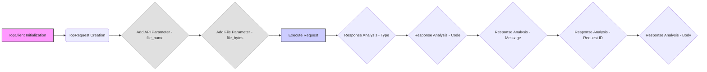

## Анализ кода `test_upload.py`

### <алгоритм>
1. **Инициализация клиента IopClient:**
   - Создается экземпляр класса `IopClient`, который отвечает за взаимодействие с API.
   - Принимает три параметра: URL API (`https://api.taobao.tw/rest`), ключ приложения (`${appKey}`), секрет приложения (`${appSecret}`).
   - *Пример*: `client = iop.IopClient('https://api.taobao.tw/rest', '${appKey}', '${appSecret}')`

2. **Создание запроса IopRequest:**
   - Создается объект `IopRequest` с указанием API-метода, к которому будет обращение (`/xiaoxuan/mockfileupload`).
   - *Пример*: `request = iop.IopRequest('/xiaoxuan/mockfileupload')`

3. **Добавление параметров запроса:**
    - **Добавление простых параметров:** Вызывается метод `add_api_param` для добавления параметра `file_name` со значением `pom.xml`. Эти параметры передаются как часть URL или тела запроса.
      - *Пример*: `request.add_api_param('file_name','pom.xml')`
    - **Добавление файла:** Вызывается метод `add_file_param` для добавления файла. Параметр `file_bytes` получает содержимое файла, прочитанного из `'/Users/xt/Documents/work/tasp/tasp/pom.xml'`. Файлы отправляются в теле запроса в виде multipart/form-data.
      - *Пример*: `request.add_file_param('file_bytes',open('/Users/xt/Documents/work/tasp/tasp/pom.xml').read())`

4. **Выполнение запроса:**
   - Метод `execute` объекта `IopClient` отправляет сформированный запрос к API.
   - Возвращается объект `response`, содержащий ответ от API.
   - *Пример*: `response = client.execute(request)`

5. **Анализ ответа:**
   - Выводятся различные поля ответа:
     - `response.type`: Тип ответа (nil, ISP, ISV, SYSTEM).
     - `response.code`: Код ответа (0 - нет ошибок).
     - `response.message`: Сообщение об ошибке.
     - `response.request_id`: Уникальный идентификатор запроса.
     - `response.body`: Полный текст ответа.
   - *Примеры*:
     - `print(response.type)`
     - `print(response.code)`
     - `print(response.message)`
     - `print(response.request_id)`
     - `print(response.body)`

### <mermaid>

**Зависимости:**

- **IopClient Initialization:** Создается экземпляр класса `IopClient`, предположительно из модуля `iop`, для управления API запросами. Этот класс ответственен за отправку запросов и обработку ответов.
- **IopRequest Creation:** Создается экземпляр класса `IopRequest` для представления конкретного запроса к API. Он содержит информацию о точке доступа API и параметры запроса.
- **Add API Parameter - file_name:** Метод `add_api_param` добавляет строковый параметр к запросу, который будет отправлен в URL или теле запроса.
- **Add File Parameter - file_bytes:** Метод `add_file_param` добавляет параметр файла к запросу, читая содержимое файла из файловой системы. Этот метод подготавливает данные для отправки как `multipart/form-data`.
- **Execute Request:** Метод `execute` объекта `IopClient` отправляет запрос к API и получает ответ.
- **Response Analysis - Type, Code, Message, Request ID, Body:** Различные части ответа анализируются и выводятся на консоль.

### <объяснение>

- **Импорты:**
  - `iop`: Предположительно, это модуль, который предоставляет классы `IopClient` и `IopRequest`, а также другие необходимые инструменты для взаимодействия с API. Этот модуль является частью проекта `hypotez/src/suppliers/aliexpress/api`.
   -  **Взаимосвязь с `src`**: Этот модуль является частью `src.suppliers.aliexpress.api`, что указывает на его роль в рамках взаимодействия с API Aliexpress.

- **Классы:**
  - `IopClient`:
    - **Роль**: Класс, отвечающий за отправку запросов к API и обработку ответов.
    - **Атрибуты**: Предположительно имеет атрибуты для хранения URL API, ключа приложения и секрета приложения.
    - **Методы**: Метод `execute` для отправки запроса и получения ответа.
    - **Взаимодействие**: Взаимодействует с классом `IopRequest`, который передается в метод `execute`.
  - `IopRequest`:
    - **Роль**: Класс, представляющий запрос к API.
    - **Атрибуты**: Предположительно имеет атрибуты для хранения URL API-метода, а также параметров запроса.
    - **Методы**: `add_api_param` для добавления простых параметров, `add_file_param` для добавления файлов.
    - **Взаимодействие**: Используется `IopClient` для отправки запроса к API.

- **Функции:**
  - В предоставленном коде нет явно определенных функций, но используется метод `execute` класса `IopClient`.
    -  **Аргументы**: принимает объект `IopRequest` и, возможно, токен доступа (access_token).
    - **Возвращаемое значение**: возвращает объект `response`, который содержит данные ответа от API.
  - Методы `add_api_param` и `add_file_param` класса `IopRequest`.
      - **Аргументы**: принимают имя параметра и его значение.
      - **Возвращаемые значения**: возвращают обновлённый объект `IopRequest`

- **Переменные:**
  - `client`: Экземпляр класса `IopClient`.
  - `request`: Экземпляр класса `IopRequest`.
  - `response`: Объект, представляющий ответ от API.
  - `file_name`: Строковая переменная, содержащая имя файла.
  - `file_bytes`: Переменная, содержащая содержимое файла в виде байтов.
  - `open(...)`: Функция открытия файла.
- **Потенциальные ошибки и области для улучшения:**
  - **Обработка ошибок:** Код не обрабатывает возможные исключения при чтении файла или при выполнении запроса.
  - **Жестко закодированные пути:** Путь к файлу (`/Users/xt/Documents/work/tasp/tasp/pom.xml`) закодирован жестко, что не подходит для общего использования.
  - **Управление ключами API:** Ключи API (`${appKey}`, `${appSecret}`) также закодированы, что не является хорошей практикой. Их следует хранить отдельно и безопасно.
  - **Модульность**: Код может быть улучшен путем добавления функций или классов для обработки конкретных шагов, таких как чтение файла, отправка запроса и анализ ответа, для увеличения читаемости и удобства повторного использования.

- **Цепочка взаимосвязей с другими частями проекта:**
  - Этот код является примером использования API для загрузки файла на сервер. Он использует класс `IopClient`, который, вероятно, является общим компонентом для всех API-запросов Aliexpress. Следовательно, этот код взаимодействует с более общим уровнем абстракции для работы с API. Также, можно предположить что `IopClient` зависит от `src.utils.http_client`, или похожей библиотеки для выполнения HTTP запросов.