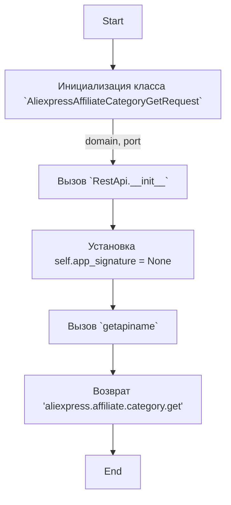
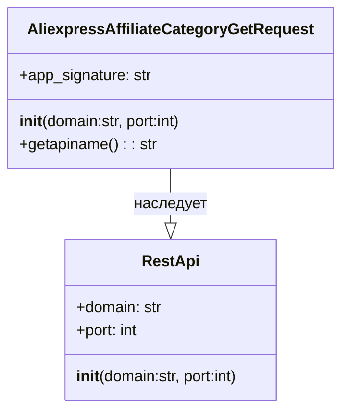

## АНАЛИЗ КОДА: `hypotez/src/suppliers/aliexpress/api/_examples/rest/AliexpressAffiliateCategoryGetRequest.py`

### 1. <алгоритм>

1.  **Инициализация класса `AliexpressAffiliateCategoryGetRequest`**:
    *   При создании объекта класса `AliexpressAffiliateCategoryGetRequest` вызывается конструктор `__init__`.
    *   Конструктор принимает два необязательных аргумента: `domain` (по умолчанию "api-sg.aliexpress.com") и `port` (по умолчанию 80).
    *   Он вызывает конструктор родительского класса `RestApi` с переданными `domain` и `port`.
    *   Инициализируется атрибут `app_signature` значением `None`.
    *   _Пример_: `request = AliexpressAffiliateCategoryGetRequest()` создаст объект с `domain="api-sg.aliexpress.com"` и `port=80`.

2.  **Получение имени API**:
    *   Метод `getapiname` вызывается для получения имени API.
    *   Он возвращает строку 'aliexpress.affiliate.category.get'.
    *   _Пример_: `api_name = request.getapiname()` присвоит переменной `api_name` значение 'aliexpress.affiliate.category.get'.

**Схема потока данных:**

### 2. <mermaid>

**Объяснение зависимостей `mermaid`:**

*   `classDiagram` -  определяет тип диаграммы - диаграмма классов.
*   `class RestApi` -  определяет класс `RestApi` со свойствами `domain` (строка) и `port` (целое число), а также методом `__init__`.
*   `class AliexpressAffiliateCategoryGetRequest` - определяет класс `AliexpressAffiliateCategoryGetRequest` со свойством `app_signature` (строка) и методами `__init__` и `getapiname`.
*   `AliexpressAffiliateCategoryGetRequest --|> RestApi : наследует` - указывает, что класс `AliexpressAffiliateCategoryGetRequest` наследует от класса `RestApi`.

### 3. <объяснение>

**Импорты:**

*   `from ..base import RestApi`: Импортирует класс `RestApi` из модуля `base`, который находится на уровень выше в иерархии пакетов (`..`).  Этот класс, вероятно, содержит базовую функциональность для взаимодействия с REST API. `RestApi` является базовым классом для `AliexpressAffiliateCategoryGetRequest`.  Это означает, что  `AliexpressAffiliateCategoryGetRequest` наследует общую функциональность работы с API от `RestApi`.

**Классы:**

*   `AliexpressAffiliateCategoryGetRequest(RestApi)`:
    *   **Роль:** Этот класс предназначен для создания запроса на получение категорий товаров через API AliExpress. Он является специфическим запросом,  который наследует общую логику для REST API из `RestApi`.
    *   **Атрибуты:**
        *   `app_signature`:  Имеет значение `None` при инициализации. Вероятно, предназначена для хранения подписи приложения, необходимой для API.
    *   **Методы:**
        *   `__init__(self, domain="api-sg.aliexpress.com", port=80)`: Конструктор класса. Принимает домен API и порт (по умолчанию "api-sg.aliexpress.com" и 80) и вызывает конструктор родительского класса `RestApi` для инициализации этих параметров. Также устанавливает `app_signature` в `None`.
        *   `getapiname(self)`: Возвращает строку 'aliexpress.affiliate.category.get', которая, вероятно, является именем API-метода, который должен быть вызван для получения категорий.

**Функции:**

*   `__init__`:  Инициализирует объект класса, устанавливая домен, порт и `app_signature`.
*    `getapiname`:  Возвращает имя API метода, который будет использоваться.

**Переменные:**

*   `domain`: Строка, представляющая доменное имя API.
*   `port`: Целое число, представляющее порт для соединения с API.
*    `app_signature`:  Строка или `None`. Предназначена для хранения подписи приложения, необходимой для API.
*   `self`:  Ссылка на экземпляр класса.

**Взаимосвязь с другими частями проекта:**

*   Этот файл является частью модуля для работы с API AliExpress, который находится в `src/suppliers/aliexpress/api`.
*   Он использует класс `RestApi` из `src/suppliers/aliexpress/api/base.py`, предоставляя базовую функциональность для API-запросов.
*   Этот класс, вероятно, будет использоваться в других частях проекта, например, для получения и обработки категорий товаров.
*   Этот файл является примером конкретного запроса к API Aliexpress, и скорее всего будет использоваться вместе с другими запросами.

**Потенциальные ошибки и области для улучшения:**

*   `app_signature` не инициализируется правильным значением. Возможно, его следует получать из конфигурации или вычислять на основе других параметров.
*   Код не обрабатывает ошибки API, это может быть улучшено путем добавления try/except блоков в методах, которые будут делать вызовы API.

**Дополнение про `header.py`**:

В предоставленном коде отсутствует `import header`, поэтому нет необходимости добавлять `mermaid` для `header.py`.