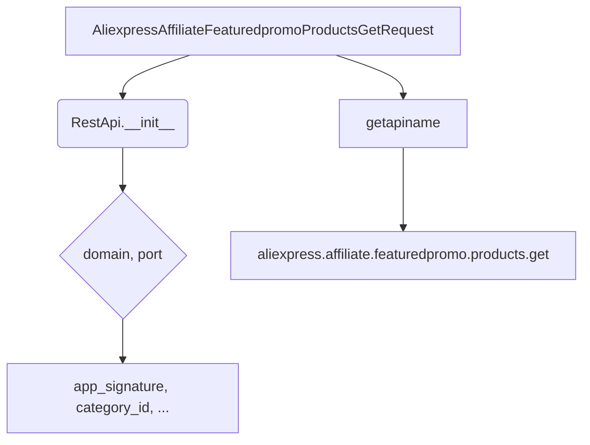

# <input code>

```python
## \file hypotez/src/suppliers/aliexpress/api/_examples/rest/AliexpressAffiliateFeaturedpromoProductsGetRequest.py
# -*- coding: utf-8 -*-
#! venv/Scripts/python.exe # <- venv win
## ~~~~~~~~~~~~~
""" module: src.suppliers.aliexpress.api._examples.rest """

'''
Created by auto_sdk on 2021.05.17
'''
from ..base import RestApi
class AliexpressAffiliateFeaturedpromoProductsGetRequest(RestApi):
	def __init__(self, domain="api-sg.aliexpress.com", port=80):
		RestApi.__init__(self,domain, port)
		self.app_signature = None
		self.category_id = None
		self.country = None
		self.fields = None
		self.page_no = None
		self.page_size = None
		self.promotion_end_time = None
		self.promotion_name = None
		self.promotion_start_time = None
		self.sort = None
		self.target_currency = None
		self.target_language = None
		self.tracking_id = None

	def getapiname(self):
		return 'aliexpress.affiliate.featuredpromo.products.get'
```

# <algorithm>

**Шаг 1:** Инициализация класса `AliexpressAffiliateFeaturedpromoProductsGetRequest`.
* Передаются значения `domain` и `port` (по умолчанию).
* Вызывается конструктор базового класса `RestApi`.
* Инициализируются атрибуты класса со значениями по умолчанию (None).  Это параметры запроса к API AliExpress.

**Шаг 2:** Получение имени API.
* Вызывается метод `getapiname()`, возвращающий строку 'aliexpress.affiliate.featuredpromo.products.get'. Это имя API-метода для получения данных.


**Пример:**

```python
request = AliexpressAffiliateFeaturedpromoProductsGetRequest(domain="api-us.aliexpress.com")
print(request.getapiname())  # Выведет: aliexpress.affiliate.featuredpromo.products.get
```

Данные передаются между классами, используя наследование от `RestApi`.  Атрибуты запроса заполняются  в объекте `AliexpressAffiliateFeaturedpromoProductsGetRequest`.


# <mermaid>



# <explanation>

**Импорты:**

* `from ..base import RestApi`: Импортирует класс `RestApi` из родительского модуля (предполагается, что `base` находится в `src.suppliers.aliexpress.api`).  Это указывает на иерархию модулей и реализацию базового функционала для работы с API.

**Классы:**

* `AliexpressAffiliateFeaturedpromoProductsGetRequest`: Этот класс предназначен для создания запросов к API AliExpress для получения данных о специальных промо-продуктах. Он наследуется от класса `RestApi`, предполагая наличие базовой функциональности для обработки запросов (например, настройки параметров, формирование URL, отправка запроса и т.д.).  
* `RestApi`:  Базовый класс, о котором ничего не известно из приведённого кода, но предполагается, что он отвечает за общую логику запросов к API и управлением сетевыми подключениями.

**Функции:**

* `__init__(self, domain="api-sg.aliexpress.com", port=80)`: Конструктор класса. Инициализирует атрибуты объекта, принимая необязательные параметры `domain` и `port`, которые по умолчанию установлены для API AliExpress. Внутри конструктора, вызов `RestApi.__init__` говорит о том, что выполняется инициализация и настройка базового класса для работы с API.
* `getapiname(self)`: Возвращает имя API-метода. Эта функция используется для определения имени API, с которым нужно взаимодействовать.

**Переменные:**

* Атрибуты класса (например, `app_signature`, `category_id`): Хранят параметры запроса к API.  Типы этих данных не определены, предполагается, что они будут определены в других частях кода, которые взаимодействуют с этим классом. Значения по умолчанию (None) являются стандартным способом обозначения отсутствующих или не определённых значений.


**Возможные ошибки и улучшения:**

* Отсутствие обработки исключений: При выполнении запроса к API могут возникнуть ошибки (например, проблемы с сетевым соединением, неправильные данные запроса). Необходимо добавить обработку исключений для повышения надёжности кода.
* Недостаточно информации о классе `RestApi`: Нет информации о том, что делает `RestApi`. Необходимо определить реализацию класса `RestApi`, чтобы понять, как происходит выполнение запросов и их обработка.
* Отсутствие документации: Необходимо добавить документацию для функций и классов.
* Отсутствие валидации данных: Необходимо добавить проверку данных, которые передаются в конструктор и методы для предотвращения ошибок и некорректных значений.


**Цепочка взаимосвязей:**

Этот класс взаимодействует с классом `RestApi` и, вероятно, с другими частями проекта, которые используют API AliExpress.  В коде отсутствуют прямые указания на эти взаимодействия. Полная картина взаимосвязей будет понятна только при анализе других частей проекта, включая `RestApi` и компоненты, которые используют этот класс для взаимодействия с API.