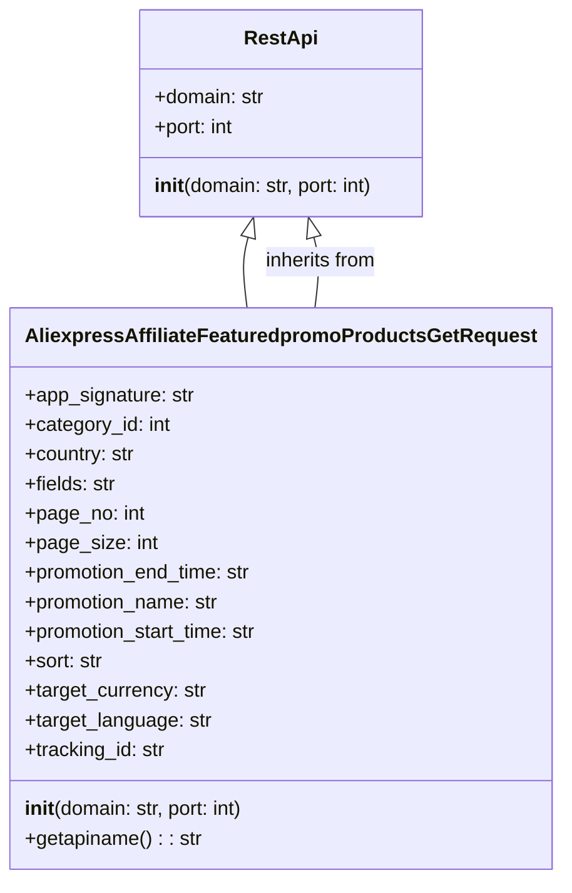

## <алгоритм>

1. **Инициализация объекта `AliexpressAffiliateFeaturedpromoProductsGetRequest`**:
   - Создается экземпляр класса `AliexpressAffiliateFeaturedpromoProductsGetRequest`.
   - При инициализации вызывается конструктор базового класса `RestApi`, передавая домен и порт (по умолчанию `api-sg.aliexpress.com` и 80).
   - Инициализируются атрибуты экземпляра, такие как `app_signature`, `category_id`, `country` и другие, устанавливая их в `None`.

   **Пример**:
   ```python
   request = AliexpressAffiliateFeaturedpromoProductsGetRequest()
   # request.domain == "api-sg.aliexpress.com"
   # request.port == 80
   # request.app_signature == None
   ```

2. **Вызов метода `getapiname()`**:
   - Метод `getapiname()` вызывается у экземпляра `AliexpressAffiliateFeaturedpromoProductsGetRequest`.
   - Метод возвращает строку `'aliexpress.affiliate.featuredpromo.products.get'`, представляющую имя API-запроса.

   **Пример**:
   ```python
   api_name = request.getapiname()
   # api_name == 'aliexpress.affiliate.featuredpromo.products.get'
   ```

## <mermaid>



**Объяснение `mermaid`:**

- **`class RestApi`**: Определяет базовый класс для API-запросов.
  - `domain`: Строка, представляющая домен API.
  - `port`: Целое число, представляющее порт API.
  - `__init__(domain: str, port: int)`: Конструктор класса, принимающий домен и порт.
- **`class AliexpressAffiliateFeaturedpromoProductsGetRequest`**: Определяет класс для конкретного API-запроса, который наследуется от `RestApi`.
  -  `app_signature`: Строка, представляющая подпись приложения.
  - `category_id`: Целое число, представляющее ID категории.
  - `country`: Строка, представляющая страну.
  - `fields`: Строка, представляющая поля.
  - `page_no`: Целое число, представляющее номер страницы.
  - `page_size`: Целое число, представляющее размер страницы.
  - `promotion_end_time`: Строка, представляющая время окончания акции.
  - `promotion_name`: Строка, представляющая название акции.
  - `promotion_start_time`: Строка, представляющая время начала акции.
  - `sort`: Строка, представляющая порядок сортировки.
  - `target_currency`: Строка, представляющая целевую валюту.
  - `target_language`: Строка, представляющая целевой язык.
  - `tracking_id`: Строка, представляющая ID отслеживания.
  - `__init__(domain: str, port: int)`: Конструктор класса, вызывающий конструктор родительского класса.
  - `getapiname(): str`: Метод, возвращающий имя API-запроса.
- **`RestApi <|-- AliexpressAffiliateFeaturedpromoProductsGetRequest`**: Обозначает, что класс `AliexpressAffiliateFeaturedpromoProductsGetRequest` наследуется от класса `RestApi`.
- **`AliexpressAffiliateFeaturedpromoProductsGetRequest --|> RestApi : inherits from`**: Альтернативное обозначение наследования.

## <объяснение>

**Импорты:**

- `from ..base import RestApi`:
  - Импортирует класс `RestApi` из модуля `base`, находящегося на уровень выше в иерархии пакетов.
  - Класс `RestApi`, вероятно, предоставляет базовую функциональность для работы с REST API, такую как установка домена, порта, и возможно другие общие методы для отправки запросов.
  - Таким образом, `AliexpressAffiliateFeaturedpromoProductsGetRequest` наследует функциональность `RestApi` и расширяет её специфичными для конкретного API-запроса методами и атрибутами.

**Классы:**

- **`AliexpressAffiliateFeaturedpromoProductsGetRequest(RestApi)`**:
    - Это класс для формирования запроса к API Aliexpress для получения популярных товаров по акции.
    - **Атрибуты**:
        - `app_signature`: Подпись приложения, необходимая для авторизации. Тип: `str` или `None`.
        - `category_id`: Идентификатор категории товаров. Тип: `int` или `None`.
        - `country`: Код страны, для которой нужны товары. Тип: `str` или `None`.
        - `fields`: Список полей, которые нужно вернуть в ответе. Тип: `str` или `None`.
        - `page_no`: Номер страницы результатов. Тип: `int` или `None`.
        - `page_size`: Количество элементов на странице. Тип: `int` или `None`.
        - `promotion_end_time`: Дата и время окончания акции. Тип: `str` или `None`.
        - `promotion_name`: Название акции. Тип: `str` или `None`.
        - `promotion_start_time`: Дата и время начала акции. Тип: `str` или `None`.
        - `sort`: Параметр сортировки результатов. Тип: `str` или `None`.
        - `target_currency`: Целевая валюта. Тип: `str` или `None`.
        - `target_language`: Целевой язык. Тип: `str` или `None`.
        - `tracking_id`: ID отслеживания. Тип: `str` или `None`.
    - **Методы**:
        - `__init__(self, domain="api-sg.aliexpress.com", port=80)`: Конструктор класса. Вызывает конструктор базового класса `RestApi` и инициализирует атрибуты запроса в `None`.
        - `getapiname(self)`: Возвращает имя API-запроса, а именно `'aliexpress.affiliate.featuredpromo.products.get'`.

**Функции:**

- `__init__(self, domain="api-sg.aliexpress.com", port=80)`: Конструктор класса.
  - **Аргументы**:
      - `domain`: Домен API (по умолчанию `api-sg.aliexpress.com`).
      - `port`: Порт API (по умолчанию 80).
  - **Назначение**: Инициализирует объект класса `AliexpressAffiliateFeaturedpromoProductsGetRequest`, вызывая конструктор базового класса `RestApi` и инициализируя атрибуты запроса.
  - **Возвращаемое значение**: None
- `getapiname(self)`:
  - **Аргументы**: `self` - ссылка на текущий экземпляр класса.
  - **Назначение**: Возвращает строку, представляющую имя API-запроса.
  - **Возвращаемое значение**: Строка `'aliexpress.affiliate.featuredpromo.products.get'`.

**Переменные:**

- Все атрибуты класса (`app_signature`, `category_id`, `country` и т.д.) являются переменными экземпляра и могут хранить значения, специфичные для каждого экземпляра класса. Их начальное значение `None`, подразумевая, что значения будут заданы позже при использовании объекта.

**Потенциальные ошибки или области для улучшения:**

- В текущем коде не предусмотрена валидация входных данных, например, проверка типов или допустимых значений для параметров запроса. Это может привести к ошибкам при отправке запроса на API.
- Нет методов для установки значений атрибутов, что делает использование класса не удобным.
- Не предусмотрена обработка исключений при вызове API.
- Отсутствует реализация самой отправки запроса. Только формирование.

**Цепочка взаимосвязей с другими частями проекта:**

- Этот класс зависит от базового класса `RestApi`, который, вероятно, используется для общих операций API, таких как отправка запросов и обработка ответов.
- Этот класс будет использоваться в других частях проекта, где необходимо получить популярные товары по акции через API Aliexpress.

**Дополнительно**:

- Для полноценного использования этого класса потребуется реализовать методы для установки значений атрибутов, а также метод для фактической отправки API-запроса.
- Валидация данных перед отправкой запроса важна для предотвращения ошибок и обеспечения корректной работы программы.