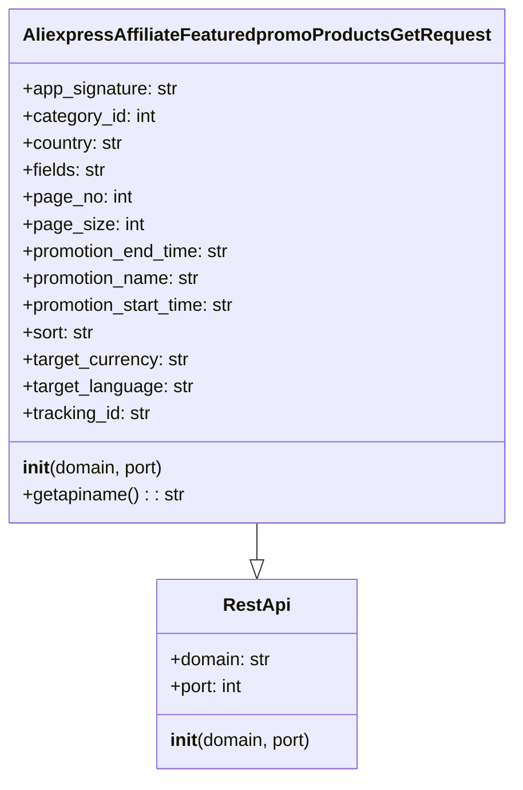

## Анализ кода `AliexpressAffiliateFeaturedpromoProductsGetRequest.py`

### <алгоритм>

1. **Инициализация объекта `AliexpressAffiliateFeaturedpromoProductsGetRequest`**:
   - При создании экземпляра класса вызывается конструктор `__init__`.
   - Вызывается конструктор базового класса `RestApi` для установки `domain` (по умолчанию "api-sg.aliexpress.com") и `port` (по умолчанию 80).
   - Устанавливаются атрибуты экземпляра в `None`, такие как `app_signature`, `category_id`, `country`, `fields`, `page_no`, `page_size`, `promotion_end_time`, `promotion_name`, `promotion_start_time`, `sort`, `target_currency`, `target_language` и `tracking_id`.

   *Пример:*
   ```python
   request = AliexpressAffiliateFeaturedpromoProductsGetRequest(domain="api.aliexpress.com", port=443) 
   # request.domain = "api.aliexpress.com"
   # request.port = 443
   # request.app_signature = None
   # ... все остальные атрибуты также None
   ```

2. **Определение имени API `getapiname`**:
   - Метод `getapiname` возвращает строку `'aliexpress.affiliate.featuredpromo.products.get'`, которая представляет собой имя API запроса.

   *Пример:*
   ```python
    api_name = request.getapiname()
    # api_name == 'aliexpress.affiliate.featuredpromo.products.get'
   ```
   
3. **Использование объекта для API запроса**
   - Объект `AliexpressAffiliateFeaturedpromoProductsGetRequest` используется для отправки запроса к API Aliexpress с помощью библиотеки `RestApi`
   - Параметры запроса задаются через атрибуты объекта.
   - Библиотека `RestApi` обрабатывает создание запроса и получение ответа на основе этих параметров

   *Пример:*
     ```python
     request = AliexpressAffiliateFeaturedpromoProductsGetRequest()
     request.category_id = 100
     request.page_no = 1
     request.page_size = 20
     # ... другие параметры ...

     response = rest_api_client.execute(request) # rest_api_client - экземпляр класса RestApiClient
     # rest_api_client использует request для создания и отправки запроса API
    ```

### <mermaid>



**Объяснение `mermaid`:**

- `class RestApi`:  Описывает базовый класс `RestApi`. Он содержит атрибуты `domain` (домен API) и `port` (порт API), а также метод `__init__` для инициализации экземпляра.
- `class AliexpressAffiliateFeaturedpromoProductsGetRequest`:  Описывает класс `AliexpressAffiliateFeaturedpromoProductsGetRequest`, который наследуется от `RestApi`. Он включает атрибуты для параметров API запроса (такие как `category_id`, `page_no`, `fields`, и т. д.) и метод `getapiname()`, возвращающий имя API.
- `AliexpressAffiliateFeaturedpromoProductsGetRequest --|> RestApi`: Указывает на то, что `AliexpressAffiliateFeaturedpromoProductsGetRequest` наследует от `RestApi`, что означает, что `AliexpressAffiliateFeaturedpromoProductsGetRequest` является подклассом `RestApi` и наследует его свойства и методы.

### <объяснение>

**Импорты:**

- `from ..base import RestApi`: Импортирует класс `RestApi` из модуля `base`, находящегося на один уровень выше текущего. Класс `RestApi` вероятно, предоставляет базовую функциональность для взаимодействия с REST API, такую как отправка HTTP запросов и обработка ответов. Взаимосвязь -  `AliexpressAffiliateFeaturedpromoProductsGetRequest` наследует от `RestApi`, что позволяет ему использовать базовый функционал для отправки запросов API.

**Классы:**

- `AliexpressAffiliateFeaturedpromoProductsGetRequest`: Этот класс представляет собой запрос на получение избранных промо товаров от AliExpress API.
    - **Роль:** Представляет собой объект запроса, который будет использован для отправки запроса к API.
    - **Атрибуты:**
        - `domain` (str): Доменное имя API сервера (по умолчанию "api-sg.aliexpress.com").
        - `port` (int): Порт API сервера (по умолчанию 80).
        - `app_signature` (str): Подпись приложения для API.
        - `category_id` (int): ID категории товаров.
        - `country` (str): Код страны.
        - `fields` (str): Список полей для получения из API.
        - `page_no` (int): Номер страницы результатов.
        - `page_size` (int): Размер страницы результатов.
        - `promotion_end_time` (str): Время окончания акции.
        - `promotion_name` (str): Название акции.
        - `promotion_start_time` (str): Время начала акции.
        - `sort` (str): Критерий сортировки.
        - `target_currency` (str): Код целевой валюты.
        - `target_language` (str): Код целевого языка.
        - `tracking_id` (str): ID отслеживания.
    - **Методы:**
        - `__init__(self, domain="api-sg.aliexpress.com", port=80)`: Конструктор класса. Инициализирует атрибуты объекта, в том числе вызывает конструктор родительского класса `RestApi`.
        - `getapiname(self)`: Возвращает имя API метода.
    - **Взаимодействие:**
        - Наследует от `RestApi`, что позволяет использовать функциональность базового класса для отправки HTTP запросов.
        - Используется для задания параметров запроса к API.

**Функции:**

- `__init__(self, domain="api-sg.aliexpress.com", port=80)`:
    - **Аргументы:**
        - `self`: Ссылка на экземпляр класса.
        - `domain` (str, по умолчанию "api-sg.aliexpress.com"): Доменное имя API сервера.
        - `port` (int, по умолчанию 80): Порт API сервера.
    - **Возвращаемое значение:** None.
    - **Назначение:** Конструктор класса. Инициализирует атрибуты экземпляра, в том числе вызывает конструктор родительского класса `RestApi`.
    - **Пример:**
      ```python
      request = AliexpressAffiliateFeaturedpromoProductsGetRequest(domain="api.example.com", port=443)
      # создает объект запроса с указанным доменом и портом
      ```
- `getapiname(self)`:
    - **Аргументы:**
        - `self`: Ссылка на экземпляр класса.
    - **Возвращаемое значение:** Строка `'aliexpress.affiliate.featuredpromo.products.get'`.
    - **Назначение:** Возвращает имя API метода.
    - **Пример:**
      ```python
      request = AliexpressAffiliateFeaturedpromoProductsGetRequest()
      api_name = request.getapiname()
      # api_name == 'aliexpress.affiliate.featuredpromo.products.get'
      ```

**Переменные:**

- Все атрибуты класса `AliexpressAffiliateFeaturedpromoProductsGetRequest` являются переменными экземпляра (instance variables). Они используются для хранения параметров API запроса.
    - **Типы:**
        - `domain` (str):  домен API.
        - `port` (int): порт API.
        - `app_signature` (str): Подпись приложения.
        - `category_id` (int): ID категории.
        - `country` (str): Код страны.
        - `fields` (str): Список полей.
        - `page_no` (int): Номер страницы.
        - `page_size` (int): Размер страницы.
        - `promotion_end_time` (str): Время окончания акции.
        - `promotion_name` (str): Название акции.
        - `promotion_start_time` (str): Время начала акции.
        - `sort` (str): Критерий сортировки.
        - `target_currency` (str): Целевая валюта.
        - `target_language` (str): Целевой язык.
        - `tracking_id` (str): ID отслеживания.
    - **Использование:** Используются для передачи параметров в API запрос.

**Потенциальные ошибки и области для улучшения:**

1.  **Отсутствует валидация:** Нет никакой валидации входных параметров (например, проверка на допустимые значения `category_id`, `page_no`, `page_size` и т.д.). Это может привести к ошибкам при отправке запросов к API.
2.  **Строковые типы для времени:** Использование `str` для представления времени (`promotion_end_time`, `promotion_start_time`) не является оптимальным. Лучше использовать типы `datetime`.
3.  **Нет обработки ошибок:** Отсутствует код обработки ошибок, которые могут возникнуть при выполнении API запроса (например, ошибки соединения, ошибки авторизации и т.д.)
4.  **Недостаточно документации:** Документация по классам и функциям не полная и требует расширения для улучшения понимания кода.
5.  **Отсутствует механизм отправки запроса**:  Данный класс только создает параметры запроса, но не отвечает за отправку запроса и обработку ответа. Для этого, вероятнее всего используется `RestApi` и другие части проекта.

**Цепочка взаимосвязей с другими частями проекта:**

-   Класс `AliexpressAffiliateFeaturedpromoProductsGetRequest` зависит от класса `RestApi`, который, вероятно, является частью более общего пакета для работы с API.
-   Вероятно, существует класс или функция, которая использует объект `AliexpressAffiliateFeaturedpromoProductsGetRequest` для создания запроса к API, отправляет его и обрабатывает ответ. Этот класс или функция может находиться в другом модуле.
-   Этот класс используется в контексте системы, которая работает с AliExpress API, т.е. скорее всего является частью более крупного модуля, отвечающего за интеграцию с AliExpress.
-  В `_examples` предполагается наличие примеров использования API, поэтому в проекте должна присутствовать логика создания и использования `AliexpressAffiliateFeaturedpromoProductsGetRequest` для демонстрации функционала.

В заключение, данный код представляет собой класс для создания запроса к AliExpress API. Этот класс инкапсулирует параметры запроса и предоставляет метод для получения имени API. Он является частью системы для работы с API AliExpress. Код имеет потенциал для улучшения в части валидации, обработки ошибок и документации.