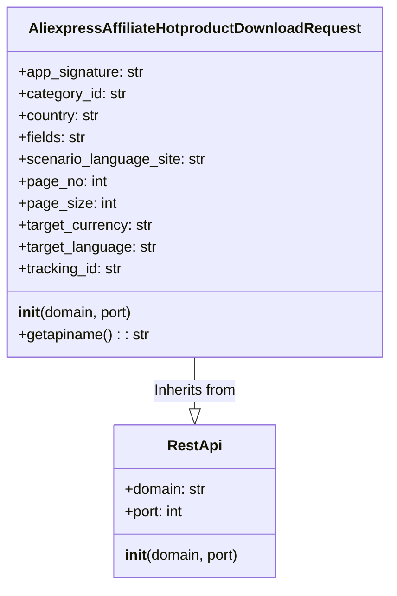

## Анализ кода `AliexpressAffiliateHotproductDownloadRequest.py`

### 1. <алгоритм>
**Блок-схема работы класса `AliexpressAffiliateHotproductDownloadRequest`:**

1. **Инициализация объекта `AliexpressAffiliateHotproductDownloadRequest`:**
   - Создается экземпляр класса `AliexpressAffiliateHotproductDownloadRequest`.
   - Вызывается конструктор родительского класса `RestApi` для установки домена (`domain`) и порта (`port`) для API.
   - Инициализируются атрибуты объекта: `app_signature`, `category_id`, `country`, `fields`, `scenario_language_site`, `page_no`, `page_size`, `target_currency`, `target_language`, `tracking_id` устанавливаются в `None`.
   - *Пример*: `request = AliexpressAffiliateHotproductDownloadRequest(domain="api-us.aliexpress.com", port=443)`

2. **Получение имени API:**
   - Вызывается метод `getapiname()`.
   - Метод возвращает строку `'aliexpress.affiliate.hotproduct.download'`, которая представляет собой имя API-метода для загрузки горячих товаров AliExpress.
   - *Пример*: `api_name = request.getapiname()` Результат: `api_name` будет равен `'aliexpress.affiliate.hotproduct.download'`.

**Поток данных:**
   - При создании объекта `AliexpressAffiliateHotproductDownloadRequest` данные (домен, порт) передаются в конструктор базового класса `RestApi`.
   - При вызове `getapiname()`, метод возвращает жестко заданное имя API в виде строки.
   - Другие атрибуты (вроде `app_signature`, `category_id` и т.д.) предназначены для последующего использования при формировании запроса к API, но пока остаются `None`.

### 2. <mermaid>

**Анализ диаграммы `mermaid`:**

-   **`RestApi`**:
    -   Это базовый класс, предоставляющий общую функциональность для работы с REST API.
    -   Имеет атрибуты: `domain` (доменное имя API) типа `str` и `port` (порт API) типа `int`.
    -   Имеет конструктор `__init__(domain, port)` для инициализации домена и порта.
-   **`AliexpressAffiliateHotproductDownloadRequest`**:
    -   Этот класс представляет конкретный запрос к API AliExpress для загрузки списка горячих товаров.
    -   Наследует от класса `RestApi` (обозначено стрелкой с пустым треугольником `-->|`).
    -   Имеет атрибуты для настройки запроса к API:
        -   `app_signature`: Подпись приложения.
        -   `category_id`: ID категории товаров.
        -   `country`: Код страны.
        -   `fields`: Список полей для возврата.
        -   `scenario_language_site`: Языковая версия сайта.
        -   `page_no`: Номер страницы.
        -   `page_size`: Размер страницы.
        -   `target_currency`: Целевая валюта.
        -   `target_language`: Целевой язык.
        -   `tracking_id`: ID отслеживания.
    -   Имеет конструктор `__init__(domain, port)` для инициализации базовых параметров `RestApi`.
    -   Имеет метод `getapiname()`, возвращающий имя API-метода.
-   **Зависимости:**
    -   Класс `AliexpressAffiliateHotproductDownloadRequest` зависит от класса `RestApi`, так как наследует его функциональность.

### 3. <объяснение>
**Импорты:**
-   `from ..base import RestApi`: Импортируется класс `RestApi` из модуля `base`, находящегося на один уровень выше в иерархии пакетов. Класс `RestApi` вероятно является базовым классом для всех API запросов. Это позволяет повторно использовать логику для установления соединения с API, обработки ответов и т.д., тем самым уменьшая дублирование кода. `src` - это корень проекта, `suppliers` - папка с поставщиками, `aliexpress` - конкретный поставщик, `api` - директория с API, `base` - базовый класс API.

**Классы:**
-   **`AliexpressAffiliateHotproductDownloadRequest`:**
    -   **Роль:**  Представляет собой класс для формирования запроса к API AliExpress для получения списка горячих товаров. Класс является потомком класса `RestApi` и наследует его свойства.
    -   **Атрибуты:** Все атрибуты, такие как `app_signature`, `category_id`, `country`, `fields`, `scenario_language_site`, `page_no`, `page_size`, `target_currency`, `target_language`, и `tracking_id` предназначены для настройки параметров запроса к API. Они  устанавливаются в `None` при инициализации и должны быть заполнены значениями перед использованием.
    -   **Методы:**
        -   `__init__(self, domain="api-sg.aliexpress.com", port=80)`: Конструктор класса, который принимает домен и порт, вызывает конструктор родительского класса `RestApi` и инициализирует атрибуты.
        -   `getapiname(self)`: Метод, возвращающий имя API-метода как строку (`'aliexpress.affiliate.hotproduct.download'`).

**Функции:**
-   `__init__(self, domain="api-sg.aliexpress.com", port=80)`:  Конструктор класса, который инициализирует экземпляр класса `AliexpressAffiliateHotproductDownloadRequest`.
    -   **Аргументы**:
        -   `self`: Ссылка на экземпляр класса.
        -   `domain`: Доменное имя API (по умолчанию "api-sg.aliexpress.com").
        -   `port`: Порт API (по умолчанию 80).
    -   **Возвращаемое значение**: Отсутствует (`None`).
    -   **Назначение**: Инициализирует атрибуты экземпляра, устанавливает соединение с API через вызов конструктора родительского класса `RestApi` и подготавливает экземпляр к использованию.
-    `getapiname(self)`:
    -   **Аргументы**:
        -   `self`: Ссылка на экземпляр класса.
    -   **Возвращаемое значение**: Строка, представляющая имя API-метода (`'aliexpress.affiliate.hotproduct.download'`).
    -   **Назначение**: Возвращает имя API-метода, который будет вызван.

**Переменные:**
-   Все атрибуты класса (`app_signature`, `category_id`, `country` и т. д.) являются переменными экземпляра и инициализируются значением `None`. Эти переменные предназначены для хранения параметров API запроса.  В текущем коде они не заполняются значениями, и должны быть заданы позже при использовании экземпляра класса.

**Потенциальные ошибки и области для улучшения:**
-   В классе нет валидации входящих параметров. При использовании класса нужно контролировать типы и значения передаваемых атрибутов.
-   Нет механизма для автоматического формирования URL запроса,  класс лишь предоставляет имя api метода.
-   Нет обработки ошибок API запросов.
-   Класс не содержит метод отправки запроса, а лишь описывает его структуру.
-  Использование `None` по умолчанию для всех параметров запроса может привести к неявным ошибкам, если при вызове API не будут предоставлены обязательные параметры.
-  Отсутствует документация (документ-строки) для методов класса.

**Взаимосвязь с другими частями проекта:**

-   Данный класс `AliexpressAffiliateHotproductDownloadRequest` является частью более крупной системы по работе с API AliExpress.  Он тесно связан с базовым классом `RestApi`, от которого он наследует общие методы. Предполагается, что будут существовать и другие классы, представляющие другие API-запросы AliExpress, также наследуемые от `RestApi`.  Этот класс, вероятно, используется в каком-то менеджере запросов или сервисе, который занимается формированием, отправкой и обработкой API запросов к AliExpress. Цепочка взаимосвязей:  `API Request class` -> `RestApi class` -> `API Manager/Service`.