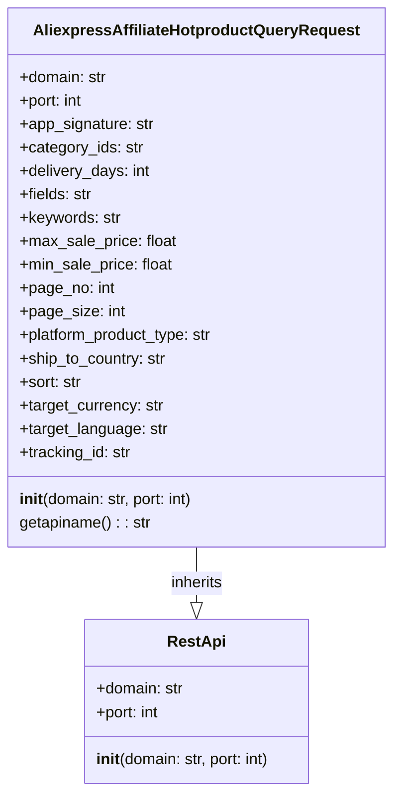

## <алгоритм>

**1. Инициализация экземпляра класса `AliexpressAffiliateHotproductQueryRequest`:**

   - При создании экземпляра класса `AliexpressAffiliateHotproductQueryRequest`, вызывается конструктор `__init__`.
   - Конструктор принимает два необязательных аргумента: `domain` (по умолчанию `"api-sg.aliexpress.com"`) и `port` (по умолчанию `80`).
   - Вызывается конструктор родительского класса `RestApi` с переданными значениями `domain` и `port`.
   - Инициализируются атрибуты экземпляра: `app_signature`, `category_ids`, `delivery_days`, `fields`, `keywords`, `max_sale_price`, `min_sale_price`, `page_no`, `page_size`, `platform_product_type`, `ship_to_country`, `sort`, `target_currency`, `target_language`, `tracking_id` со значением `None`.

   **Пример:**
   ```python
   request = AliexpressAffiliateHotproductQueryRequest(domain="example.com", port=443)
   print(request.domain) # Вывод: example.com
   print(request.port)   # Вывод: 443
   print(request.fields) # Вывод: None
   ```
**2. Вызов метода `getapiname`:**

   - Метод `getapiname` вызывается для получения имени API-метода.
   - Метод возвращает строку `'aliexpress.affiliate.hotproduct.query'`.

   **Пример:**
   ```python
   request = AliexpressAffiliateHotproductQueryRequest()
   api_name = request.getapiname()
   print(api_name) # Вывод: aliexpress.affiliate.hotproduct.query
   ```
## <mermaid>


**Объяснение `mermaid`:**

*   **`class AliexpressAffiliateHotproductQueryRequest`**:  Описывает класс, который отвечает за формирование запроса для получения списка горячих товаров. Он содержит атрибуты, представляющие параметры запроса, такие как идентификаторы категорий, ключевые слова, цены, номера страниц и т.д., а также методы для инициализации и получения имени API метода.
*   **`class RestApi`**: Описывает базовый класс для работы с REST API. Содержит атрибуты `domain` и `port`, а также метод инициализации.
*   **`AliexpressAffiliateHotproductQueryRequest --|> RestApi: inherits`**:  Указывает на то, что класс `AliexpressAffiliateHotproductQueryRequest` наследует свойства и методы от класса `RestApi`.
*   **Атрибуты классов**:  Внутри классов перечислены все атрибуты с их типами данных.

## <объяснение>

**Импорты:**

*   `from ..base import RestApi`: Импортирует класс `RestApi` из модуля `base`, расположенного на уровень выше в иерархии пакетов (относительный импорт). `RestApi`, вероятно, представляет собой базовый класс для работы с API, предоставляя общую функциональность для отправки запросов.

**Классы:**

*   `AliexpressAffiliateHotproductQueryRequest`:
    *   **Роль**: Представляет собой класс, формирующий запрос для получения списка горячих товаров от AliExpress API.
    *   **Атрибуты**:
        *   `domain` (str): Доменное имя API (по умолчанию `"api-sg.aliexpress.com"`).
        *   `port` (int): Порт API (по умолчанию `80`).
        *   `app_signature` (str): Сигнатура приложения для авторизации.
        *   `category_ids` (str): Список идентификаторов категорий, разделенных запятыми.
        *   `delivery_days` (int): Количество дней для доставки.
        *   `fields` (str): Список полей, которые нужно включить в ответ.
        *   `keywords` (str): Ключевые слова для поиска товаров.
        *   `max_sale_price` (float): Максимальная цена товара.
        *   `min_sale_price` (float): Минимальная цена товара.
        *   `page_no` (int): Номер страницы для постраничного вывода.
        *   `page_size` (int): Размер страницы для постраничного вывода.
        *   `platform_product_type` (str): Тип продукта платформы.
        *   `ship_to_country` (str): Код страны доставки.
        *   `sort` (str): Поле для сортировки результатов.
        *   `target_currency` (str): Целевая валюта.
        *   `target_language` (str): Целевой язык.
        *   `tracking_id` (str): Идентификатор отслеживания.
    *   **Методы**:
        *   `__init__(self, domain="api-sg.aliexpress.com", port=80)`: Конструктор класса, инициализирует атрибуты, принимает домен и порт.
        *   `getapiname(self)`: Возвращает строку `'aliexpress.affiliate.hotproduct.query'`, которая является именем API-метода, для получения списка горячих продуктов.
    *   **Взаимодействие**: Наследует от класса `RestApi`, получая от него базовые возможности для работы с REST API, такие как домен и порт.

**Функции:**

*   `__init__(self, domain="api-sg.aliexpress.com", port=80)`:  Конструктор класса `AliexpressAffiliateHotproductQueryRequest`, устанавливает значения атрибутов экземпляра, вызывает конструктор родительского класса `RestApi`, предоставляя значения для `domain` и `port`.

*   `getapiname(self)`:  Возвращает имя API-метода, которое используется для формирования URL запроса к AliExpress API.

**Переменные:**

*   Все переменные, указанные как атрибуты класса, инициализируются значением `None` при создании объекта.

**Потенциальные ошибки или области для улучшения:**

*   В коде отсутствуют проверки типов данных и валидации входных параметров.
*   Необходимо предусмотреть обработку ошибок при отправке запроса.
*   Нет механизма для автоматического формирования URL запроса на основе заданных параметров.
*   Для полноты картины не хватает обработки полученных результатов.

**Взаимосвязь с другими частями проекта:**

*   Этот класс предназначен для работы с API AliExpress и, вероятно, будет использоваться в других частях проекта, где требуется получение списка горячих товаров.
*   Он наследуется от класса `RestApi`, что подразумевает наличие других классов и модулей, использующих этот базовый класс для взаимодействия с другими API.
*   Логично предположить, что результаты работы этого класса, будут использоваться для обработки и отображения данных пользователю, или для других бизнес процессов в рамках проекта.